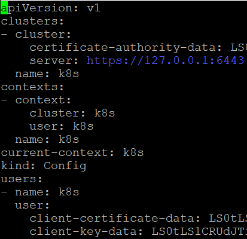
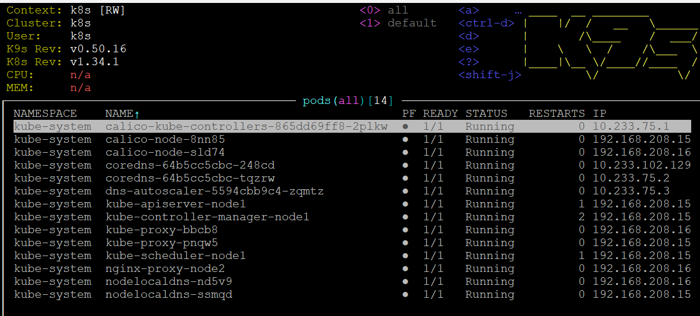

## 10. Kubernetes
```bash
scp root@192.168.208.15:/root/.kube/config ~/.kube/config-k8s
nano .kube/config-k8s
echo "alias k8s='export KUBECONFIG=\$HOME/.kube/config-k8s'" >> ~/.bashrc
source ~/.bashrc
ssh -L 6443:127.0.0.1:6443 root@192.168.208.15 -f -N
kubectl get pods -A --context k8s
NAMESPACE     NAME                                       READY   STATUS    RESTARTS   AGE
kube-system   calico-kube-controllers-865dd69ff8-2plkw   1/1     Running   0          9d
kube-system   calico-node-8nn85                          1/1     Running   0          9d
kube-system   calico-node-sld74                          1/1     Running   0          9d
kube-system   coredns-64b5cc5cbc-248cd                   1/1     Running   0          9d
kube-system   coredns-64b5cc5cbc-tqzrw                   1/1     Running   0          9d
kube-system   dns-autoscaler-5594cbb9c4-zqmtz            1/1     Running   0          9d
kube-system   kube-apiserver-node1                       1/1     Running   1          9d
kube-system   kube-controller-manager-node1              1/1     Running   2          9d
kube-system   kube-proxy-bbcb8                           1/1     Running   0          9d
kube-system   kube-proxy-pnqw5                           1/1     Running   0          9d
kube-system   kube-scheduler-node1                       1/1     Running   1          9d
kube-system   nginx-proxy-node2                          1/1     Running   0          9d
kube-system   nodelocaldns-nd5v9                         1/1     Running   0          9d
kube-system   nodelocaldns-ssmqd                         1/1     Running   0          9d
```


```bash
wget https://github.com/derailed/k9s/releases/latest/download/k9s_Linux_amd64.tar.gz
tar -xzf k9s_Linux_amd64.tar.gz
sudo mv k9s /usr/local/bin/
k9s version
 ____  __ ________
|    |/  /   __   \______
|       /\____    /  ___/
|    \   \  /    /\___  \
|____|\__ \/____//____  /
         \/           \/

Version:    v0.50.16
Commit:     3c37ca2197ca48591566d1f599b7b3a50d54a408
Date:       2025-10-19T15:52:37Z
```


## https://github.com/CyganekM/K8S/actions
[GitHub actions](https://github.com/CyganekM/K8S/actions)
