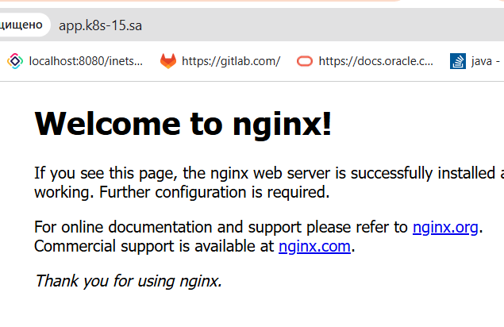

## Nginx deployment
```bash
# add row  178.124.206.53 app.k8s-15.sa /etc/hosts
ssh -L 6443:127.0.0.1:6443 root@192.168.208.15 -f -N

kubectl apply -f nginx_deploy.yaml
NAME               READY   UP-TO-DATE   AVAILABLE   AGE
nginx-deployment   4/4     4            4           7m40s

kubectl get deployment nginx-deployment
NAME               READY   UP-TO-DATE   AVAILABLE   AGE
nginx-deployment   4/4     4            4           7m40s

kubectl get pods -l app=nginx
NAME                                READY   STATUS    RESTARTS   AGE
nginx-deployment-577d4dd576-9vnhv   1/1     Running   0          17m
nginx-deployment-577d4dd576-j4h2d   1/1     Running   0          17m
nginx-deployment-577d4dd576-rgr9m   1/1     Running   0          17m
nginx-deployment-577d4dd576-tbstv   1/1     Running   0          17m

kubectl get svc nginx-service
NAME            TYPE        CLUSTER-IP    EXTERNAL-IP   PORT(S)   AGE
nginx-service   ClusterIP   10.233.4.37   <none>        80/TCP    20m

kubectl get ingress nginx-ingress
NAME            CLASS    HOSTS                  ADDRESS   PORTS   AGE
nginx-ingress   <none>   nginx-test.k8s-15.sa             80      21m

wget https://raw.githubusercontent.com/kubernetes/ingress-nginx/refs/heads/main/deploy/static/provider/baremetal/deploy.yaml -O ingress-controller.yaml
nano ingress-controller.yaml
 # add nodePort: 30001 
 kubectl apply -f ingress-controller.yaml
```
