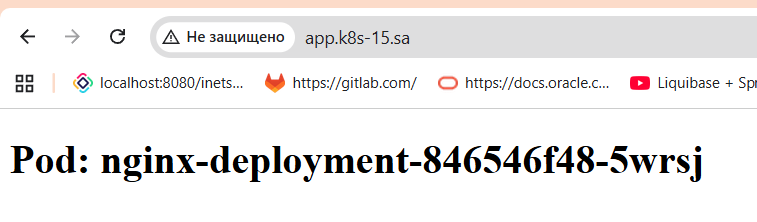

## 12. Kubernetes. Data. Security
```bash
ssh-keygen -t rsa -b 4096 -f k8s-ssh-key -N ""
curl -OL "https://github.com/bitnami-labs/sealed-secrets/releases/download/v0.33.1/kubeseal-0.33.1-linux-amd64.tar.gz"
tar -xvzf kubeseal-0.33.1-linux-amd64.tar.gz kubeseal
sudo install -m 755 kubeseal /usr/local/bin/kubeseal
rm kubeseal-0.33.1-linux-amd64.tar.gz
rm kubeseal
# Получаем публичный ключ от sealed-secrets controller
kubeseal --fetch-cert > sealed-secrets-cert.pem
# Создаем зашифрованный SealedSecret
kubectl create secret generic ssh-keys-secret \
  --from-file=id_rsa=./k8s-ssh-key \
  --from-file=id_rsa.pub=./k8s-ssh-key.pub \
  --dry-run=client -o yaml > temp-secret.yaml
kubeseal --format=yaml --cert=sealed-secrets-cert.pem < temp-secret.yaml > sealed-secret.yaml
# Очистка временных файлов
rm temp-secret.yaml sealed-secrets-cert.pem
kubectl apply -f sealed-secret.yaml
kubectl apply -f nginx-deploy.yaml
```


