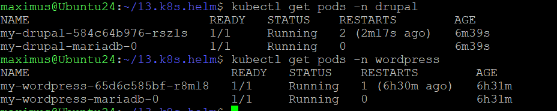
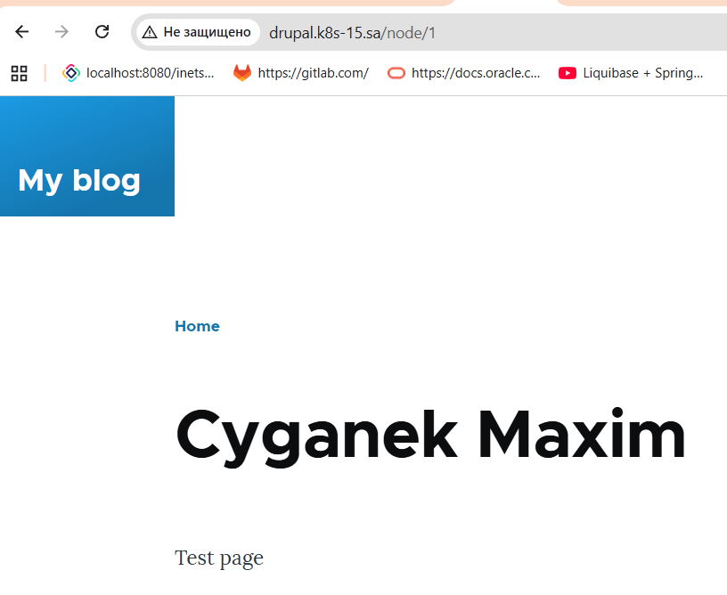
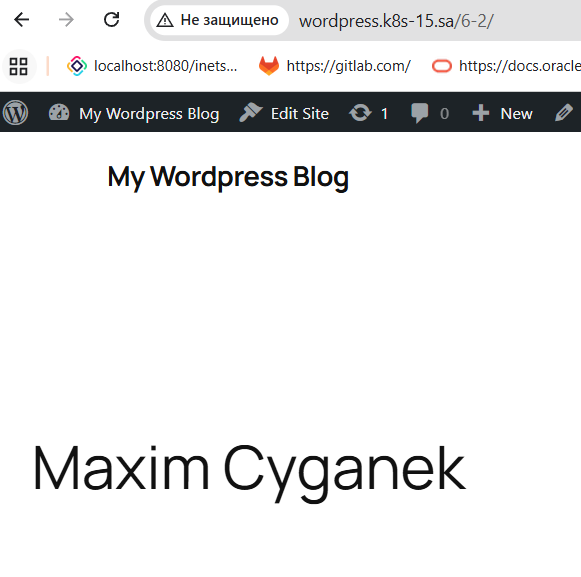

```bash 
curl -fsSL -o get_helm.sh https://raw.githubusercontent.com/helm/helm/main/scripts/get-helm-4
chmod 700 get_helm.sh
./get_helm.sh
rm get_helm.sh
kubectl create namespace drupal
cat > drupal.yaml << EOF
ingress:
  enabled: true
  ingressClassName: nginx
  hostname: drupal.k8s-15.sa

service:
  type: ClusterIP

persistence:
  enabled: false

mariadb:
  image:
    registry: docker.io
    repository: bitnamilegacy/mariadb
    tag: latest
  auth:
    rootPassword: secretpassword
  primary:
    persistence:
      enabled: false

image:
  registry: docker.io
  repository: bitnamilegacy/drupal
  tag: latest

drupalUsername: admin
drupalPassword: admin
EOF

helm install my-drupal oci://registry-1.docker.io/bitnamicharts/drupal -n drupal -f drupal.yaml

kubectl create namespace wordpress
cat > wordpress.yaml << EOF
global:
  storageClass: "standard"

ingress:
  enabled: true
  ingressClassName: nginx
  hostname: wordpress.k8s-15.sa

service:
  type: ClusterIP
  
wordpressUsername: "admin"
wordpressPassword: "admin123"
wordpressEmail: "admin@example.com"
wordpressFirstName: "Admin"
wordpressLastName: "User"
wordpressBlogName: "My Wordpress Blog"

mariadb:
  enabled: true
  auth:
    rootPassword: "rootpassword123"
    database: "wordpress"
    username: "wordpress"
    password: "wordpress123"
EOF
helm install my-wordpress oci://registry-1.docker.io/bitnamicharts/wordpress --namespace wordpress -f wordpress.yaml
```



