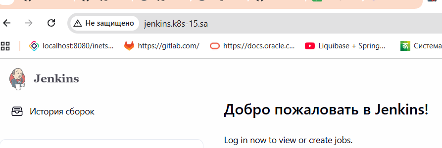

## 14. Kubernetes application deployment
```bash
helm package  helm-sources
helm repo index --url "https://cyganekm.github.io/helmJenkins/" .
helm repo add jenkins-helm https://cyganekm.github.io/helmJenkins/
helm repo update
Hang tight while we grab the latest from your chart repositories...
...Successfully got an update from the "jenkins-helm" chart repository
Update Complete. ⎈Happy Helming!⎈

helm search repo jenkins
NAME                    CHART VERSION   APP VERSION     DESCRIPTION
jenkins-helm/jenkins    0.1.0           latest          A Helm chart for Jenkins CI/CD

helm install jenkins-helm jenkins-helm/jenkins
maximus@Ubuntu24:~/14.k8s.HelmJenkins/helm-releases$ kubectl get pods -n ci-cd
NAME                      READY   STATUS    RESTARTS   AGE
jenkins-94d8494b7-xpvrm   1/1     Running   0          116s
```
