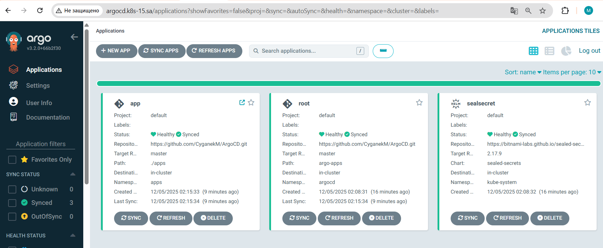

- ## 15.Kubernetes CI CD
```bash
wget https://raw.githubusercontent.com/argoproj/argo-cd/stable/manifests/install.yaml argo-install
kubectl apply -f install.yaml -n argocd
kubeseal --format=yaml --scope cluster-wide  --cert=sealed-secrets-cert.pem < temp-secret.yaml > sealed-secret-wide.yaml
kubectl get applications app -n argocd -o yaml > argo-apps/app.yaml
kubectl get applications sealsecret -n argocd -o yaml > argo-apps/secret.yaml
```
- [https://github.com/CyganekM/ArgoCD](https://github.com/CyganekM/ArgoCD)


