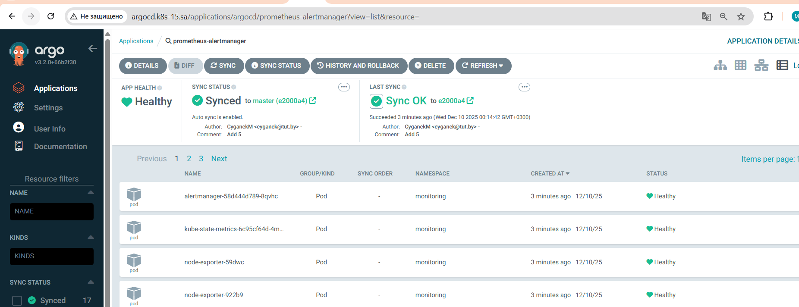
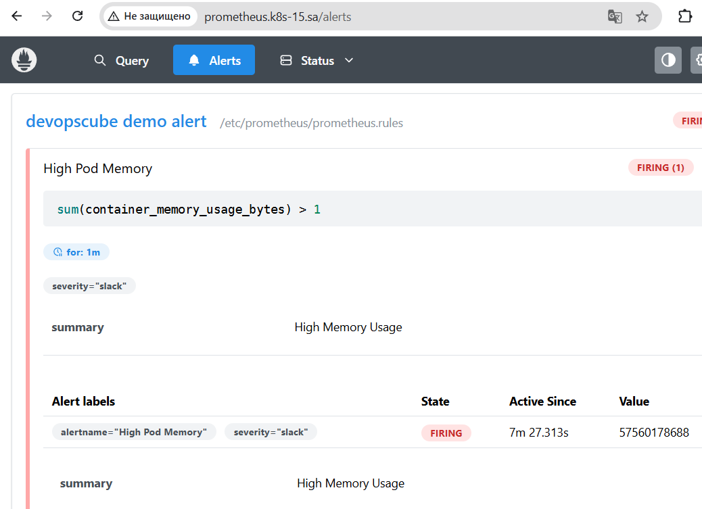
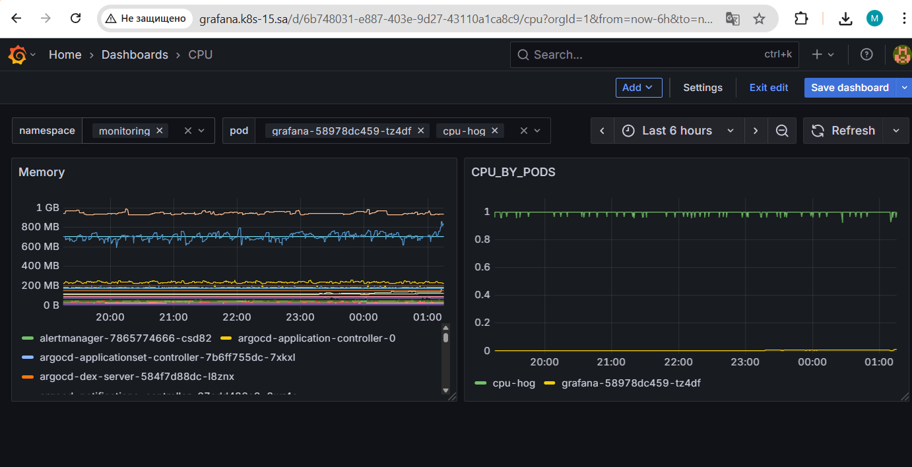

- ## 16. Technical and service monitoring
- Создание файлов prometheus-deploy.yaml alertmanager.yaml node-exporter.yaml ksm.yaml в директории monitor.```
- git push
- [https://github.com/CyganekM/ArgoCD](https://github.com/CyganekM/ArgoCD)
- Развёртывание используя ArgoCD


- Развёртывание GRAFANA https://grafana.github.io/helm-charts используя ArgoCD grafana-application.yaml
  
  - sum(container_memory_working_set_bytes{container!="POD", container!="", pod=~".+"}) by (pod)
  - sum(rate(container_cpu_usage_seconds_total{container!="POD", container!=""}[5m])) by (pod)