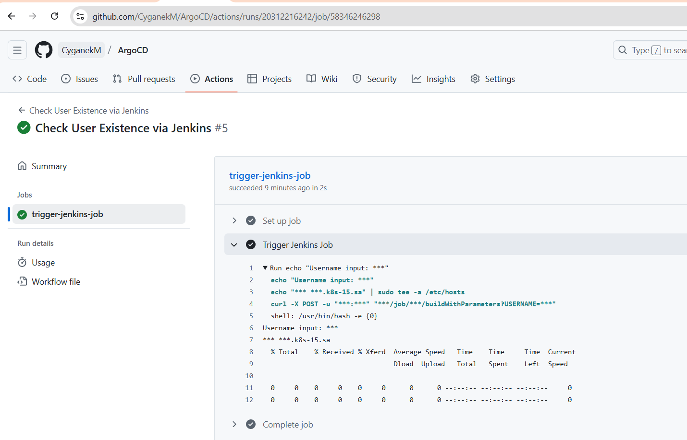
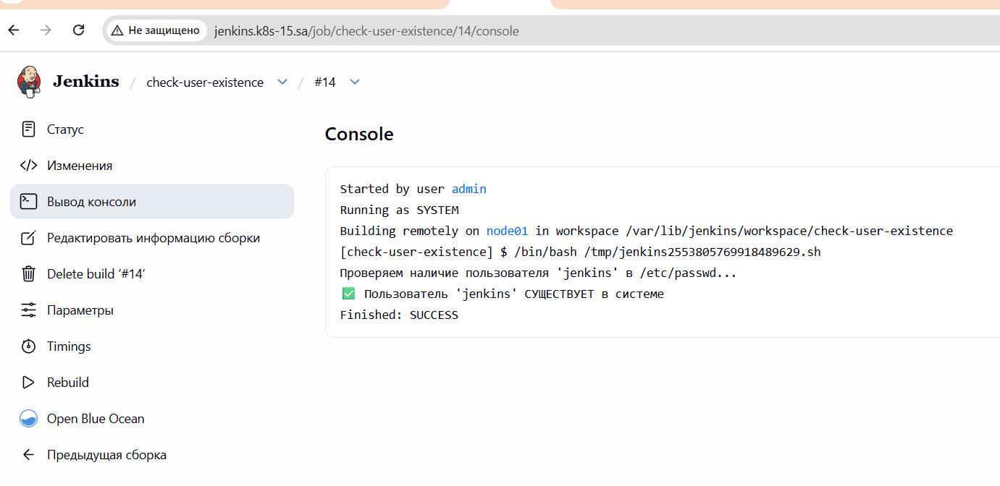
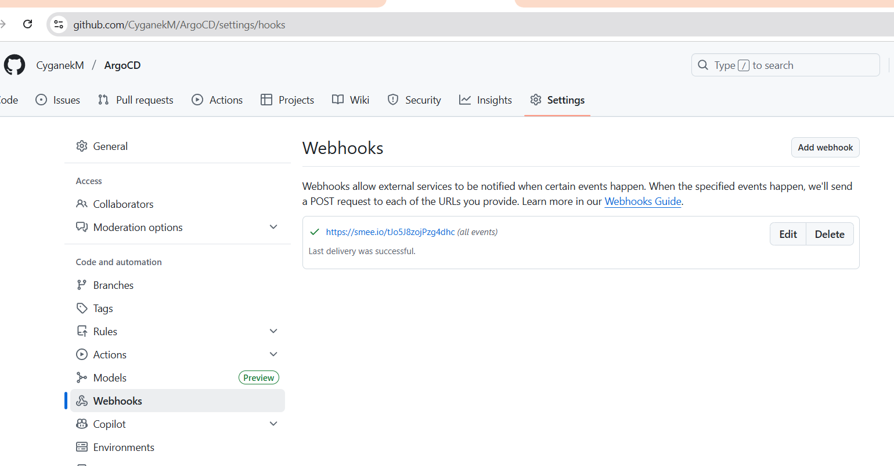
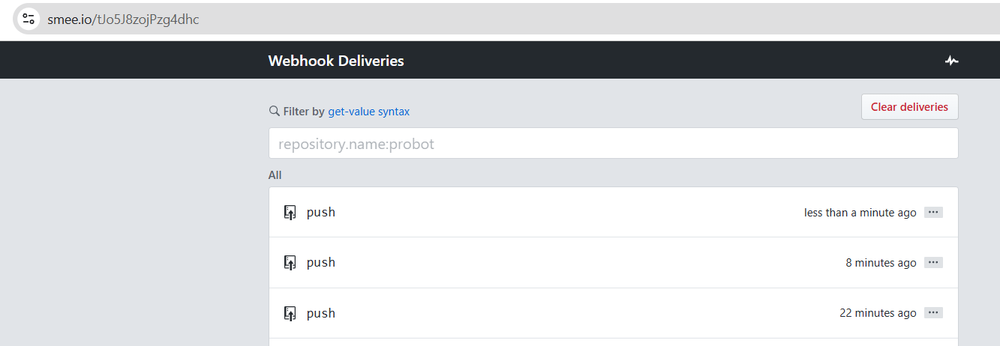
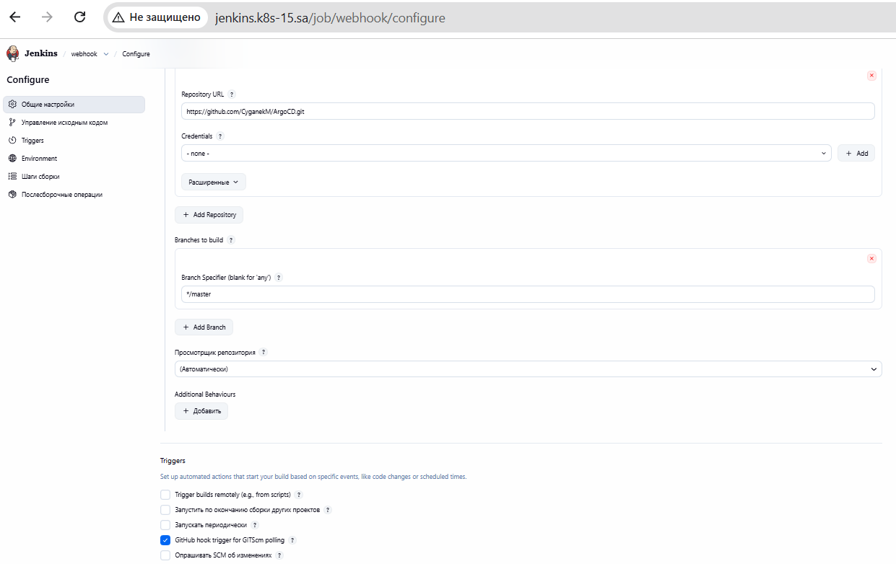

## 20. Jenkins. Routine
### Homework Assignment 1: Jenkins API
```yaml
# .github/workflows/check-user.yml
name: Check User Existence via Jenkins

on:
  workflow_dispatch:
    inputs:
      username:
        description: 'Username to check in /etc/passwd'
        required: true
        type: string

jobs:
  trigger-jenkins-job:
    runs-on: ubuntu-latest

    steps:
      - name: Trigger Jenkins Job
        run: |
          echo "Username input: ${{ secrets.JENKINS_USER }}"
          echo "${{ secrets.BASTION_HOST }} jenkins.k8s-15.sa" | sudo tee -a /etc/hosts
          curl -X POST -u "${{ secrets.JENKINS_ADMIN }}:${{ secrets.JENKINS_TOKEN }}" "${{ secrets.JENKINS_URL }}/job/${{ secrets.JOB_NAME }}/buildWithParameters?USERNAME=${{ secrets.JENKINS_USER }}"
          sleep 15
          LAST_BUILD=$(curl -s GET -u "${{ secrets.JENKINS_ADMIN }}:${{ secrets.JENKINS_TOKEN }}" "${{ secrets.JENKINS_URL }}/job/${{ secrets.JOB_NAME }}/lastBuild/api/json")
          RESULT=$(echo $LAST_BUILD | grep -o '"result":"[^"]*"' | cut -d'"' -f4)
          if [ $RESULT = "SUCCESS" ]; then
            echo "✅ User EXISTS"
            exit 0
          elif [ $RESULT = "FAILURE" ]; then
            echo "❌ User does NOT exist"
            exit 1
          else
            echo "⚠️ Unknown result: $RESULT"
            exit 1
          fi
```



## Homework Assignment 2: Webhook
```bash
kubectl apply -f 20.jenkins/smee.yaml -n ci-cd

```




