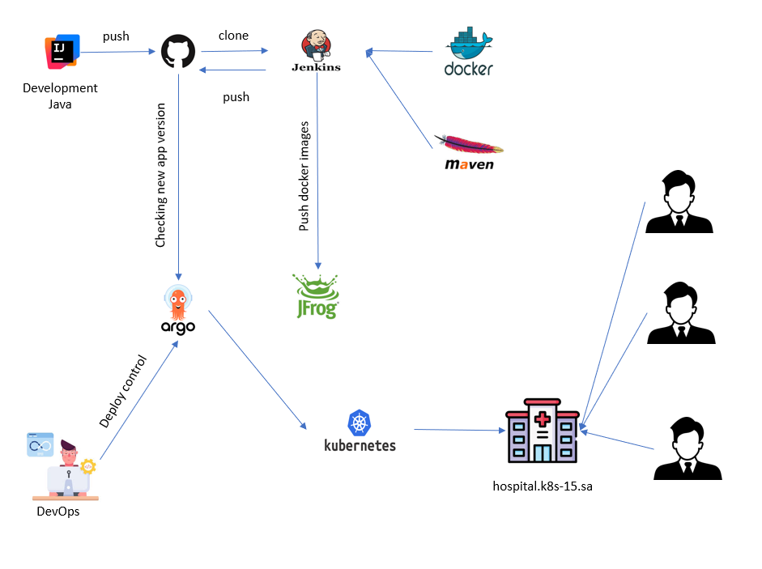

# Project Report
Project Reporter: Maxim Cyganek
Group Number: md-sa2-33-25

## Application Description
- Application name: hospital-api
- Programming language: Java21 (Spring framework)
- Database type: MySQL 8.3.0
- Repository: https://github.com/CyganekM/hospital

## Pipeline – High-Level Design

## Technologies Used
- Orchestration: Kubernetes
- Automation tools: Shell scripts for automating routine configuration and maintenance tasks (e.g., cleanup, backup, cluster health checks).
- CI implementation: Jenkins. The pipeline (defined via a Jenkinsfile) handles: application build, unit and integration testing, Docker image creation, vulnerability scanning (if applicable), and pushing the image to a Container Registry. The final key CI step is updating the image version in the Git repository holding the Kubernetes manifests (e.g., deployment.yaml).
- Deployment flows: GitOps with Argo CD. Following a successful CI run, Jenkins triggers an update to the configuration repository. Argo CD continuously monitors this repository (containing plain YAML manifests) and automatically synchronizes the desired state, applying changes directly to the Kubernetes cluster. The process is fully declarative and auditable.
- Rollback strategy: Fully based on GitOps principles.
  1. Primary Method: Reverting the change in the Git manifest repository (e.g., via git revert). Argo CD will automatically detect the new state and redeploy the previous, working application version to the cluster.
  2. Emergency Method: Using Argo CD's built-in rollback feature in its UI or CLI (the "Sync" button to a previous revision) for immediate response.
  3. Fallback Method (Kubernetes-level): The kubectl rollout undo deployment/<deployment_name> command.
## References & Links
- https://github.com/CyganekM/hospital
- https://github.com/CyganekM/hospital_ci_cd
- https://jfrog.it-academy.by/ui/native/public/hospital

