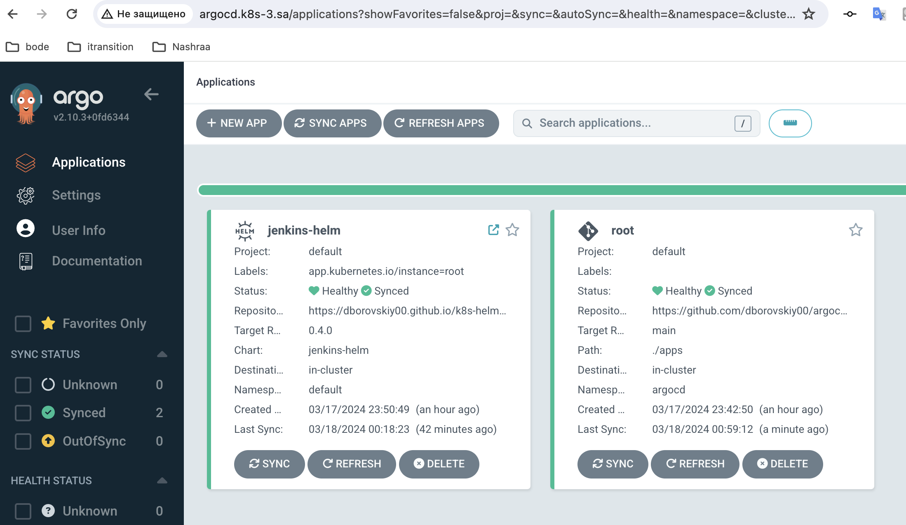
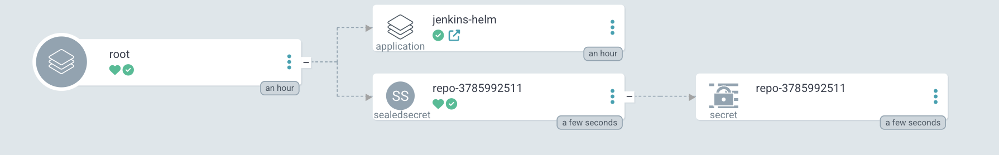

## 15.Kubernetes.ArgoCD

---

### Install ArgoCD

---

```bash
kubectl create namespace argocd
wget https://raw.githubusercontent.com/argoproj/argo-cd/stable/manifests/install.yaml -O argocd.yaml
kubectl apply -f argocd.yaml -n argocd
```

### Apply Sealed secrets

---

```bash
kubectl get secrets repo-3785992511 -n argocd -o yaml > secret.yaml
cat secret.yaml | kubeseal --format yaml > sealed.yaml
```

```yaml
# sealed.yaml

---
apiVersion: bitnami.com/v1alpha1
kind: SealedSecret
metadata:
  creationTimestamp: null
  name: repo-3785992511
  namespace: argocd
spec:
  encryptedData:
    project: AgDUh+NVyaFdDXzXYsCaaGlQxifr2NZwIWUFlL3Wqbna6x1s5wVOAcQQcIs5vA+ey8tqxpLnJ14OPVnvi0Yl9FlebmGNJ8Tnpn95VhkZ6rH1xhbI51iwj0R9lR1yLgxIQUvz5QXU0BwWS5J7Oj4DB/4V6jrSe9SXIjRLX6cmRaTairQxlmcZRtD64jeNrvtJ5m1gp6QV9XpcK7KYTuiDyOFU5y7ZweL7owAdyOAg+W1M>
    type: AgAGCHq7UJQjzzjBhvWyt/Ymo7fBC32eu0UW+3vazSmlvA23pLRXcOzmgslp4cQSKDXW7fftsMc6j1wGbbwOQiRldYjX0tYOEifoSpIMcELwYzn8a79QJBYD6kzcOV2l4lj8QxcNdj/NaoQ65MJ/oWoqJkrD5gfx14xwI4PKdm3N7adxagNQvZQj2O8pPEkczI1ns+5cIR5+3qpkcQbkPt5mYmfixyUMWxJ7HufYxqRFfq/>
    url: AgADMsKFGYChiwnQIECkMB0ovxI+Vw/tQArqjZ2EsVXZYDHkZSU/G5DhQD64EysVeV/EI0OW+qJ/hvgIwEDnpyaZqAsi2IIEnQRsgx9UKVvAFQ6dBlSjZzfP88fkR8x/mBN6h5X/SRcFQ2d+S0juMNhJM2CfmD8H4YcNOtdpfmN1T56EJoslOPqJr5VucIJ2gMvlCUgEMTT6nr+8n34XAOGyzC+l3qnriw32K40SN0RMIAbg>
  template:
    metadata:
      annotations:
        managed-by: argocd.argoproj.io
      creationTimestamp: null
      labels:
        argocd.argoproj.io/secret-type: repository
      name: repo-3785992511
      namespace: argocd
    type: Opaque
```

### Deployed ArgoCD and Apps schemas

---





### Sources

---

- [Helm Repository](https://github.com/dborovskiy00/k8s-helm-jenkins)
- [ArgoCD Repository](https://github.com/dborovskiy00/argocd-k8s)
