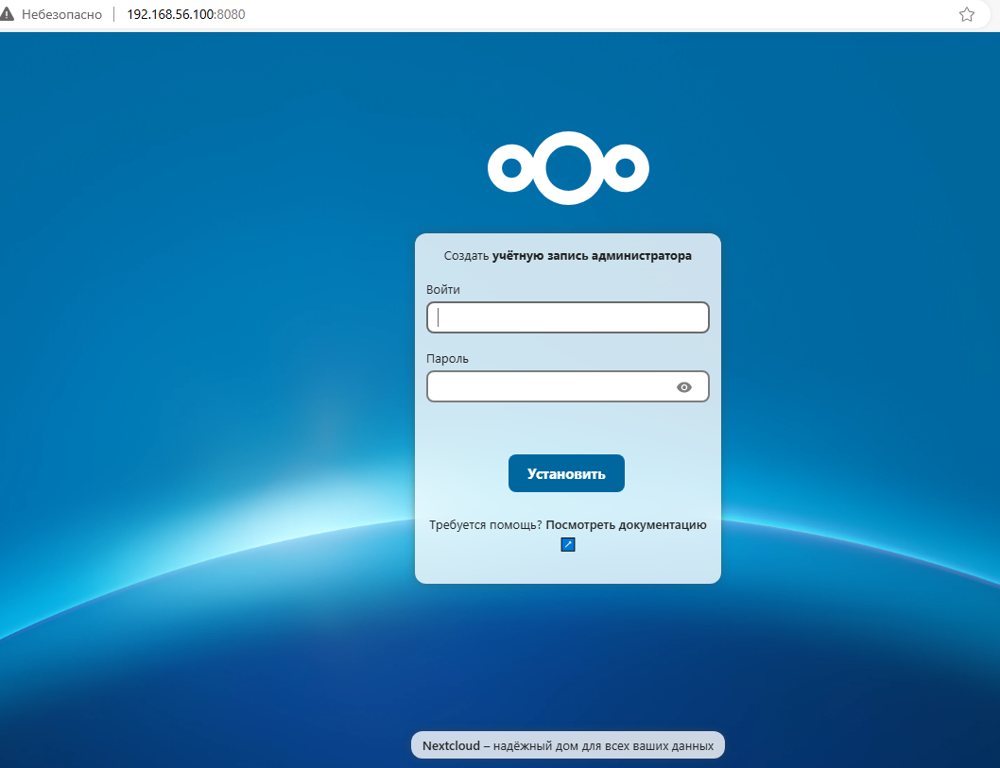
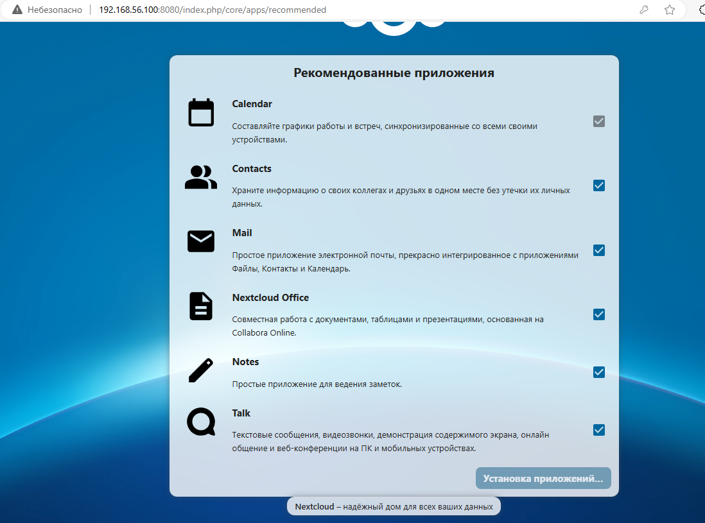
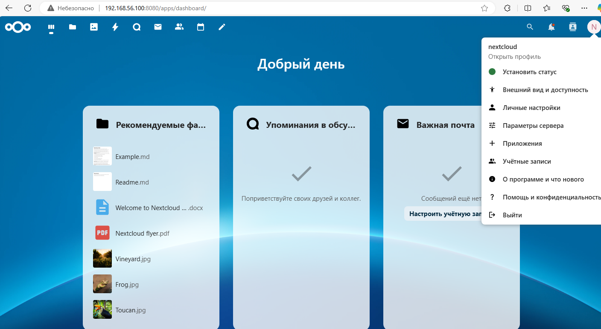
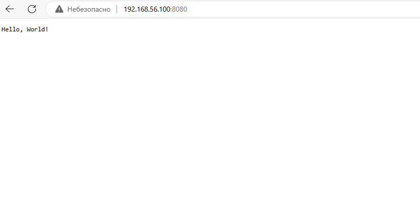
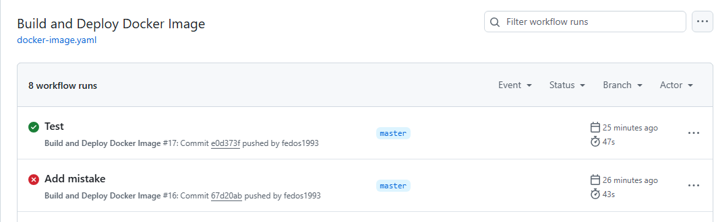
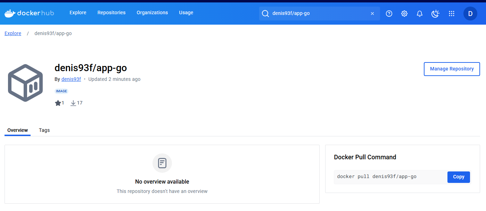
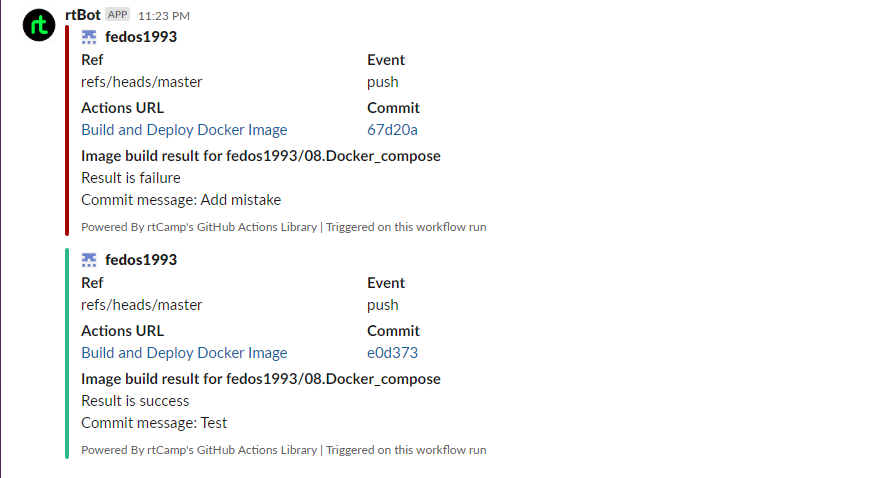

# 08. Docker. Docker compose

## Homework Assignment 1: Docker Compose for Application Stacks
The chosen service for creating a multi-container application is Nextcloud.

[Link to the Docker Compose file](Assignment_1/docker-compose.yaml)

### Run the application stack
```shell
docker compose up -d
[+] Running 32/32
 ✔ nextcloud Pulled                                                                                                                                   374.6s
   ✔ fd674058ff8f Already exists                                                                                                                        0.0s
   ✔ 0e012f699cbd Pull complete                                                                                                                         1.0s
   ✔ 5b35ca6db0b5 Pull complete                                                                                                                       235.2s
   ✔ 704dee2cabd9 Pull complete                                                                                                                       235.4s
   ✔ 5fdb0e4d812c Pull complete                                                                                                                       245.6s
   ✔ fd696393bc53 Pull complete                                                                                                                       245.8s
   ✔ 5b7af5ff0c1b Pull complete                                                                                                                       246.0s
   ✔ 384588a3de49 Pull complete                                                                                                                       256.2s
   ✔ 9bfa95b81973 Pull complete                                                                                                                       258.3s
   ✔ b24a3aff350b Pull complete                                                                                                                       265.6s
   ✔ eecbcdb9e3e3 Pull complete                                                                                                                       265.8s
   ✔ fabbb9254aa4 Pull complete                                                                                                                       266.0s
   ✔ f45d2a5ba4b8 Pull complete                                                                                                                       266.4s
   ✔ 4f4fb700ef54 Pull complete                                                                                                                       266.5s
   ✔ 6088943ab250 Pull complete                                                                                                                       278.5s
   ✔ 40fe94b7c989 Pull complete                                                                                                                       293.5s
   ✔ 4f3b33d1b8c1 Pull complete                                                                                                                       293.6s
   ✔ 0eaf9f7f242a Pull complete                                                                                                                       293.7s
   ✔ f525446fe3d3 Pull complete                                                                                                                       293.9s
   ✔ c543388d2f11 Pull complete                                                                                                                       372.9s
   ✔ 298d93704e13 Pull complete                                                                                                                       373.0s
   ✔ 40e7110e6c8a Pull complete                                                                                                                       373.0s
 ✔ db Pulled                                                                                                                                          260.7s
   ✔ de44b265507a Pull complete                                                                                                                       169.0s
   ✔ ca9b21d0c985 Pull complete                                                                                                                       171.0s
   ✔ 041c753879ae Pull complete                                                                                                                       181.6s
   ✔ e7b5137dc4b2 Pull complete                                                                                                                       181.9s
   ✔ 655e5d2590bd Pull complete                                                                                                                       182.2s
   ✔ 41b3170b5f12 Pull complete                                                                                                                       255.8s
   ✔ 95adc28016bc Pull complete                                                                                                                       257.1s
   ✔ 407e9d6eefb4 Pull complete                                                                                                                       257.7s
[+] Running 5/5
 ✔ Network 08docker_compose_nextcloud-network  Created                                                                                                  0.2s
 ✔ Volume "08docker_compose_nextcloud-data"    Created                                                                                                  0.0s
 ✔ Volume "08docker_compose_db-data"           Created                                                                                                  0.0s
 ✔ Container 08docker_compose-db-1             Started                                                                                                  1.2s
 ✔ Container 08docker_compose-nextcloud-1      Started                                                                                                  1.7s
```
### Checking access to the application through a web browser
Start page Nextcloud

Nextcloud app installation

Nextcloud dashboard


## Homework Assignment 2: Docker build automation (github action)

List of links:
- [Dockerfile](Assignment_2/dockerfile)
- [Workflow](.github/workflows/docker-image.yaml)
- [App](Assignment_2/main.go)
- [Action](https://github.com/fedos1993/08.Docker_compose/actions/workflows/docker-image.yaml)
- [Image on docker hub](https://hub.docker.com/r/denis93f/app-go)

### Build the Docker image
```shell
docker build -t app-go .
[+] Building 353.0s (13/13) FINISHED                                                                                                          docker:default
 => [internal] load build definition from dockerfile                                                                                                    0.0s
 => => transferring dockerfile: 260B                                                                                                                    0.0s
 => [internal] load metadata for docker.io/library/debian:bookworm-slim                                                                                 1.5s
 => [internal] load metadata for docker.io/library/golang:1.23.4-bookworm                                                                               1.9s
 => [internal] load .dockerignore                                                                                                                       0.0s
 => => transferring context: 2B                                                                                                                         0.0s
 => [builder 1/4] FROM docker.io/library/golang:1.23.4-bookworm@sha256:2e838582004fab0931693a3a84743ceccfbfeeafa8187e87291a1afea457ff7a               228.4s
 => => resolve docker.io/library/golang:1.23.4-bookworm@sha256:2e838582004fab0931693a3a84743ceccfbfeeafa8187e87291a1afea457ff7a                         0.1s
 => => sha256:0a96bdb8280554b560ffee0f2e5f9843dc7b625f28192021ee103ecbcc2d629b 48.50MB / 48.50MB                                                      111.6s
 => => sha256:aff7bd25e6a162e9db0a284663d6aff04d456416cb3cc94d692a89be72b0e605 2.32kB / 2.32kB                                                          0.0s
 => => sha256:7012e31470cb237fd56d72b6a7d16892ea12e7f8fd361be9010444423f28c821 2.80kB / 2.80kB                                                          0.0s
 => => sha256:2e838582004fab0931693a3a84743ceccfbfeeafa8187e87291a1afea457ff7a 9.10kB / 9.10kB                                                          0.0s
 => => sha256:54c7be425079efba0003054ee884bf72f1ffebca733bedd6f077d2809ee9aa6f 23.87MB / 23.87MB                                                       44.5s
 => => sha256:7aa8176e6d893aff4b57b2c22574ec2afadff4673b8e0954e275244bfd3d7bc1 64.39MB / 64.39MB                                                       85.8s
 => => sha256:4930ffbfb2152fc9d9ccd8712b7162244c1b95a0998025070dbb4229bc0564d4 92.31MB / 92.31MB                                                      173.0s
 => => sha256:06f05ace1117d62b655e04f6f73c83617e3e0febc38681dbedf58f477dd0658c 74.05MB / 74.05MB                                                      169.7s
 => => sha256:3fd114183f3282d111ed7eaa48e1f94ff3018db89a43f47239fed2180f2d1084 125B / 125B                                                            113.0s
 => => extracting sha256:0a96bdb8280554b560ffee0f2e5f9843dc7b625f28192021ee103ecbcc2d629b                                                              12.8s
 => => sha256:4f4fb700ef54461cfa02571ae0db9a0dc1e0cdb5577484a6d75e68dc38e8acc1 32B / 32B                                                              113.6s
 => => extracting sha256:54c7be425079efba0003054ee884bf72f1ffebca733bedd6f077d2809ee9aa6f                                                               7.8s
 => => extracting sha256:7aa8176e6d893aff4b57b2c22574ec2afadff4673b8e0954e275244bfd3d7bc1                                                              21.9s
 => => extracting sha256:4930ffbfb2152fc9d9ccd8712b7162244c1b95a0998025070dbb4229bc0564d4                                                              18.4s
 => => extracting sha256:06f05ace1117d62b655e04f6f73c83617e3e0febc38681dbedf58f477dd0658c                                                              32.6s
 => => extracting sha256:3fd114183f3282d111ed7eaa48e1f94ff3018db89a43f47239fed2180f2d1084                                                               0.0s
 => => extracting sha256:4f4fb700ef54461cfa02571ae0db9a0dc1e0cdb5577484a6d75e68dc38e8acc1                                                               0.0s
 => [runtime 1/3] FROM docker.io/library/debian:bookworm-slim@sha256:d365f4920711a9074c4bcd178e8f457ee59250426441ab2a5f8106ed8fe948eb                   0.2s
 => => resolve docker.io/library/debian:bookworm-slim@sha256:d365f4920711a9074c4bcd178e8f457ee59250426441ab2a5f8106ed8fe948eb                           0.1s
 => => sha256:d365f4920711a9074c4bcd178e8f457ee59250426441ab2a5f8106ed8fe948eb 8.56kB / 8.56kB                                                          0.0s
 => => sha256:719ab80ef51a82a0a3e92a72436d8a8a027b10da6d8eea114db7e44a68c0a32e 1.02kB / 1.02kB                                                          0.0s
 => => sha256:802cc311ed7dd49c19c9fe6ab11acc6338b8cbb25bd48e3e90beb297eb483e39 453B / 453B                                                              0.0s
 => [internal] load build context                                                                                                                       0.1s
 => => transferring context: 394B                                                                                                                       0.0s
 => [runtime 2/3] WORKDIR /app                                                                                                                          0.1s
 => [builder 2/4] WORKDIR /app                                                                                                                          1.1s
 => [builder 3/4] COPY main.go .                                                                                                                        0.2s
 => [builder 4/4] RUN go build -o app main.go                                                                                                         120.1s
 => [runtime 3/3] COPY --from=builder /app/app .                                                                                                        0.1s
 => exporting to image                                                                                                                                  0.3s
 => => exporting layers                                                                                                                                 0.2s
 => => writing image sha256:ae64e0b203d087b84c7bf4c6083b6dec97c93f5540abda1267714b66b3c4594e                                                            0.0s
 => => naming to docker.io/library/app-go
```
### Running a container
```shell
docker images
REPOSITORY   TAG       IMAGE ID       CREATED          SIZE
app-go       latest    ae64e0b203d0   10 seconds ago   82.3MB
docker run --name app-go -d -p 8080:8080 ae64e0b203d0
docker ps
CONTAINER ID   IMAGE          COMMAND   CREATED         STATUS         PORTS                                       NAMES
3aeaba9ac494   ae64e0b203d0   "./app"   5 seconds ago   Up 3 seconds   0.0.0.0:8080->8080/tcp, :::8080->8080/tcp   app-go
```
### Application demonstration


### Workflow run results


### Checking the image on docker hub


### Checking slack notification

