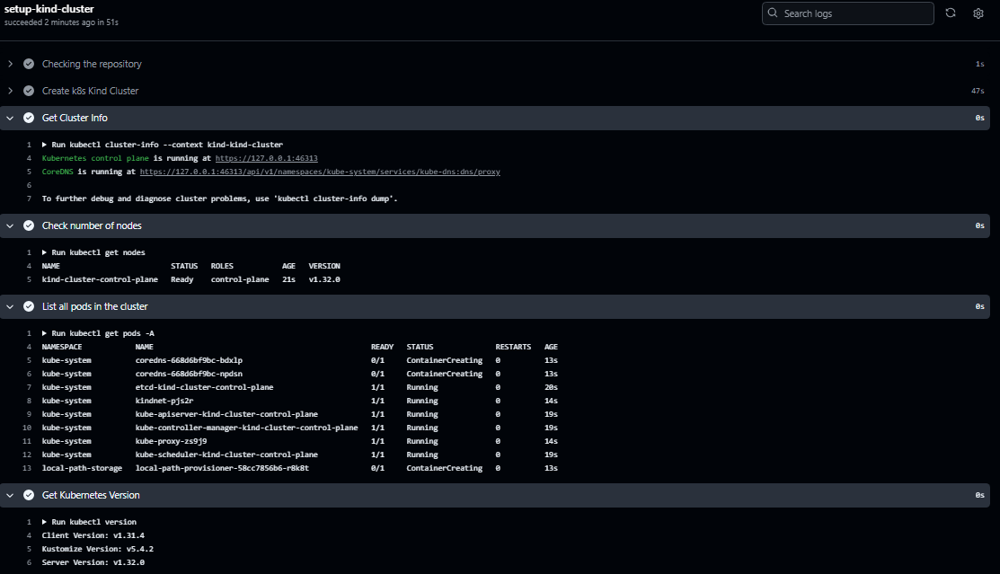
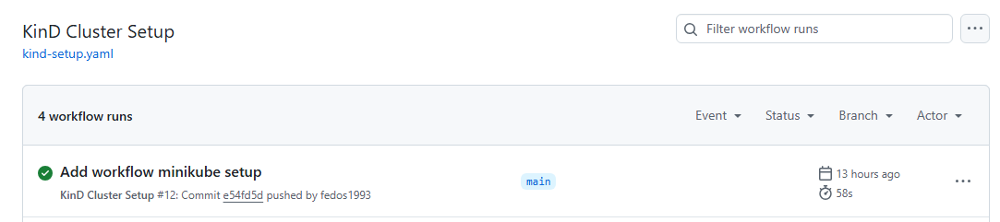
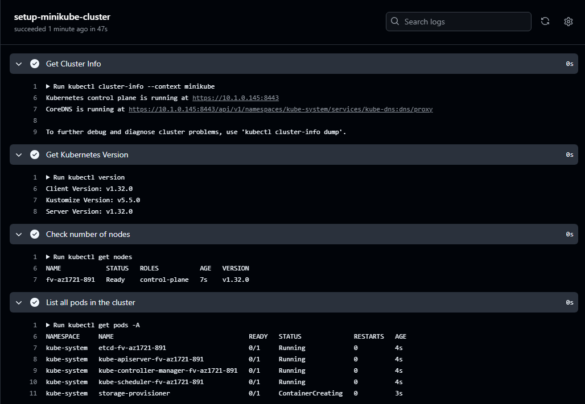
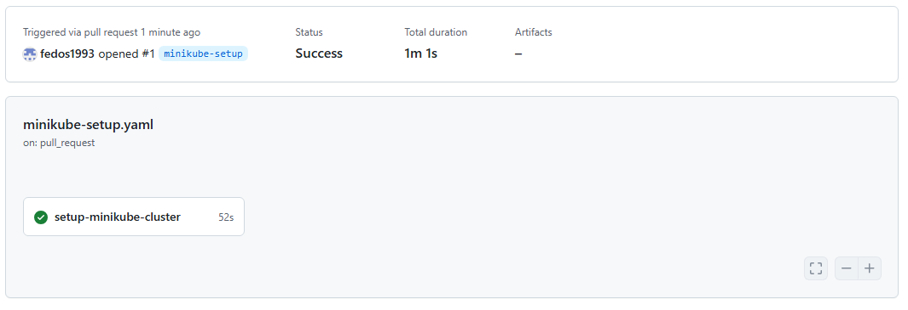

# 09. Kubernetes

## Homework Assignment 1: KinD Kubernetes Cluster Setup
### Install KinD
```shell
denis@denisserv:~$ [ $(uname -m) = x86_64 ] && curl -Lo ./kind https://kind.sigs.k8s.io/dl/v0.26.0/kind-linux-amd64
  % Total    % Received % Xferd  Average Speed   Time    Time     Time  Current
                                 Dload  Upload   Total   Spent    Left  Speed
100    97  100    97    0     0    245      0 --:--:-- --:--:-- --:--:--   246
  0     0    0     0    0     0      0      0 --:--:-- --:--:-- --:--:--     0
100  9.9M  100  9.9M    0     0  1050k      0  0:00:09  0:00:09 --:--:--  936k

denis@denisserv:~$ chmod +x ./kind
denis@denisserv:~$ sudo mv ./kind /usr/local/bin/kind
denis@denisserv:~$ kind --version
kind version 0.26.0
```
### Creating a local cluster
```shell
denis@denisserv:~$ kind create cluster --name kind-cluster
Creating cluster "kind-cluster" ...
 ✓ Ensuring node image (kindest/node:v1.32.0) 🖼
 ✓ Preparing nodes 📦
 ✓ Writing configuration 📜
 ‚úì Starting control-plane
 ✓ Installing CNI 🔌
 ✓ Installing StorageClass 💾
Set kubectl context to "kind-kind-cluster"
You can now use your cluster with:

kubectl cluster-info --context kind-kind-cluster

Not sure what to do next? 😅  Check out https://kind.sigs.k8s.io/docs/user/quick-start/
```
### Check if the cluster is running
```shell
denis@denisserv:~$ kubectl cluster-info --context kind-kind-cluster
Kubernetes control plane is running at https://127.0.0.1:44065
CoreDNS is running at https://127.0.0.1:44065/api/v1/namespaces/kube-system/services/kube-dns:dns/proxy

To further debug and diagnose cluster problems, use 'kubectl cluster-info dump'.

denis@denisserv:~$ kubectl get node
NAME                         STATUS   ROLES           AGE     VERSION
kind-cluster-control-plane   Ready    control-plane   4m53s   v1.32.0

denis@denisserv:~$ kubectl get pods -A
NAMESPACE            NAME                                                 READY   STATUS    RESTARTS   AGE
kube-system          coredns-668d6bf9bc-22w9b                             1/1     Running   0          4m52s
kube-system          coredns-668d6bf9bc-gqvpt                             1/1     Running   0          4m52s
kube-system          etcd-kind-cluster-control-plane                      1/1     Running   0          4m59s
kube-system          kindnet-prb4v                                        1/1     Running   0          4m52s
kube-system          kube-apiserver-kind-cluster-control-plane            1/1     Running   0          5m
kube-system          kube-controller-manager-kind-cluster-control-plane   1/1     Running   0          5m2s
kube-system          kube-proxy-lzbrx                                     1/1     Running   0          4m52s
kube-system          kube-scheduler-kind-cluster-control-plane            1/1     Running   0          4m57s
local-path-storage   local-path-provisioner-58cc7856b6-6wz5w              1/1     Running   0          4m48s
```

## Homework Assignment 2: Minikube Kubernetes Cluster Setup
### Install Minikube
```shell
curl -Lo minikube https://storage.googleapis.com/minikube/releases/latest/minikube-linux-amd64 && chmod +x minikube

  % Total    % Received % Xferd  Average Speed   Time    Time     Time  Current
                                 Dload  Upload   Total   Spent    Left  Speed
100  119M  100  119M    0     0  18.4M      0  0:00:06  0:00:06 --:--:-- 21.6M

sudo install minikube /usr/local/bin/
```
### Creating a local cluster
```shell
denis@denisserv:~$ minikube start --vm-driver=docker
* minikube v1.35.0 –Ω–∞ Ubuntu 24.04 (vbox/amd64)
* –ò—Å–ø–æ–ª—å–∑—É–µ—Ç—Å—è –¥—Ä–∞–π–≤–µ—Ä docker –Ω–∞ –æ—Å–Ω–æ–≤–µ –∫–æ–Ω—Ñ–∏–≥–∞ –ø–æ–ª—å–∑–æ–≤–∞—Ç–µ–ª—è

X The requested memory allocation of 1967MiB does not leave room for system overhead (total system memory: 1967MiB). You may face stability issues.
* –ü—Ä–µ–¥–ª–æ–∂–µ–Ω–∏–µ: Start minikube with less memory allocated: 'minikube start --memory=1967mb'

* Using Docker driver with root privileges
* Starting "minikube" primary control-plane node in "minikube" cluster
* Pulling base image v0.0.46 ...
* –°–∫–∞—á–∏–≤–∞–µ—Ç—Å—è Kubernetes v1.32.0 ...
    > preloaded-images-k8s-v18-v1...:  333.57 MiB / 333.57 MiB  100.00% 1.97 Mi
    > gcr.io/k8s-minikube/kicbase...:  500.31 MiB / 500.31 MiB  100.00% 1.68 Mi
* Creating docker container (CPUs=2, Memory=1967MB) ...
* –ü–æ–¥–≥–æ—Ç–∞–≤–ª–∏–≤–∞–µ—Ç—Å—è Kubernetes v1.32.0 –Ω–∞ Docker 27.4.1 ...
  - Generating certificates and keys ...
  - Booting up control plane ...
  - Configuring RBAC rules ...
* Configuring bridge CNI (Container Networking Interface) ...
* –ö–æ–º–ø–æ–Ω–µ–Ω—Ç—ã Kubernetes –ø—Ä–æ–≤–µ—Ä—è—é—Ç—Å—è ...
  - –ò—Å–ø–æ–ª—å–∑—É–µ—Ç—Å—è –æ–±—Ä–∞–∑ gcr.io/k8s-minikube/storage-provisioner:v5
* –í–∫–ª—é—á–µ–Ω–Ω—ã–µ –¥–æ–ø–æ–ª–Ω–µ–Ω–∏—è: storage-provisioner, default-storageclass
* –ì–æ—Ç–æ–≤–æ! kubectl –Ω–∞—Å—Ç—Ä–æ–µ–Ω –¥–ª—è –∏—Å–ø–æ–ª—å–∑–æ–≤–∞–Ω–∏—è –∫–ª–∞—Å—Ç–µ—Ä–∞ "minikube" –∏ "default" –ø—Ä–æ—Å—Ç—Ä–∞–Ω—Å—Ç–≤–∞ –∏–º—ë–Ω –ø–æ —É–º–æ–ª—á–∞–Ω–∏—é
```
### Check if the cluster is running
```shell
denis@denisserv:~$ minikube status
minikube
type: Control Plane
host: Running
kubelet: Running
apiserver: Running
kubeconfig: Configured

denis@denisserv:~$ kubectx
kind-kind-cluster
minikube

denis@denisserv:~$ kubectl get node
NAME       STATUS   ROLES           AGE     VERSION
minikube   Ready    control-plane   4m45s   v1.32.0

denis@denisserv:~$ kubectl get pods -A
NAMESPACE     NAME                               READY   STATUS    RESTARTS        AGE
kube-system   coredns-668d6bf9bc-86tv9           1/1     Running   0               3m28s
kube-system   etcd-minikube                      1/1     Running   0               3m50s
kube-system   kube-apiserver-minikube            1/1     Running   0               3m50s
kube-system   kube-controller-manager-minikube   1/1     Running   0               3m50s
kube-system   kube-proxy-hqltf                   1/1     Running   0               3m29s
kube-system   kube-scheduler-minikube            1/1     Running   0               3m51s
kube-system   storage-provisioner                1/1     Running   1 (3m11s ago)   3m24s
```

## Homework Assignment 3: GitHub Actions for KinD Cluster Setup

List of links:
- [Workflow](.github/workflows/kind-setup.yaml)
- [Action](https://github.com/fedos1993/09.-Kubernetes/actions/workflows/kind-setup.yaml)

### Cluster Details Report


### The duration of the workflow run


## Homework Assignment 4: GitHub Actions for Minikube Cluster Setup

List of links:
- [Workflow](.github/workflows/minikube-setup.yaml)
- [Action](https://github.com/fedos1993/09.-Kubernetes/actions/workflows/minikube-setup.yaml)

### Cluster Details Report


### The duration of the workflow run

