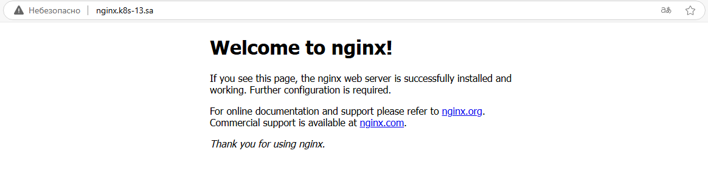
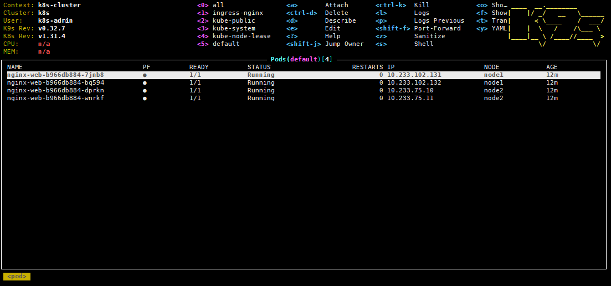
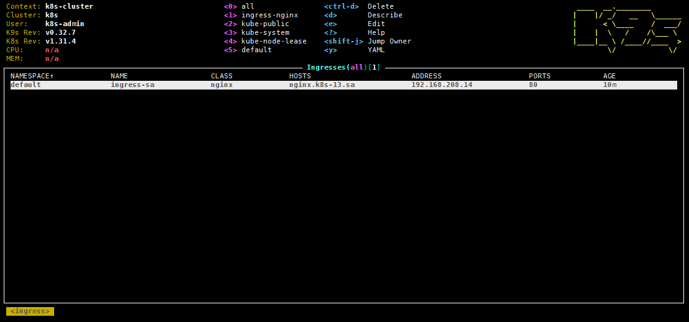

# 11.Kubernetes.Basic_objects
## Homework Assignment 1. Nginx deployment

### Deployment Configuration
```yaml
apiVersion: apps/v1
kind: Deployment
metadata:
  name: nginx-web
  labels:
    app: nginx-web
spec:
  replicas: 4
  selector:
    matchLabels:
      app: nginx-web
  template:
    metadata:
      labels:
        app: nginx-web
    spec:
      containers:
      - name: nginx-web
        image: nginx:latest
        ports:
        - containerPort: 80
        resources:
          requests:
            memory: "64Mi"
            cpu: "250m"
          limits:
            memory: "128Mi"
            cpu: "500m"
        livenessProbe:
          httpGet:
            path: /
            port: 80
          initialDelaySeconds: 20
          periodSeconds: 30
        readinessProbe:
          httpGet:
            path: /
            port: 80
          initialDelaySeconds: 20
          periodSeconds: 10
---
apiVersion: v1
kind: Service
metadata:
  name: nginx-web-service
spec:
  selector:
    app: nginx-web
  ports:
  - port: 80
    targetPort: 80
---
apiVersion: networking.k8s.io/v1
kind: Ingress
metadata:
  name: ingress-sa
  annotations:
    nginx.ingress.kubernetes.io/server-alias: "nginx.k8s-14.sa"
spec:
  ingressClassName: nginx
  rules:
    - host: nginx.k8s-13.sa
      http:
        paths:
          - path: /
            pathType: Prefix
            backend:
              service:
                name: nginx-web-service
                port:
                  number: 80
```
### Links to manifests:
- [nginx-deploy.yaml](./nginx-deploy.yaml)
- [ingress-controller.yaml](./ingress-controller.yaml)

### NGINX availability check in the browser"



### Pods of nginx-web deployment



### Ingress


