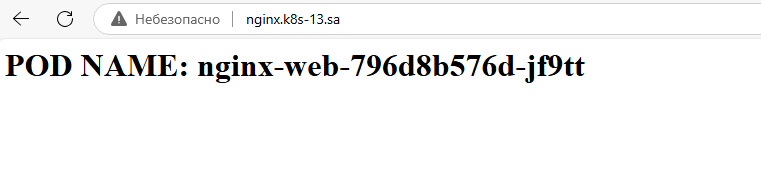
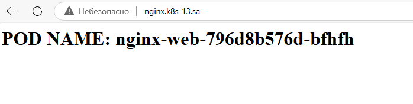
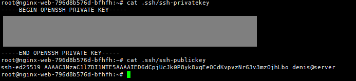

# 12. Kubernetes. Data. Security
## Homework Assignment 1. Config maps and secrets

### Generating an index.html file inside the init container that displays the pod's hostname as a first-level header.
[Link to the manifest from the previous homework assignment](../11.Kubernetes.Basic_objects/nginx-deploy.yaml)

#### Creating Init Container for index.html
```yaml
initContainers:
  - name: generate-index
    image: busybox:1.36
    command: ['sh', '-c', 'echo "<h1>POD NAME: $HOSTNAME</h1>" > /tmp/index.html']
    volumeMounts:
    - name: sharing
      mountPath: "/tmp"
      subPath: "index.html"
```
#### Mounting the generated index.html file 
```yaml
volumeMounts:
- name: sharing
  mountPath: "/usr/share/nginx/html/"
  subPath: "index.html"
```
#### Adding the volume
```yaml
volumes:
- name: sharing
  emptyDir: {}
```

#### Verifying Pod Hostname in Browser




### Generating pair public and private keys and add them to the pod for user root as secrets, please use sealsecret object for that

#### Installation sealed-secrets
```shell
wget https://github.com/bitnami-labs/sealed-secrets/releases/download/v0.28.0/controller.yaml
kubectl apply -f controller.yaml
curl -OL "https://github.com/bitnami-labs/sealed-secrets/releases/download/v0.28.0/kubeseal-0.28.0-linux-amd64.tar.gz"
tar -xvzf kubeseal-0.28.0-linux-amd64.tar.gz kubeseal
sudo install -m 755 kubeseal /usr/local/bin/kubeseal
```
#### Generating pair public and private keys
```shell
ssh-keygen -f hw_12 -N ""
```
#### Сreating the SealedSecret object
```shell
nano ssh-secret.yaml
cat ssh-secret.yaml | kubeseal --format yaml >  sealed_secret_ssh.yaml
kubectl apply -f sealed_secret_ssh.yaml
```

#### Mounting the secret file 
```yaml
volumeMounts:
- name: ssh-keys
  mountPath: "/root/.ssh"
  readOnly: true
```
#### Adding the volume
```yaml
volumes:
- name: ssh-keys
  secret:
    secretName: secret-ssh-key
```
#### Validating SSH Key Inside the Pod



#### List of links:
- [Final deployment manifest](./nginx-deploy.yaml)
- [Secret](./ssh-secret.yaml)
- [SealedSecret](./sealed_secret_ssh.yaml)
