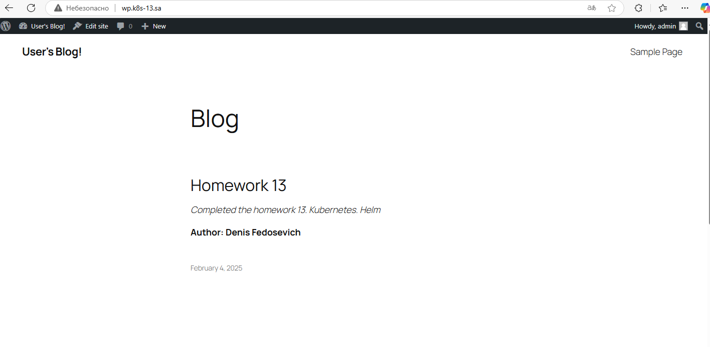
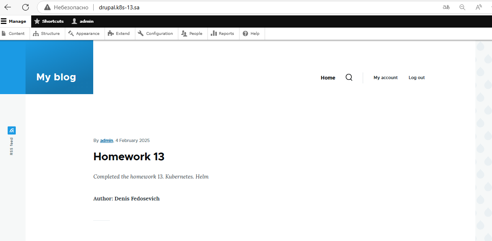

# 13. Kubernetes. Helm
## Homework Assignment 1. Application deployment by Helm
### Installing Helm
```shell
curl -fsSL -o get_helm.sh https://raw.githubusercontent.com/helm/helm/main/scripts/get-helm-3
chmod 700 get_helm.sh
./get_helm.sh
```

### Deploying NFS Subdirectory External Provisioner using a Helm chart
```shell
helm repo add nfs-subdir-external-provisioner https://kubernetes-sigs.github.io/nfs-subdir-external-provisioner/
helm install nfs-subdir-external-provisioner nfs-subdir-external-provisioner/nfs-subdir-external-provisioner \
    --set nfs.server=192.168.37.105 \
    --set nfs.path=/mnt/IT-Academy/nfs-data/sa2-30-24/denis_f
kubectl get storageclass
NAME         PROVISIONER                                     RECLAIMPOLICY   VOLUMEBINDINGMODE   ALLOWVOLUMEEXPANSION   AGE
nfs-client   cluster.local/nfs-subdir-external-provisioner   Delete          Immediate           true                   2m51s
```

### Deploying Wordpress using a Helm chart
```shell
helm install my-wordpress \
  --set wordpressUsername=admin \
  --set wordpressPassword=admin \
  --set service.type=ClusterIP \
  --set ingress.enabled=true \
  --set ingress.ingressClassName=nginx \
  --set ingress.hostname=wp.k8s-13.sa \
  --set persistence.accessMode=ReadWriteMany \
  --set persistence.size=1Gi \
  --set persistence.storageClass=nfs-client \
  --set mariadb.primary.persistence.size=1Gi \
  --set mariadb.primary.persistence.storageClass=nfs-client \
  oci://registry-1.docker.io/bitnamicharts/wordpress
```

### Deploying Drupal using a Helm chart
```shell
helm install drupal \
  --set drupalUsername=admin \
  --set drupalPassword=admin \
  --set persistence.storageClass=nfs-client \
  --set persistence.accessModes={ReadWriteMany} \
  --set persistence.size=1Gi \
  --set service.type=ClusterIP \
  --set ingress.enabled=true \
  --set ingress.ingressClassName=nginx \
  --set ingress.hostname=drupal.k8s-13.sa \
  --set mariadb.primary.persistence.storageClass=nfs-client \
  --set mariadb.primary.persistence.accessModes={ReadWriteMany} \
  --set mariadb.primary.persistence.size=1Gi \
  oci://registry-1.docker.io/bitnamicharts/drupal
```

### Checking my articles in the browser
**Wordpress**



**Drupal**


