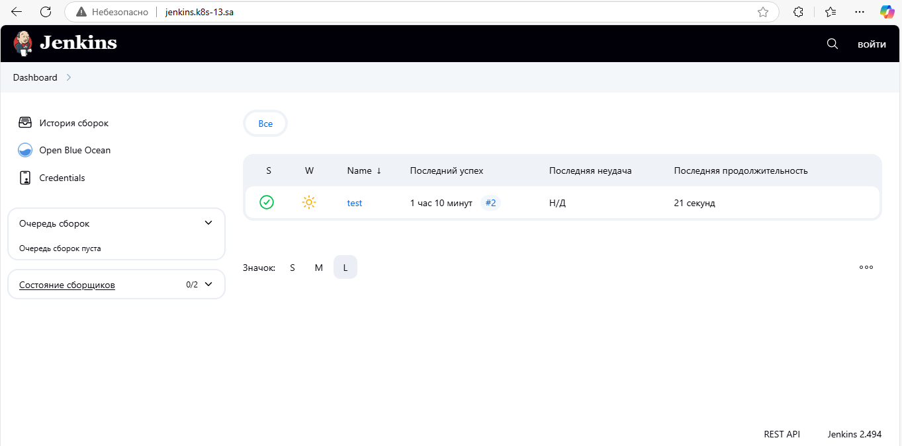

# 14. Kubernetes application deployment

## Homework Assignment 1. Transform Jenkins deployment to Helm

**1. Creating a Helm Chart for Jenkins**
```shell
$ helm create jenkins
```
**2. Packaging the Helm Chart after Template and Values Configuration**
```shell
$ helm package jenkins
```
**3. Installing the Helm Chart**
```shell
$ helm install jenkins ./helm-sources/jenkins/ --namespace ci-cd --dry-run
$ helm install jenkins ./helm-sources/jenkins/ --namespace ci-cd --create-namespace
```
**4. Adding a Helm Repository**
```shell
$ git add .
$ git commit -m "Init commit"
$ git push
$ helm repo add helm-repo https://fedos1993.github.io/helm-repo/
$ helm repo update
$ helm search repo
NAME                                              	CHART VERSION	APP VERSION	DESCRIPTION
helm-repo/jenkins                                 	0.1.0        	1.16.0     	A Helm chart for Kubernetes
nfs-subdir-external-provisioner/nfs-subdir-exte...	4.0.18       	4.0.2      	nfs-subdir-external-provisioner is an automatic...
```
**5. Packaging a New Version of the Helm Chart**
```shell
$ helm package helm-sources/jenkins/
Successfully packaged chart and saved it to: /home/denis/14.Kubernetes_application_deployment/jenkins-0.2.0.tgz
$ helm list --all-namespaces
NAME                           	NAMESPACE	REVISION	UPDATED                                	STATUS  	CHART                                 	APP VERSION
drupal                         	default  	1       	2025-02-03 19:45:27.58699954 +0000 UTC 	deployed	drupal-21.1.2                         	11.1.1
jenkins                        	ci-cd    	1       	2025-02-08 19:07:26.148272993 +0000 UTC	deployed	jenkins-0.1.0                         	1.16.0
my-wordpress                   	default  	1       	2025-02-04 09:05:19.834955141 +0000 UTC	deployed	wordpress-24.1.9                      	6.7.1
nfs-subdir-external-provisioner	default  	1       	2025-02-02 18:59:33.079642519 +0000 UTC	deployed	nfs-subdir-external-provisioner-4.0.18	4.0.2
```
**6. Updating the index.yaml file**
```shell
$ helm repo index --url "https://fedos1993.github.io/helm-repo" --merge index.yaml .
$ cat index.yaml
apiVersion: v1
entries:
  jenkins:
  - apiVersion: v2
    appVersion: 1.16.0
    created: "2025-02-08T20:03:41.776918813Z"
    description: A Helm chart for Kubernetes
    digest: 4386e26b1a8be7cd9890424bcd538cbe4c58ce33509fe0bdffd293fd4f17bc8d
    name: jenkins
    type: application
    urls:
    - https://fedos1993.github.io/helm-repo/helm-releases/jenkins-0.2.0.tgz
    version: 0.2.0
  - apiVersion: v2
    appVersion: 1.16.0
    created: "2025-02-08T20:03:41.775330555Z"
    description: A Helm chart for Kubernetes
    digest: 2e2c33f61b0f77a20202148f270e963108c512b475f6812031f9f2c9c4dc618a
    name: jenkins
    type: application
    urls:
    - https://fedos1993.github.io/helm-repo/helm-releases/jenkins-0.1.0.tgz
    version: 0.1.0
generated: "2025-02-08T20:03:41.773509984Z"
```
**7. Updating the Repository and Pushing the New Version**
```shell
$ git add .
$ git commit -m "Add version 0.2.0"
$ git push
$ helm repo update
$ helm search repo
NAME                                              	CHART VERSION	APP VERSION	DESCRIPTION
helm-repo/jenkins                                 	0.2.0        	1.16.0     	A Helm chart for Kubernetes
nfs-subdir-external-provisioner/nfs-subdir-exte...	4.0.18       	4.0.2      	nfs-subdir-external-provisioner is an automatic...
```
**8. Upgrading the Jenkins Release to the New Version**
```shell
$ helm upgrade jenkins helm-repo/jenkins --version 0.2.0 -n ci-cd
Release "jenkins" has been upgraded. Happy Helming!
NAME: jenkins
LAST DEPLOYED: Sat Feb  8 20:33:07 2025
NAMESPACE: ci-cd
STATUS: deployed
REVISION: 2
NOTES:
1. Get the application URL by running these commands:
  http://jenkins.k8s-13.sa/

$ helm list -A
NAME                           	NAMESPACE	REVISION	UPDATED                                	STATUS  	CHART                                 	APP VERSION
drupal                         	default  	1       	2025-02-03 19:45:27.58699954 +0000 UTC 	deployed	drupal-21.1.2                         	11.1.1
jenkins                        	ci-cd    	2       	2025-02-08 20:33:07.82462707 +0000 UTC 	deployed	jenkins-0.2.0                         	1.16.0
my-wordpress                   	default  	1       	2025-02-04 09:05:19.834955141 +0000 UTC	deployed	wordpress-24.1.9                      	6.7.1
nfs-subdir-external-provisioner	default  	1       	2025-02-02 18:59:33.079642519 +0000 UTC	deployed	nfs-subdir-external-provisioner-4.0.18	4.0.2
```

**List of links:** 
- [Helm Chart Index File](https://fedos1993.github.io/helm-repo/index.yaml)
- [My Helm Repository](https://github.com/fedos1993/helm-repo)

**Checking jenkins in the browser**


