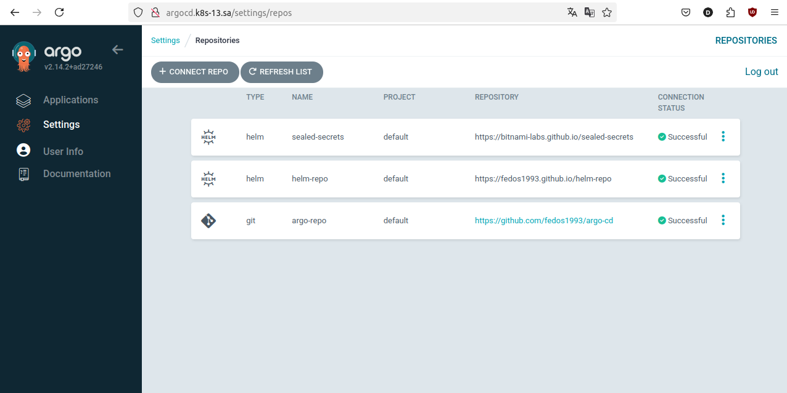
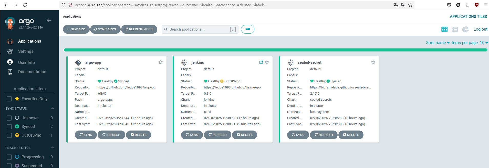
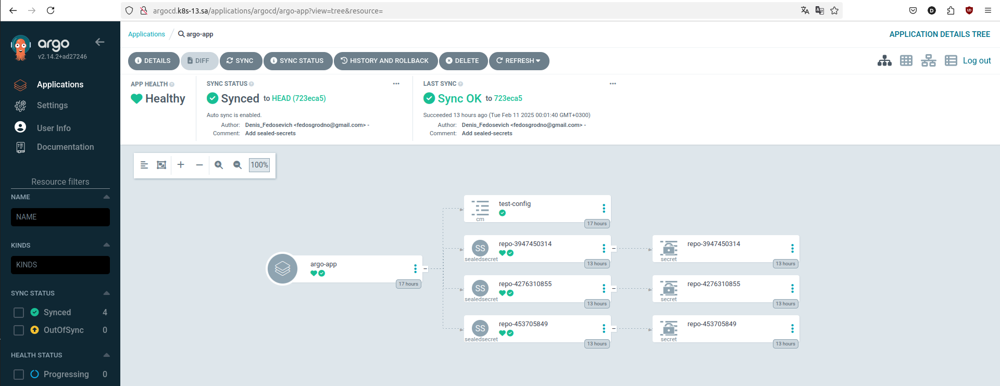

# 15. Kubernetes CI CD
## Homework Assignment 1. ArgoCD deployment and application

**List of links:**
- [My Repository ArgoCD](https://github.com/fedos1993/argo-cd)
- [My Helm Repository](https://github.com/fedos1993/helm-repo)
- [Sealed Secret object](https://github.com/fedos1993/argo-cd/tree/master/argo-apps/sealed-secrets)

### 1.Installing ArgoCD
```shell
$ wget https://raw.githubusercontent.com/argoproj/argo-cd/v2.14.2/manifests/install.yaml -O argocd-install.yaml
$ kubectl create namespace argocd
$ kubectl apply -f argo-cd-install.yaml -n argocd
```
### 2.Obtaining a password for ArgoCD
```shell
$ kubectl -n argo-cd get secret argocd-initial-admin-secret -o jsonpath="{.data.password}" | base64 -d
```
### 3.Connecting repositories
**List of connected repositories**



### 4.Creating and Deploying Applications in ArgoCD

**My Repository argo-cd**
```yaml
apiVersion: argoproj.io/v1alpha1
kind: Application
metadata:
  finalizers:
  - resources-finalizer.argocd.argoproj.io
  name: argo-app
  namespace: argocd
spec:
  destination:
    server: https://kubernetes.default.svc
  project: default
  source:
    directory:
      recurse: true
    path: argo-apps
    repoURL: https://github.com/fedos1993/argo-cd
    targetRevision: HEAD
  syncPolicy:
    automated:
      prune: true
      selfHeal: true
```
**Sealed secret controller**
```yaml
apiVersion: argoproj.io/v1alpha1
kind: Application
metadata:
  name: sealed-secret
  namespace: argocd
spec:
  destination:
    namespace: kube-system
    server: https://kubernetes.default.svc
  source:
    repoURL: https://bitnami-labs.github.io/sealed-secrets
    targetRevision: 2.17.0
    chart: sealed-secrets
    helm:
      parameters:
        - name: fullnameOverride
          value: sealed-secrets-controller
  project: default
  syncPolicy:
    automated:
      prune: true
      selfHeal: true
    syncOptions:
      - CreateNamespace=true
```
**My helm Repository**
```yaml
apiVersion: argoproj.io/v1alpha1
kind: Application
metadata:
  name: jenkins
  namespace: argocd
spec:
  project: default
  destination:
    namespace: ci-cd
    server: https://kubernetes.default.svc
  source:
    chart: jenkins
    repoURL: https://fedos1993.github.io/helm-repo
    targetRevision: 0.3.0
  syncPolicy:
    automated:
      prune: true
      selfHeal: true
    syncOptions:
    - CreateNamespace=true
```
**Deploying**
```shell
$ kubectl apply -f applications/argo-app.yaml
$ kubectl apply -f applications/sealed-secret-app.yaml
$ kubectl apply -f applications/jenkins-app.yaml
```
**List of applications managed by ArgoCD**


### 5.Retrieving and Encrypting Secrets from ArgoCD
```shell
$ kubectl get secret repo-4276310855  -n argocd -o yaml > secret-argo-repo.yaml
$ kubectl get secret repo-3947450314  -n argocd -o yaml > secret-seals-repo.yaml
$ kubectl get secret repo-453705849 -n argocd -o yaml > secret-helm-repo.yaml

$ cat secret-argo-repo.yaml | kubeseal --format yaml >  sealed_argo_repo.yaml
$ cat secret-seals-repo.yaml | kubeseal --format yaml >  sealed-seals-repo.yaml
$ cat secret-helm-repo.yaml | kubeseal --format yaml >  sealed-helm-repo.yaml
```
### 6.Deployment of Sealed Secrets objects after pushing them to a remote repository tracked by ArgoCD

**List of sealed secrets objects**

