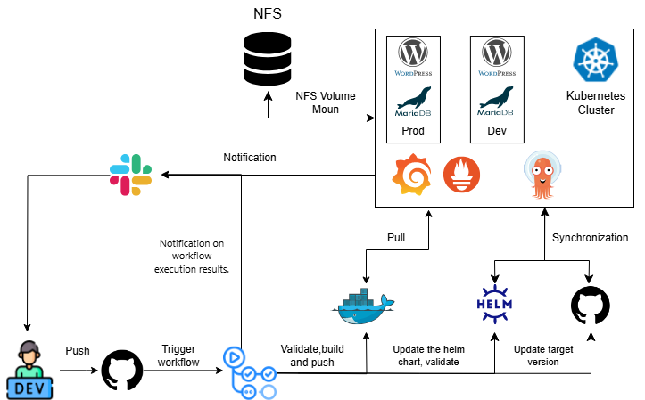

# Project Report: Automated Deployment of WordPress in Kubernetes using ArgoCD and Helm

**Project's reporter:** Denis Fedosevich

**Group number:** md-sa2-30-24

## Description of Application for Deployment

- **Name of Application:** WordPress  
- **Programming Language:** PHP  
- **Database:** MariaDB  
- **Link to GitHub Repository:** 
  - [Application](https://github.com/fedos1993/wp-project)
  - [Helm](https://github.com/fedos1993/helm-project)
  - [Argo-CD](https://github.com/fedos1993/argocd-project)
## Pipeline. High-Level Design

## Technologies Used in the Project

 **Orchestration:** Kubernetes

 **Automation Tools:** GitHub Actions, Helm, ArgoCD, Bash

 **Monitoring:** Prometheus, Alertmanager, Grafana, Loki

 **Notifications:** Slack

### CI description

The main branch contains the project description. The project uses two environments: dev for development and testing, and prod for production deployment, which correspond to the branches in the repository: dev for development and prod for production.

*Stages in the `dev` branch:*
1. A developer pushes changes to the `dev` branch.
2. GitHub Actions triggers the pipeline:
   - Assigns a new semantic tag.
   - Validates the Dockerfile.
   - Builds a Docker image with the new version.
   - Pushes the image to DockerHub.
   - Updates the Helm chart with the new tag version.
   - Validates the Helm chart.
   - Sends a notification to Slack.
   - Updates the ArgoCD manifest in the repository.
3. ArgoCD updates the `dev` environment.

*Stages in the `prod` branch:*
1. A developer creates a Pull Request from `dev` to `prod`.
2. Upon merging, GitHub Actions triggers the pipeline:
   - Determines the latest tag from `dev`.
   - Checks if the chart version exists in the Helm repository.
   - Check image in the Docker Hub
   - Updates the ArgoCD manifest.
3. ArgoCD updates the `prod` environment.

### Deployment flows short description

*Green Deployment.*
A new version of the application is deployed in the `dev` environment for testing.  
After successful validation, the changes are deployed to the `prod` environment,  
allowing the new version to be tested without impacting production.
The deployment process is automated using CI/CD pipelines in **GitHub Actions**.  
The application can be deployed from scratch.

*ArgoCD.*
Deployment is managed using **ArgoCD**, which monitors two repositories:  
- The **Helm charts repository**  
- The **ArgoCD manifests repository**  
When changes are made to the repositories, **ArgoCD** automatically updates the configuration  
and deploys the new application version.

*Data Persistence.*
The **MariaDB** database, **WordPress** files, and user data  
are stored in a **Persistent Volume Claim (PVC)** using **NFS storage**.  
This ensures data persistence during updates  
while maintaining the same content across different application versions.

### Rollback flow description and implementation

*Rollback Triggers:* 
- Rollback is performed manually in case of critical errors in the production environment.

*Rollback Implementation:*
- Rollback is done through the ArgoCD UI.
- Before rolling back, automatic synchronization must be disabled in the ArgoCD application settings.
- After disabling auto-sync, the previous stable version is selected and deployed.

*Data Persistence:*
- The MariaDB database and user files are preserved during a rollback because they are stored in a Persistent Volume Claim (PVC) backed by an NFS storage.
- This ensures that rollbacks do not result in data loss, allowing previously published content and media files to remain intact.
