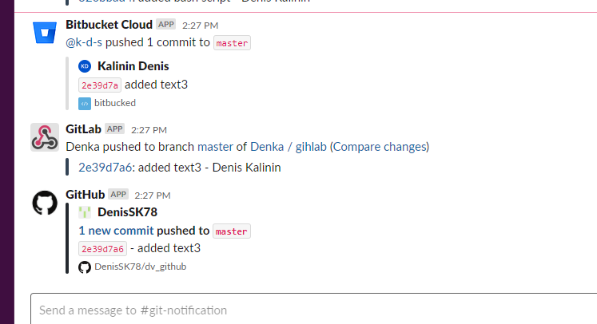
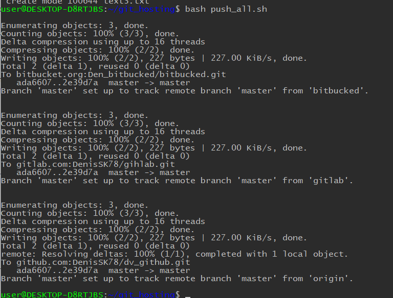

 ## Remote repositories

1) [bitbucket link](https://bitbucket.org/Den_bitbucked/bitbucked/src/master/)
2) [gitlab link](https://gitlab.com/DenisSK78/gihlab)
3) [github link](https://github.com/DenisSK78/dv_github)

## Create slack/email integration push/commit events




## Automate pushing your changes to all remote repositories
```
#!/bin/bash

arr=($(git remote))
length=${#arr[@]}

for ((i = 0; i != length; i++)); do
    echo
    git push -u "${arr[i]}" --all
    echo
done
```


