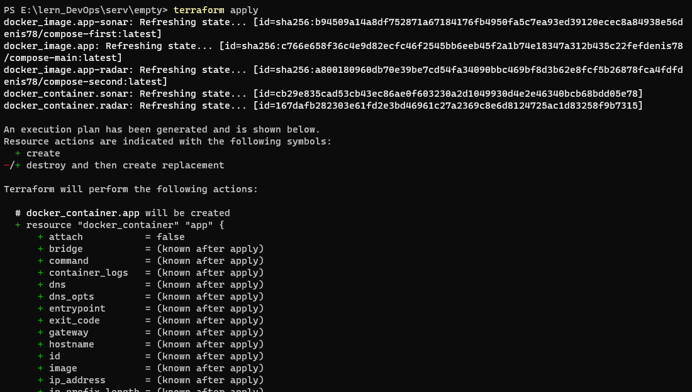
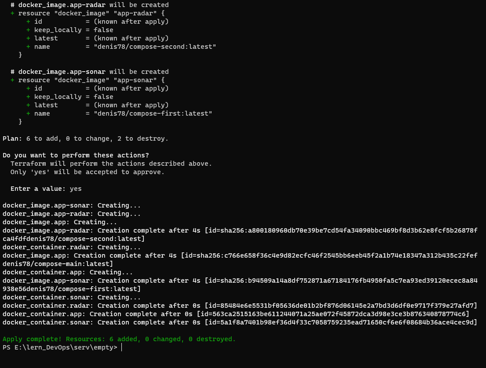

####Compose
```
version: '3.3'
services:
  app:
    image: denis78/compose-main:latest
    container_name: app
    ports:
      - "9000:9000"
    restart: unless-stopped
  sonarr:
    image: denis78/compose-first:latest
    container_name: app-sonar
    ports:
      - "9001:9001"
    restart: unless-stopped
  radarr:
    image: denis78/compose-second:latest
    container_name: app-radar
    ports:
      - "9002:9002"
    restart: unless-stopped
```
####Terraform
```
terraform {
  required_providers {
    docker = {
      source = "terraform-providers/docker"
    }
  }
}

provider "docker" {
  host    = "npipe:////.//pipe//docker_engine"
}

resource "docker_image" "app" {
  name = "denis78/compose-main:latest"
  keep_locally = false
}
resource "docker_image" "app-sonar" {
  name = "denis78/compose-first:latest"
  keep_locally = false
}
resource "docker_image" "app-radar" {
  name = "denis78/compose-second:latest"
  keep_locally = false
}

resource "docker_container" "app" {
  image = docker_image.app.latest
  name  = "app"
  restart = "always"
  ports {
    internal = 9000
    external = 9000
  }
}

resource "docker_container" "sonar" {
  image = docker_image.app-sonar.latest
  name  = "sonar"
  restart = "always"
  ports {
    internal = 9001
    external = 9001
  }
}

resource "docker_container" "radar" {
  image = docker_image.app-radar.latest
  name  = "radar"
  restart = "always"
  ports {
    internal = 9002
    external = 9002
  }
}
```
####Terraform start output

####Terraform finish output

