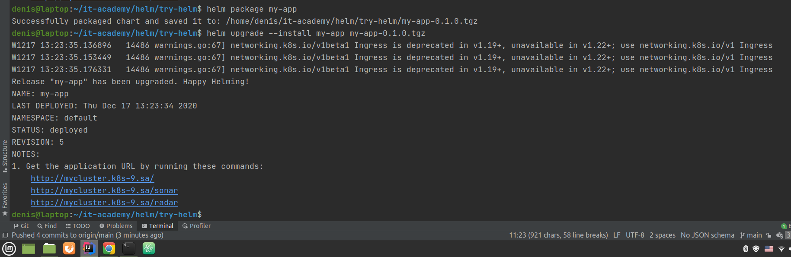

####My-cluster.yaml
```
---
apiVersion: apps/v1
kind: Deployment
metadata:
  namespace: training-project
  name: mycluster
  labels:
    app: my-app
spec:
  replicas: 2
  selector:
    matchLabels:
      app: my-app
  template:
    metadata:
      labels:
        app: my-app
    spec:
      containers:
      - name: app
        image: denis78/compose-main
        ports:
        - containerPort: 9000
        resources:
          requests:
            cpu: 200m
            memory: 200Mi
          limits:
            cpu: 400m
            memory: 300Mi
      - name: app-sonar
        image: denis78/compose-first
        ports:
        - containerPort: 9001
        resources:
          requests:
            cpu: 200m
            memory: 200Mi
          limits:
            cpu: 400m
            memory: 300Mi
      - name: app-radar
        image: denis78/compose-second
        ports:
        - containerPort: 9002
        resources:
          requests:
            cpu: 200m
            memory: 200Mi
          limits:
            cpu: 400m
            memory: 300Mi
---
apiVersion: v1
kind: Service
metadata:
  namespace: training-project
  name: my-app-service
  labels:
    app: my-app-service
spec:
  type: LoadBalancer
  selector:
    app: my-app
  ports:
  - port: 80
    name: app
    targetPort: 9000
    protocol: TCP
  - port: 9001
    name: sonar
    targetPort: 9001
    protocol: TCP
  - port: 9002
    name: radar
    targetPort: 9002
    protocol: TCP
---
apiVersion: extensions/v1beta1
kind: Ingress
metadata:
  namespace: training-project
  name: ingress-sa
spec:
  backend:
    serviceName: default-http-backend
    servicePort: 80
  rules:
  - host: mycluster.k8s-9.sa
    http:
      paths:
      - path: /
        backend:
          serviceName: my-app-service
          servicePort: 9000
      - path: /sonarh
        backend:
          serviceName: my-app-service
          servicePort: 9001
      - path: /radar
        backend:
          serviceName: my-app-service
          servicePort: 9002
```
####Helm.values
```
replicaCount: 2

imagePullSecrets: []
nameOverride: ""
fullnameOverride: ""

serviceAccount:
  create: true
  annotations: {}
  name: my-app-service
podAnnotations: {}
podSecurityContext: {}
securityContext: {}

service:
  type: LoadBalancer

ingress:
  enabled: true
  annotations:
     kubernetes.io/ingress.class: nginx
  hosts:
    - host: mycluster.k8s-9.sa

  tls: []
resources:
  limits:
    cpu: 300m
    memory: 300Mi
  requests:
    cpu: 200m
    memory: 200Mi

pullPolicy: IfNotPresent

microservices:
  - name: app
    port: 80
    targetPort: 9000
    path: "/"
    imege: "denis78/compose-main:latest"
  - name: sonar
    port: 9001
    targetPort: 9001
    path: "/sonar"
    imege: "denis78/compose-first:latest"
  - name: radar
    port: 9002
    targetPort: 9002
    path: "/radar"
    imege: "denis78/compose-second:latest"

autoscaling:
  enabled: false

nodeSelector: {}
tolerations: []
affinity: {}
```
