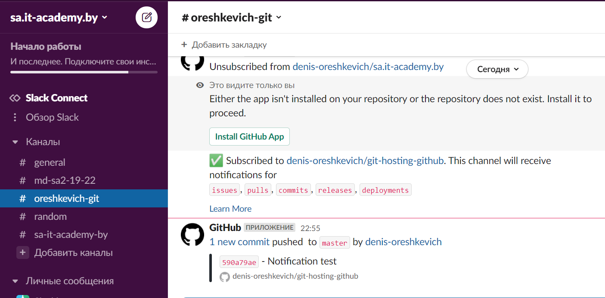

## 03.GIT.Hosting

### Commands
``` bash
  295  git remote add origin-github git@github.com:denis-oreshkevich/git-hosting-github.git
  296  git push origin-github
  297* git push --hel
  298  git push -f origin-github
  299  git push -all origin-github
  300  git push --all origin-github
  301  git remote add origin-gitlab git@gitlab.com:denis-oreshkevich/git-hosting-gitlab.git
  302  git push --all origin-gitlab
  303  git pull origin-gitlab
  304* git pull
  305  git pull origin-gitlab
  306  git fetch origin-gitlab
  307  git remote add origin-bitbucket git@bitbucket.org:denis-oreshkevich/git-hosting-bitbucket.git
  308  git push --all origin-bitbucket
  309  touch .gitignore
  310  vim .gitignore
  311  touch git-push-script.sh
  312  history
  313  vim git-push-script.sh
  314  chmod +x git-push-script.sh
  315  git status
  316  git add .gitignore
  317  vim .gitignore
  318  vim .gitignore
  319  git status
  320  git add .gitignore
  321  git commit -m "gitignore"
  322  ls
  323  ./git-push-script.sh
```

### Repositories
1. [Github](https://github.com/denis-oreshkevich/git-hosting-github)
2. [GitLab](https://gitlab.com/denis-oreshkevich/git-hosting-gitlab)
3. [Bitbucket](https://bitbucket.org/denis-oreshkevich/git-hosting-bitbucket/src)

### Slack channel
[#oreshkevich-git](https://sa-itacademy-by.slack.com/archives/C02UTKCPZU5)


### Push script
``` bash
#!/bin/bash

git push origin-github
git push origin-gitlab
git push origin-bitbucket
```
