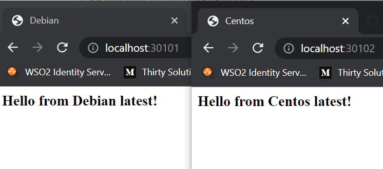

## 05.Vagrant

### Debian Vagrantfile
```ruby
Vagrant.configure("2") do |config|
  config.vm.define "host1" do |debian|
    config.vm.box = "debian/bullseye64"
    debian.vm.network "forwarded_port", guest: 80, host: 30101
    debian.vm.network "private_network", ip: "192.168.94.211"
    debian.vm.provider "virtualbox" do |vb|
       vb.gui = false
       vb.memory = "1024"
    end
    debian.vm.provision "shell", inline: <<-SHELL
      apt-get update
      apt-get install -y vim git wget curl nginx
      systemctl enable nginx
      systemctl start nginx
      echo "<html><head><title>Debian</title></head><body><h3>Hello from Debian latest!</h3></body></html>" > /var/www/html/index.html
    SHELL
  end
end

```

### Centos Vagrantfile
```ruby
$script = <<-SCRIPT
yum update
yum install -y vim git wget curl nginx
systemctl enable nginx
systemctl start nginx
echo "<html><head><title>Centos</title></head><body><h3>Hello from Centos latest!</h3></body></html>" > /usr/share/nginx/html/index.html
SCRIPT


Vagrant.configure("2") do |config|
  config.vm.define "host2" do |centos|
    centos.vm.box = "centos/8"
    centos.vm.network "forwarded_port", guest: 80, host: 30102
    centos.vm.network "private_network", ip: "192.168.94.212"
    centos.vm.provider "virtualbox" do |vb|
       vb.gui = false
       vb.memory = "1024"
    end
    centos.vm.provision "shell",
        inline: $script
  end
end

```

### Browser screenshot


### Vagrant boxes
1. https://app.vagrantup.com/denis-oreshkevich/boxes/debian-nginx

2. https://app.vagrantup.com/denis-oreshkevich/boxes/centos-nginx
