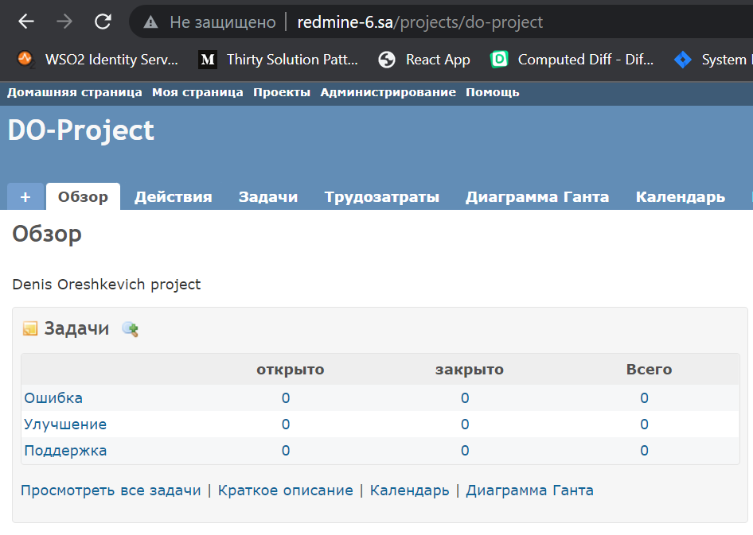

## 08.Ansible.Workshop

### Screenshot


### Console

```log
vagrant@vagrant:~/ansible$ ansible-playbook -i inv.yaml redmine_hw.yaml

PLAY [redmine] ************************************************************************************

TASK [Gathering Facts] ****************************************************************************
Monday 07 February 2022  15:48:49 +0000 (0:00:00.018)       0:00:00.018 *******
ok: [redmine]

TASK [debug] **************************************************************************************
Monday 07 February 2022  15:48:52 +0000 (0:00:03.074)       0:00:03.093 *******
ok: [redmine] => {
    "msg": "192.168.201.6"
}

TASK [Redmine. Install packages] ******************************************************************
Monday 07 February 2022  15:48:52 +0000 (0:00:00.035)       0:00:03.128 *******
ok: [redmine]

TASK [mysql : mysql_db] ***************************************************************************
Monday 07 February 2022  15:48:54 +0000 (0:00:01.984)       0:00:05.113 *******
ok: [redmine]

TASK [mysql : mysql_user] *************************************************************************
Monday 07 February 2022  15:48:55 +0000 (0:00:00.910)       0:00:06.023 *******
ok: [redmine]

TASK [redmine_hw : Redmine. Clone repository] *****************************************************
Monday 07 February 2022  15:48:56 +0000 (0:00:00.897)       0:00:06.920 *******
ok: [redmine]

TASK [redmine_hw : Redmine. Change permissions] ***************************************************
Monday 07 February 2022  15:48:57 +0000 (0:00:01.023)       0:00:07.944 *******
ok: [redmine]

TASK [redmine_hw : Redmine. Change permissions] ***************************************************
Monday 07 February 2022  15:48:58 +0000 (0:00:01.011)       0:00:08.955 *******
ok: [redmine]

TASK [redmine_hw : Config database] ***************************************************************
Monday 07 February 2022  15:48:59 +0000 (0:00:00.644)       0:00:09.599 *******
ok: [redmine]

TASK [redmine_hw : Redmine. Setup 01] *************************************************************
Monday 07 February 2022  15:49:00 +0000 (0:00:01.484)       0:00:11.084 *******
changed: [redmine]

TASK [redmine_hw : Session store secret generation] ***********************************************
Monday 07 February 2022  15:49:05 +0000 (0:00:05.160)       0:00:16.244 *******
ok: [redmine]

TASK [redmine_hw : Redmine. Setup 02] *************************************************************
Monday 07 February 2022  15:49:06 +0000 (0:00:00.678)       0:00:16.923 *******
changed: [redmine]

TASK [redmine_hw : Configuration files for virtualhost] *******************************************
Monday 07 February 2022  15:49:17 +0000 (0:00:10.821)       0:00:27.744 *******
ok: [redmine]

TASK [redmine_hw : meta] **************************************************************************
Monday 07 February 2022  15:49:18 +0000 (0:00:01.009)       0:00:28.754 *******

TASK [Add redmine-6.sa to host file] **************************************************************
Monday 07 February 2022  15:49:18 +0000 (0:00:00.090)       0:00:28.844 *******
changed: [redmine]

TASK [uri] ****************************************************************************************
Monday 07 February 2022  15:49:19 +0000 (0:00:00.687)       0:00:29.532 *******
ok: [redmine]

TASK [lineinfile] *********************************************************************************
Monday 07 February 2022  15:49:20 +0000 (0:00:00.971)       0:00:30.503 *******
changed: [redmine]

PLAY RECAP ****************************************************************************************
redmine                    : ok=16   changed=4    unreachable=0    failed=0    skipped=0    rescued=0    ignored=0

Monday 07 February 2022  15:49:20 +0000 (0:00:00.780)       0:00:31.284 *******
===============================================================================
redmine_hw : Redmine. Setup 02 ------------------------------------------------------------ 10.82s
redmine_hw : Redmine. Setup 01 ------------------------------------------------------------- 5.16s
Gathering Facts ---------------------------------------------------------------------------- 3.07s
Redmine. Install packages ------------------------------------------------------------------ 1.98s
redmine_hw : Config database --------------------------------------------------------------- 1.48s
redmine_hw : Redmine. Clone repository ----------------------------------------------------- 1.02s
redmine_hw : Redmine. Change permissions --------------------------------------------------- 1.01s
redmine_hw : Configuration files for virtualhost ------------------------------------------- 1.01s
uri ---------------------------------------------------------------------------------------- 0.97s
mysql : mysql_db --------------------------------------------------------------------------- 0.91s
mysql : mysql_user ------------------------------------------------------------------------- 0.90s
lineinfile --------------------------------------------------------------------------------- 0.78s
Add redmine-6.sa to host file -------------------------------------------------------------- 0.69s
redmine_hw : Session store secret generation ----------------------------------------------- 0.68s
redmine_hw : Redmine. Change permissions --------------------------------------------------- 0.64s
redmine_hw : meta -------------------------------------------------------------------------- 0.09s
debug -------------------------------------------------------------------------------------- 0.04s
Playbook run took 0 days, 0 hours, 0 minutes, 31 seconds

```

### redmine_hw.yaml

```yaml
- hosts: redmine
  vars_files:
   - db_vars.yaml
   - package_vars.yaml
   - host_vars.yaml 
  pre_tasks:
   - debug:
      msg: "{{ ansible_host }}"

   - name: Redmine. Install packages
     apt:
      name: "{{ apt_redmine_packages }}"
      state: latest
      update_cache: yes

  roles:
    - mysql
    - redmine_hw

  post_tasks:
    - name: "Add {{ app_fqdn }} to host file"
      shell: echo "127.0.0.1       {{ app_fqdn }}" >> /etc/hosts
      tags:
       - test

    - uri:
        url: "http://{{ app_fqdn }}"
        return_content: yes
      register: this
      failed_when: "'Jean-Philippe Lang' not in this.content"
      tags:
       - test

    - lineinfile:
        path: /etc/hosts
        state: absent
        regexp: '^127.0.0.1       {{ app_fqdn }}'
      tags:
       - test
       - always

```