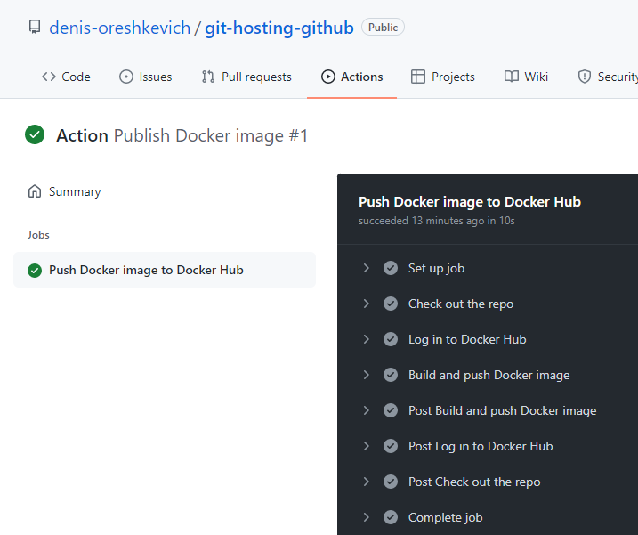

## 09.Docker

### Action file

```yaml
name: Publish Docker image

on:
  push:
    branches: [ master ]

jobs:
  push_to_registry:
    name: Push Docker image to Docker Hub
    runs-on: ubuntu-latest
    steps:
      - name: Check out the repo
        uses: actions/checkout@v2

      - name: Log in to Docker Hub
        uses: docker/login-action@v1
        with:
          username: ${{ secrets.DOCKER_USERNAME }}
          password: ${{ secrets.DOCKER_PASSWORD }}

      - name: Build and push Docker image
        uses: docker/build-push-action@v2
        with:
          context: ./docker_hw
          push: true
          tags: denisareshkevich/docker_hw:latest

```

### Action screenshot


### Demo
```log
$ docker run -p 30001:30001 --name docker_hw denisareshkevich/docker_hw
Unable to find image 'denisareshkevich/docker_hw:latest' locally
latest: Pulling from denisareshkevich/docker_hw
59bf1c3509f3: Already exists
07a400e93df3: Already exists
812206835f4c: Already exists
73342013dbd4: Already exists
27450111daa5: Already exists
10275c5f1503: Pulling fs layer
10275c5f1503: Verifying Checksum
10275c5f1503: Download complete
10275c5f1503: Pull complete
Digest: sha256:4349853a283bdcc296ae850977b6c1cffc7e3e62c9ffba6fd99771c2c4194ec6
Status: Downloaded newer image for denisareshkevich/docker_hw:latest

### 192.168.99.100 because Docker Toolbox were used

$ curl -is 192.168.99.100:30001
HTTP/1.0 200 OK
Server: SimpleHTTP/0.6 Python/3.10.2
Date: Wed, 09 Feb 2022 13:17:03 GMT
Content-type: text/html
Content-Length: 130
Last-Modified: Wed, 09 Feb 2022 13:07:07 GMT

<html>
    <head>
        <title>Docker HW</title>
    </head>
    <body>
        <h3>Hello from Docker!</h3>
    </body>
</html>

```

### Repositories

[Github](https://github.com/denis-oreshkevich/git-hosting-github)

[DockerHub](https://hub.docker.com/repository/docker/denisareshkevich/docker_hw)
