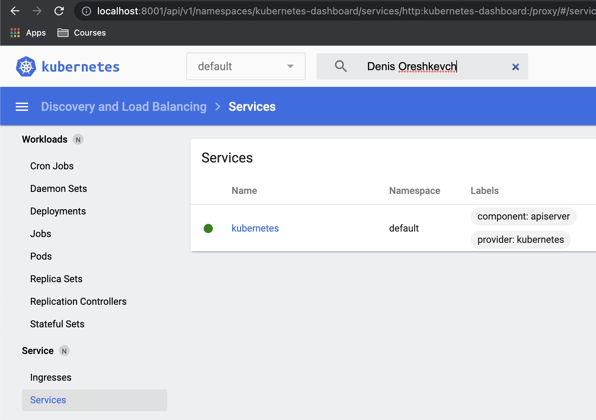

## 10.Kubernetes

### Minikube

#### History

```bash
  274  minikube version
  275  kubectl version
  276  kubectl get nodes
  277  minikube addons list
  278  minikube addons enable dashboard
  279  kubectl get services
  280  kubectl proxy --address='0.0.0.0' --disable-filter=true &
  281  minikube dashboard --url
  282  minikube addons enable ingress
  283  minikube status
  284  minikube addons list
  293  ps aux | grep "kubectl proxy"
  294  kill 21556
  295  minikube stop
  296  minikube delete
  301  minikube start --memory 6144 --cpus 4 # Run with memory and cpu
```

#### minikube addons list output

```log
courses/minikube [ minikube addons list                                                ] 4:57 PM
|-----------------------------|----------|--------------|--------------------------------|
|         ADDON NAME          | PROFILE  |    STATUS    |           MAINTAINER           |
|-----------------------------|----------|--------------|--------------------------------|
| ambassador                  | minikube | disabled     | third-party (ambassador)       |
| auto-pause                  | minikube | disabled     | google                         |
| csi-hostpath-driver         | minikube | disabled     | kubernetes                     |
| dashboard                   | minikube | enabled ✅   | kubernetes                     |
| default-storageclass        | minikube | enabled ✅   | kubernetes                     |
| efk                         | minikube | disabled     | third-party (elastic)          |
| freshpod                    | minikube | disabled     | google                         |
| gcp-auth                    | minikube | disabled     | google                         |
| gvisor                      | minikube | disabled     | google                         |
| helm-tiller                 | minikube | disabled     | third-party (helm)             |
| ingress                     | minikube | enabled ✅   | unknown (third-party)          |
| ingress-dns                 | minikube | disabled     | google                         |
| istio                       | minikube | disabled     | third-party (istio)            |
| istio-provisioner           | minikube | disabled     | third-party (istio)            |
| kubevirt                    | minikube | disabled     | third-party (kubevirt)         |
| logviewer                   | minikube | disabled     | unknown (third-party)          |
| metallb                     | minikube | disabled     | third-party (metallb)          |
| metrics-server              | minikube | disabled     | kubernetes                     |
| nvidia-driver-installer     | minikube | disabled     | google                         |
| nvidia-gpu-device-plugin    | minikube | disabled     | third-party (nvidia)           |
| olm                         | minikube | disabled     | third-party (operator          |
|                             |          |              | framework)                     |
| pod-security-policy         | minikube | disabled     | unknown (third-party)          |
| portainer                   | minikube | disabled     | portainer.io                   |
| registry                    | minikube | disabled     | google                         |
| registry-aliases            | minikube | disabled     | unknown (third-party)          |
| registry-creds              | minikube | disabled     | third-party (upmc enterprises) |
| storage-provisioner         | minikube | enabled ✅   | google                         |
| storage-provisioner-gluster | minikube | disabled     | unknown (third-party)          |
| volumesnapshots             | minikube | disabled     | kubernetes                     |
|-----------------------------|----------|--------------|--------------------------------|
```

#### Dashbord screenshot


### IT-ACADEMY environment

```log
PLAY RECAP ******************************************************************************
localhost                  : ok=4    changed=0    unreachable=0    failed=0    skipped=0    rescued=0    ignored=0
node1                      : ok=703  changed=148  unreachable=0    failed=0    skipped=1177 rescued=0    ignored=3
node2                      : ok=570  changed=117  unreachable=0    failed=0    skipped=975  rescued=0    ignored=2

Saturday 12 February 2022  18:24:30 +0000 (0:00:00.049)       0:34:45.970 *****
===============================================================================
kubernetes/preinstall : Install packages requirements --------------------------- 69.24s
kubernetes-apps/ansible : Kubernetes Apps | Lay Down CoreDNS templates ---------- 46.58s
download : download_container | Download image if required ---------------------- 45.18s
download : download_container | Download image if required ---------------------- 44.07s
download : download_container | Download image if required ---------------------- 40.67s
download : download_container | Download image if required ---------------------- 38.42s
kubernetes-apps/ansible : Kubernetes Apps | Start Resources --------------------- 35.14s
kubernetes/control-plane : kubeadm | Initialize first master -------------------- 34.09s
download : download_container | Download image if required ---------------------- 32.34s
network_plugin/calico : Calico | Create calico manifests ------------------------ 28.12s
container-engine/containerd : download_file | Download item --------------------- 27.98s
kubernetes/control-plane : Joining control plane node to the cluster. ----------- 24.06s
bootstrap-os : Assign inventory name to unconfigured hostnames (non-CoreOS, non-Flatcar, Suse and ClearLinux, non-Fedora) -- 23.68s
download : download_container | Download image if required ---------------------- 21.83s
download : download_file | Download item ---------------------------------------- 21.77s
download : download_file | Download item ---------------------------------------- 21.37s
download : download_container | Download image if required ---------------------- 20.49s
download : download_container | Download image if required ---------------------- 20.47s
container-engine/crictl : download_file | Download item ------------------------- 19.99s
download : download_file | Download item ---------------------------------------- 19.79s
```
