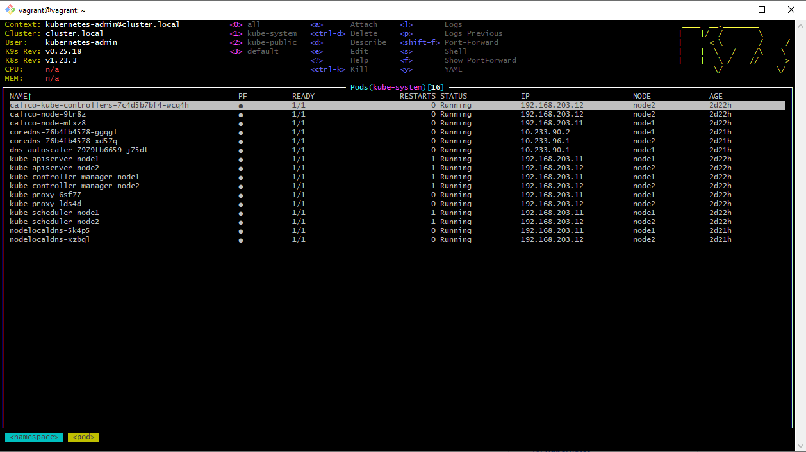

## 11. Kubernetes installation

### k9s screenshot


### kubectl config use-context demo

```log
vagrant@vagrant:~$ kubectl config get-contexts
CURRENT   NAME   CLUSTER         AUTHINFO           NAMESPACE
          k3s    default         default
*         k8s    cluster.local   kubernetes-admin

vagrant@vagrant:~$ kubectl config use-context k8s
Switched to context "k8s".

vagrant@vagrant:~$ kubectl get nodes
NAME    STATUS   ROLES                  AGE    VERSION
node1   Ready    control-plane,master   3d1h   v1.23.3
node2   Ready    control-plane,master   3d1h   v1.23.3

vagrant@vagrant:~$ kubectl config use-context k3s
Switched to context "k3s".

vagrant@vagrant:~$ kubectl get nodes
NAME       STATUS   ROLES                  AGE   VERSION
debian10   Ready    control-plane,master   25h   v1.22.6+k3s1
```

### kubectl config view

```yaml
apiVersion: v1
clusters:
- cluster:
    certificate-authority-data: DATA+OMITTED
    server: https://192.168.203.11:6443
  name: cluster.local
- cluster:
    certificate-authority-data: DATA+OMITTED
    server: https://192.168.203.30:6443
  name: default
contexts:
- context:
    cluster: default
    user: default
  name: k3s
- context:
    cluster: cluster.local
    user: kubernetes-admin
  name: k8s
current-context: k8s
kind: Config
preferences: {}
users:
- name: default
  user:
    client-certificate-data: REDACTED
    client-key-data: REDACTED
- name: kubernetes-admin
  user:
    client-certificate-data: REDACTED
    client-key-data: REDACTED
```
