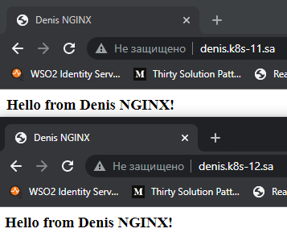

## 12. Kubernetes. First deployment

### Screenshot


### Console
```log
vagrant@vagrant:~/first_deploy$ kubectl get ns
NAME              STATUS   AGE
default           Active   7d20h
ingress-nginx     Active   30m
kube-node-lease   Active   7d20h
kube-public       Active   7d20h
kube-system       Active   7d20h
vagrant@vagrant:~/first_deploy$ kubectl get pods -n ingress-nginx
NAME                                       READY   STATUS      RESTARTS   AGE
ingress-nginx-admission-create-25k4s       0/1     Completed   0          31m
ingress-nginx-admission-patch-2r4k2        0/1     Completed   0          31m
ingress-nginx-controller-f9d6fc8d8-fvcnc   1/1     Running     0          31m
vagrant@vagrant:~/first_deploy$ kubectl get pods -n default
NAME                                READY   STATUS    RESTARTS   AGE
nginx-deployment-79fcfcf567-22pn9   1/1     Running   0          161m
nginx-deployment-79fcfcf567-lrwtb   1/1     Running   0          161m
nginx-deployment-79fcfcf567-mv769   1/1     Running   0          161m
```

### Git Hub action

#### Secret
```yaml
---
apiVersion: v1
kind: Secret
metadata:
  name: github-secret
  namespace: gitaction
type: Opaque
stringData:
  GITHUB_PERSONAL_TOKEN: ### REAL_VALUE ###
```

#### Deployment
```yaml
---
apiVersion: apps/v1
kind: Deployment
metadata:
  name: runner
  namespace: gitaction
  labels:
    app: runner
spec:
  replicas: 1
  selector:
    matchLabels:
      app: runner
  template:
    metadata:
      labels:
        app: runner
    spec:
      containers:
      - name: runner
        image: denisareshkevich/runner:latest
        resources:
          requests:
            cpu: 500m
            memory: 1000Mi
          limits:
            cpu: 1000m
            memory: 1200Mi
        env:
        - name: GITHUB_OWNER
          value: denis-oreshkevich
        - name: GITHUB_REPOSITORY
          value: git-hosting-github
        - name: GITHUB_PERSONAL_TOKEN
          valueFrom:
            secretKeyRef:
              name: github-secret
              key: GITHUB_PERSONAL_TOKEN
```
#### Demo
```log
vagrant@vagrant:~/first_deploy/github-runner$ kubectl logs  -n gitaction runner-67fcffd7fb-5sbhw
Requesting registration URL at 'https://api.github.com/repos/denis-oreshkevich/git-hosting-github/actions/runners/registration-token'

--------------------------------------------------------------------------------
|        ____ _ _   _   _       _          _        _   _                      |
|       / ___(_) |_| | | |_   _| |__      / \   ___| |_(_) ___  _ __  ___      |
|      | |  _| | __| |_| | | | | '_ \    / _ \ / __| __| |/ _ \| '_ \/ __|     |
|      | |_| | | |_|  _  | |_| | |_) |  / ___ \ (__| |_| | (_) | | | \__ \     |
|       \____|_|\__|_| |_|\__,_|_.__/  /_/   \_\___|\__|_|\___/|_| |_|___/     |
|                                                                              |
|                       Self-hosted runner registration                        |
|                                                                              |
--------------------------------------------------------------------------------

# Authentication


√ Connected to GitHub

# Runner Registration


√ Runner successfully added
√ Runner connection is good

# Runner settings


√ Settings Saved.


√ Connected to GitHub

Current runner version: '2.287.1'
2022-02-22 21:58:05Z: Listening for Jobs
2022-02-22 21:58:27Z: Running job: HELLO
2022-02-22 21:58:33Z: Job HELLO completed with result: Succeeded

```
