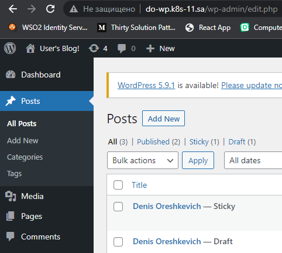
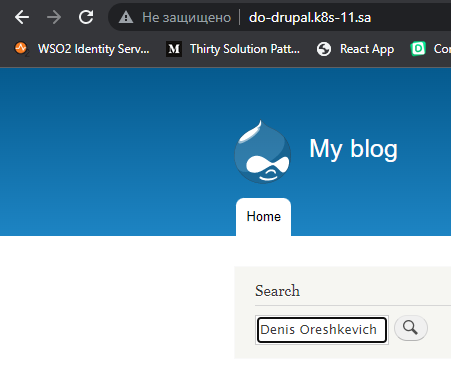

## 13. Kubernetes. Helm

### Screenshot wordress


### Screenshot drupal


### Comands
```bash
kubectl create namespace wordpress

helm install nfs-subdir-external-provisioner nfs-subdir-external-provisioner/nfs-subdir-external-provisioner \
--set nfs.server=192.168.37.105 \
--set nfs.path=/mnt/IT-Academy/nfs-data/sa2-19-22/Denis_Oreshkevich/wordpress \
--set storageClass.accessModes=ReadWriteMany

helm install -n wordpress do-wp --set global.storageClass=nfs-client,\
wordpressUsername=admin,\
wordpressPassword=admin,\
service.type=ClusterIP,\
ingress.enabled=true,ingress.ingressClassName=nginx,\
ingress.hostname=do-wp.k8s-11.sa,\
ingress.pathType=Prefix,ingress.path="/" \
bitnami/wordpress

kubectl create namespace drupal

helm install drupal-nfs-subdir-external-provisioner nfs-subdir-external-provisioner/nfs-subdir-external-provisioner \
--set nfs.server=192.168.37.105 \
--set nfs.path=/mnt/IT-Academy/nfs-data/sa2-19-22/Denis_Oreshkevich/drupal \
--set storageClass.accessModes=ReadWriteMany \
--set storageClass.name=drupal-nfs-client

helm install -n drupal do-drupal --set global.storageClass=drupal-nfs-client,\
drupalUsername=admin,\
drupalPassword=admin,\
service.type=ClusterIP,\
ingress.enabled=true,ingress.ingressClassName=nginx,\
ingress.hostname=do-drupal.k8s-11.sa,\
ingress.pathType=Prefix,ingress.path="/" \
bitnami/drupal
```
