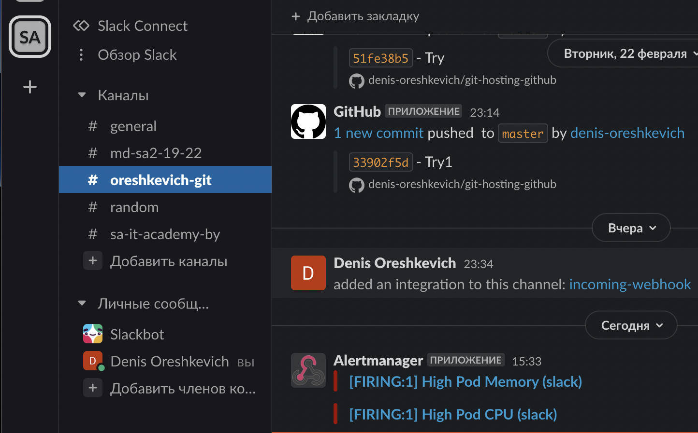
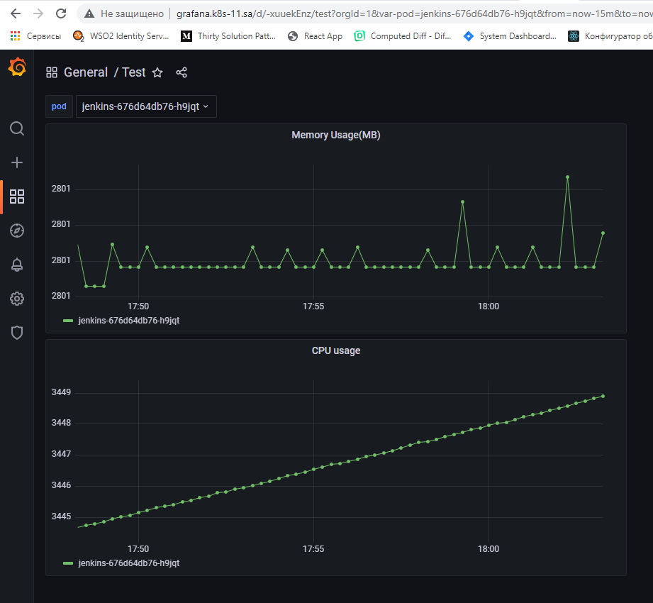

## 15. Technical and service monitoring

### Screenshot prometheus


### Screenshot alert (slack)


### Screenshot grafana dashboard


### Queries
```sql
sum(container_cpu_usage_seconds_total{pod="$pod",job="kubernetes-cadvisor"}) by (pod)

sum(container_memory_usage_bytes{pod="$pod",job="kubernetes-cadvisor"} / 1000000) by (pod)
```
