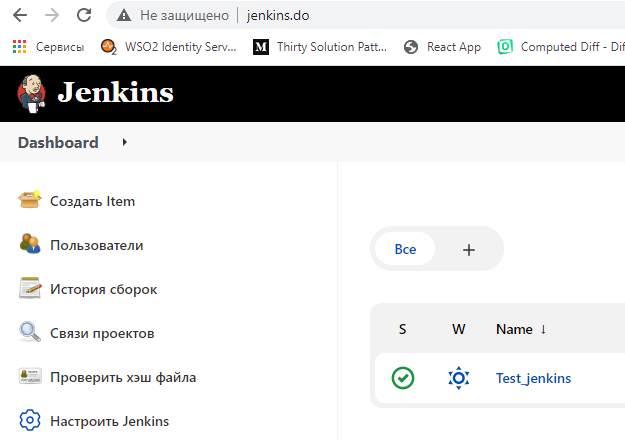
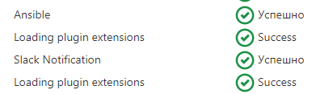
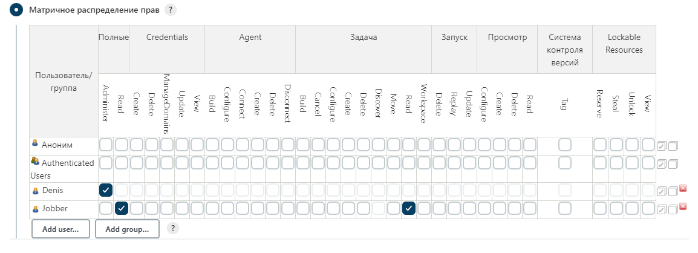

## 18. Jenkins. Start

### Jenkins

#### Jenkins screenshot


#### Nodes screenshot


#### Plugins screenshot


#### Roles screenshot


### Nginx

#### Commands
```bash
yum install epel-release
sudo yum install nginx
setsebool -P httpd_can_network_connect 1
systemctl start nginx
systemctl enable nginx
```

#### /etc/nginx/conf.d/jenkins.conf
```
upstream jenkins {
  server 127.0.0.1:8080 fail_timeout=0;
}

server {
  listen 80;
  server_name jenkins.do;

  location / {
    proxy_set_header        Host $host:$server_port;
    proxy_set_header        X-Real-IP $remote_addr;
    proxy_set_header        X-Forwarded-For $proxy_add_x_forwarded_for;
    proxy_set_header        X-Forwarded-Proto $scheme;
    proxy_redirect          http://127.0.0.1:8080 http://jenkins.do;
    proxy_pass              http://127.0.0.1:8080;
  }
}
