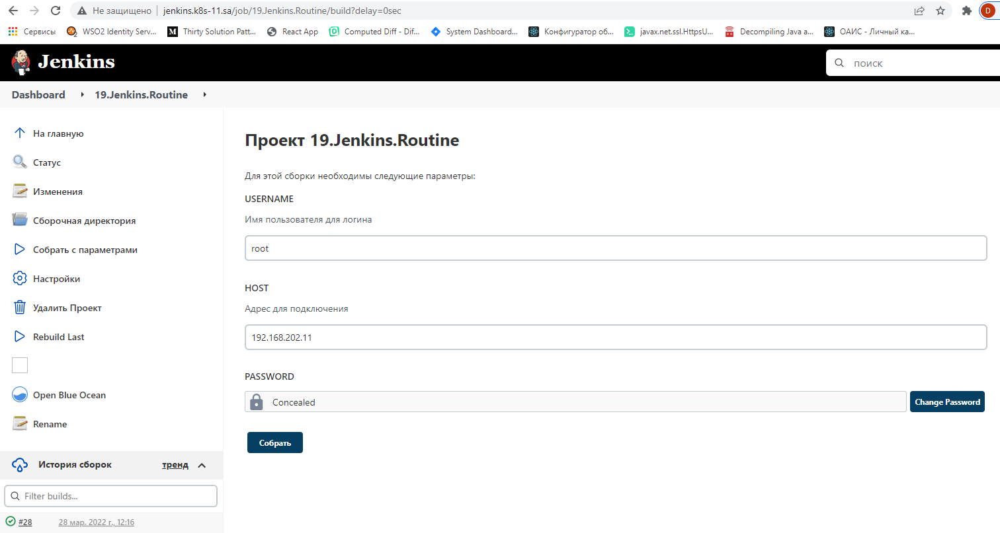

## 19. Jenkins. Routine

### Parameters screenshot


### Configuration
[config.xml](config.xml)

### Logs
```log
Started by user unknown or anonymous
Running as SYSTEM
Building in workspace /var/jenkins_home/workspace/19.Jenkins.Routine
[19.Jenkins.Routine] $ /bin/bash /tmp/jenkins8768345582530962463.sh
-------------PING REMOTE HOST--------------

WARNING: apt does not have a stable CLI interface. Use with caution in scripts.

Hit:1 http://deb.debian.org/debian bullseye InRelease
Hit:2 http://security.debian.org/debian-security bullseye-security InRelease
Hit:3 http://deb.debian.org/debian bullseye-updates InRelease
Hit:4 https://download.docker.com/linux/debian bullseye InRelease
Reading package lists...
Building dependency tree...
Reading state information...
36 packages can be upgraded. Run 'apt list --upgradable' to see them.

WARNING: apt does not have a stable CLI interface. Use with caution in scripts.

Reading package lists...
Building dependency tree...
Reading state information...
iputils-ping is already the newest version (3:20210202-1).
sshpass is already the newest version (1.09-1+b1).
The following packages were automatically installed and are no longer required:
  libblas3 liblinear4 liblua5.3-0 libpcap0.8 lua-lpeg nmap-common
Use 'apt autoremove' to remove them.
0 upgraded, 0 newly installed, 0 to remove and 36 not upgraded.
PING 192.168.202.11 (192.168.202.11) 56(84) bytes of data.
64 bytes from 192.168.202.11: icmp_seq=1 ttl=63 time=0.346 ms
64 bytes from 192.168.202.11: icmp_seq=2 ttl=63 time=0.236 ms
64 bytes from 192.168.202.11: icmp_seq=3 ttl=63 time=0.312 ms

--- 192.168.202.11 ping statistics ---
3 packets transmitted, 3 received, 0% packet loss, time 2046ms
rtt min/avg/max/mdev = 0.236/0.298/0.346/0.045 ms
[19.Jenkins.Routine] $ /bin/bash /tmp/jenkins2143239894102336108.sh
-------------NMAP SCAN FROM REMOTE HOST--------------
Warning: Permanently added '192.168.202.11' (ECDSA) to the list of known hosts.
Failed to set locale, defaulting to C
Loaded plugins: fastestmirror
Loading mirror speeds from cached hostfile
 * base: mirror.datacenter.by
 * epel: mirror.logol.ru
 * extras: mirror.datacenter.by
 * updates: mirror.datacenter.by
No packages marked for update
Failed to set locale, defaulting to C
Loaded plugins: fastestmirror
Loading mirror speeds from cached hostfile
 * base: mirror.datacenter.by
 * epel: mirror.logol.ru
 * extras: mirror.datacenter.by
 * updates: mirror.datacenter.by
Package 2:nmap-6.40-19.el7.x86_64 already installed and latest version
Nothing to do
[19.Jenkins.Routine] $ /bin/bash /tmp/jenkins8425637952081699623.sh
-------------COPY FILE FROM REMOTE HOST--------------
Warning: Permanently added '192.168.202.11' (ECDSA) to the list of known hosts.
[19.Jenkins.Routine] $ /bin/bash /tmp/jenkins15612090159764428094.sh
Warning: Permanently added '192.168.202.11' (ECDSA) to the list of known hosts.
-------------REMOVE FROM REMOTE HOST--------------
bash: line 2: apt: command not found
[19.Jenkins.Routine] $ /bin/bash /tmp/jenkins6469052661524805111.sh
-------------RESULT--------------

Starting Nmap 6.40 ( http://nmap.org ) at 2022-03-28 12:17 UTC
Nmap scan report for 192.168.202.1
Host is up (0.00096s latency).
MAC Address: 7A:12:81:F2:99:A2 (Unknown)
Nmap scan report for 192.168.202.2
Host is up (0.0012s latency).
MAC Address: 72:A6:14:0F:C1:47 (Unknown)
Nmap scan report for 192.168.202.3
Host is up (0.00073s latency).
MAC Address: 22:79:57:90:B8:66 (Unknown)
Nmap scan report for 192.168.202.4
Host is up (0.00052s latency).
MAC Address: EE:92:14:66:3D:98 (Unknown)
Nmap scan report for 192.168.202.5
Host is up (0.00048s latency).
MAC Address: F2:39:D4:99:5D:FB (Unknown)
Nmap scan report for 192.168.202.6
Host is up (0.00046s latency).
MAC Address: 42:5E:C9:7C:02:ED (Unknown)
Nmap scan report for 192.168.202.7
Host is up (0.00045s latency).
MAC Address: 1A:24:8B:35:D1:7A (Unknown)
Nmap scan report for 192.168.202.8
Host is up (0.00044s latency).
MAC Address: 12:85:5C:66:E9:4D (Unknown)
Nmap scan report for 192.168.202.9
Host is up (0.00045s latency).
MAC Address: B2:4C:66:F0:DF:0B (Unknown)
Nmap scan report for 192.168.202.10
Host is up (0.00046s latency).
MAC Address: 12:B4:77:8E:0A:77 (Unknown)
Nmap scan report for 192.168.202.12
Host is up (0.00042s latency).
MAC Address: 5A:C6:EB:F3:74:E0 (Unknown)
Nmap scan report for 192.168.202.13
Host is up (0.00089s latency).
MAC Address: 06:F2:67:D2:86:4B (Unknown)
Nmap scan report for 192.168.202.14
Host is up (-0.10s latency).
MAC Address: DE:C2:1D:C0:5E:0A (Unknown)
Nmap scan report for 192.168.202.15
Host is up (0.0012s latency).
MAC Address: EA:87:AF:CD:84:DD (Unknown)
Nmap scan report for 192.168.202.16
Host is up (0.00063s latency).
MAC Address: A2:51:25:E4:5A:75 (Unknown)
Nmap scan report for 192.168.202.17
Host is up (-0.10s latency).
MAC Address: EA:69:25:74:CD:2E (Unknown)
Nmap scan report for 192.168.202.18
Host is up (-0.10s latency).
MAC Address: 22:AD:03:F9:32:6F (Unknown)
Nmap scan report for 192.168.202.19
Host is up (-0.10s latency).
MAC Address: BA:C6:CA:DE:25:EF (Unknown)
Nmap scan report for 192.168.202.20
Host is up (-0.10s latency).
MAC Address: D6:28:F8:48:01:C0 (Unknown)
Nmap scan report for 192.168.202.21
Host is up (-0.10s latency).
MAC Address: 2A:02:CC:32:B9:A9 (Unknown)
Nmap scan report for 192.168.202.22
Host is up (-0.10s latency).
MAC Address: 6A:02:AC:23:1F:12 (Unknown)
Nmap scan report for 192.168.202.23
Host is up (-0.10s latency).
MAC Address: 1A:B1:BE:FF:37:CE (Unknown)
Nmap scan report for 192.168.202.24
Host is up (-0.10s latency).
MAC Address: 62:50:51:2B:77:B4 (Unknown)
Nmap scan report for 192.168.202.25
Host is up (-0.10s latency).
MAC Address: 9A:AA:40:27:DF:17 (Unknown)
Nmap scan report for 192.168.202.26
Host is up (-0.10s latency).
MAC Address: 3A:41:91:51:5A:8E (Unknown)
Nmap scan report for 192.168.202.27
Host is up (-0.10s latency).
MAC Address: 6A:0C:D6:6A:08:08 (Unknown)
Nmap scan report for 192.168.202.28
Host is up (-0.10s latency).
MAC Address: AE:D8:07:C1:DB:B0 (Unknown)
Nmap scan report for sa-centos-11.it-academy.local (192.168.202.11)
Host is up.
Nmap done: 50 IP addresses (28 hosts up) scanned in 1.07 seconds
[19.Jenkins.Routine] $ /bin/bash /tmp/jenkins9526610353496336735.sh
-------------REMOVE FROM CURRENT HOST--------------
Finished: SUCCESS
```
