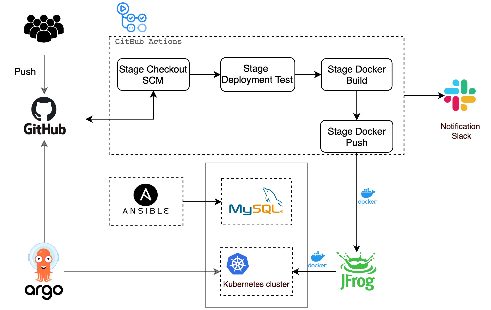
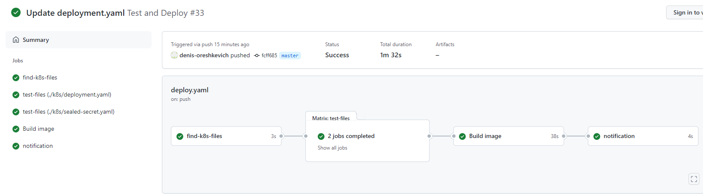

## Project report
Project's reporter: Denis Oreshkevich

Group number: md-sa2-19-22
### Description of application for deployment
* Application: Kanboard
* Programming language: PHP
* DB: MySQL

### Pipeline

### Job:

### Technologies which were used in project

#### Orchestration
Kubernetes
#### Automation tools
GitHub Actions
#### SCM
GitHub
#### Notification
Slack
#### Infrastructure
Virtual hosts in EC HTP
