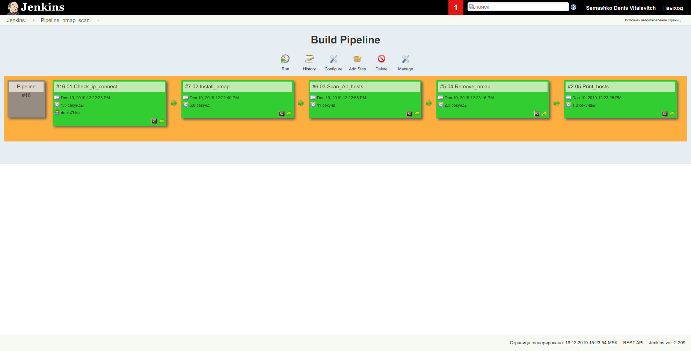

### 01.Check_ip_connect (results)

```
Started by user Semashko Denis Vitalevitch
Running as SYSTEM
Building in workspace /var/lib/jenkins/workspace/Routine/01.Check_ip_connect
[01.Check_ip_connect] $ /bin/sh -xe /tmp/jenkins3038848858775658078.sh
+ ssh root@192.168.200.28 -J jump_sa@178.124.206.48 -o BatchMode=yes -o ConnectTimeout=5 echo OK
OK
Killed by signal 1.
Triggering a new build of Routine » 02.Install_nmap
Finished: SUCCESS
```

### 02.Install_nmap (results)

```
Started by upstream project "Routine/01.Check_ip_connect" build number 16
originally caused by:
 Started by user Semashko Denis Vitalevitch
Running as SYSTEM
Building in workspace /var/lib/jenkins/workspace/Routine/02.Install_nmap
[02.Install_nmap] $ /bin/sh -xe /tmp/jenkins1895009094300104003.sh
+ ssh root@192.168.200.28 -J jump_sa@178.124.206.48 'apt update && apt install nmap -y'

WARNING: apt does not have a stable CLI interface. Use with caution in scripts.

Hit:1 http://archive.ubuntu.com/ubuntu xenial InRelease
Hit:2 http://archive.ubuntu.com/ubuntu xenial-updates InRelease
Hit:3 http://archive.ubuntu.com/ubuntu xenial-security InRelease
Reading package lists...
Building dependency tree...
Reading state information...
17 packages can be upgraded. Run 'apt list --upgradable' to see them.
Reading package lists...

WARNING: apt does not have a stable CLI interface. Use with caution in scripts.

Building dependency tree...
Reading state information...
The following NEW packages will be installed:
  nmap
0 upgraded, 1 newly installed, 0 to remove and 17 not upgraded.
Need to get 4638 kB of archives.
After this operation, 21.3 MB of additional disk space will be used.
Get:1 http://archive.ubuntu.com/ubuntu xenial/main amd64 nmap amd64 7.01-2ubuntu2 [4638 kB]
Fetched 4638 kB in 0s (8267 kB/s)
Selecting previously unselected package nmap.
(Reading database ... 
(Reading database ... 5%
(Reading database ... 10%
(Reading database ... 15%
(Reading database ... 20%
(Reading database ... 25%
(Reading database ... 30%
(Reading database ... 35%
(Reading database ... 40%
(Reading database ... 45%
(Reading database ... 50%
(Reading database ... 55%
(Reading database ... 60%
(Reading database ... 65%
(Reading database ... 70%
(Reading database ... 75%
(Reading database ... 80%
(Reading database ... 85%
debconf: unable to initialize frontend: Dialog
debconf: (TERM is not set, so the dialog frontend is not usable.)
debconf: falling back to frontend: Readline
debconf: unable to initialize frontend: Readline
debconf: (This frontend requires a controlling tty.)
debconf: falling back to frontend: Teletype
dpkg-preconfigure: unable to re-open stdin: 
(Reading database ... 90%
(Reading database ... 95%
(Reading database ... 100%
(Reading database ... 22267 files and directories currently installed.)
Preparing to unpack .../nmap_7.01-2ubuntu2_amd64.deb ...
Unpacking nmap (7.01-2ubuntu2) ...
Processing triggers for man-db (2.7.5-1) ...
Setting up nmap (7.01-2ubuntu2) ...
Killed by signal 1.
Triggering a new build of Routine » 03.Scan_All_hosts
Finished: SUCCESS
```

### 03.Scan_All_hosts (results)

```
Started by upstream project "Routine/02.Install_nmap" build number 7
originally caused by:
 Started by upstream project "Routine/01.Check_ip_connect" build number 16
 originally caused by:
  Started by user Semashko Denis Vitalevitch
Running as SYSTEM
Building in workspace /var/lib/jenkins/workspace/Routine/03.Scan_All_hosts
[03.Scan_All_hosts] $ /bin/sh -xe /tmp/jenkins1033247380838296380.sh
+ ssh root@192.168.200.28 -J jump_sa@178.124.206.48 'nmap -sn 192.168.200.0/24 > /tmp/nmap_hosts'
Killed by signal 1.
Triggering a new build of Routine » 04.Remove_nmap
Finished: SUCCESS
```

### 04.Remove_nmap (results)

```
Started by upstream project "Routine/03.Scan_All_hosts" build number 6
originally caused by:
 Started by upstream project "Routine/02.Install_nmap" build number 7
 originally caused by:
  Started by upstream project "Routine/01.Check_ip_connect" build number 16
  originally caused by:
   Started by user Semashko Denis Vitalevitch
Running as SYSTEM
Building in workspace /var/lib/jenkins/workspace/Routine/04.Remove_nmap
[04.Remove_nmap] $ /bin/sh -xe /tmp/jenkins4821797251772655195.sh
+ ssh root@192.168.200.28 -J jump_sa@178.124.206.48 'apt remove nmap -y'
Reading package lists...
WARNING: apt does not have a stable CLI interface. Use with caution in scripts.


Building dependency tree...
Reading state information...
The following packages were automatically installed and are no longer required:
  libblas-common libblas3 liblinear3 liblua5.2-0 lua-lpeg ndiff python-bs4
  python-chardet python-html5lib python-lxml python-pkg-resources python-six
Use 'apt autoremove' to remove them.
The following packages will be REMOVED:
  nmap
0 upgraded, 0 newly installed, 1 to remove and 17 not upgraded.
After this operation, 21.3 MB disk space will be freed.
(Reading database ... 
(Reading database ... 5%
(Reading database ... 10%
(Reading database ... 15%
(Reading database ... 20%
(Reading database ... 25%
(Reading database ... 30%
(Reading database ... 35%
(Reading database ... 40%
(Reading database ... 45%
(Reading database ... 50%
(Reading database ... 55%
(Reading database ... 60%
(Reading database ... 65%
(Reading database ... 70%
(Reading database ... 75%
(Reading database ... 80%
(Reading database ... 85%
(Reading database ... 90%
(Reading database ... 95%
(Reading database ... 100%
(Reading database ... 22998 files and directories currently installed.)
Removing nmap (7.01-2ubuntu2) ...
Processing triggers for man-db (2.7.5-1) ...
Killed by signal 1.
Triggering a new build of Routine » 05.Print_hosts
Finished: SUCCESS
```

### 05.Print_hosts (results)

```
Started by upstream project "Routine/04.Remove_nmap" build number 5
originally caused by:
 Started by upstream project "Routine/03.Scan_All_hosts" build number 6
 originally caused by:
  Started by upstream project "Routine/02.Install_nmap" build number 7
  originally caused by:
   Started by upstream project "Routine/01.Check_ip_connect" build number 16
   originally caused by:
    Started by user Semashko Denis Vitalevitch
Running as SYSTEM
Building in workspace /var/lib/jenkins/workspace/Routine/05.Print_hosts
[05.Print_hosts] $ /bin/sh -xe /tmp/jenkins8566060082416505868.sh
+ ssh root@192.168.200.28 -J jump_sa@178.124.206.48 'cat /tmp/nmap_hosts && rm -f /tmp/nmap_hosts'

Starting Nmap 7.01 ( https://nmap.org ) at 2019-12-19 12:22 UTC
Nmap scan report for 192.168.200.1
Host is up (0.00081s latency).
MAC Address: 56:C7:2D:7C:C4:1B (Unknown)
Nmap scan report for 192.168.200.2
Host is up (0.00042s latency).
MAC Address: 82:31:82:14:C3:22 (Unknown)
Nmap scan report for 192.168.200.3
Host is up (0.00031s latency).
MAC Address: 0A:7D:62:E4:79:7C (Unknown)
Nmap scan report for 192.168.200.4
Host is up (0.00027s latency).
MAC Address: EE:C2:91:FE:05:24 (Unknown)
Nmap scan report for 192.168.200.5
Host is up (0.00025s latency).
MAC Address: 06:3A:EB:A3:D3:47 (Unknown)
Nmap scan report for 192.168.200.6
Host is up (0.00031s latency).
MAC Address: DA:8C:E7:8B:91:91 (Unknown)
Nmap scan report for 192.168.200.7
Host is up (0.00031s latency).
MAC Address: 0A:EE:99:94:23:AE (Unknown)
Nmap scan report for 192.168.200.8
Host is up (0.00036s latency).
MAC Address: BA:A7:26:8B:5E:1E (Unknown)
Nmap scan report for 192.168.200.9
Host is up (0.00030s latency).
MAC Address: 06:9B:BD:E8:18:5C (Unknown)
Nmap scan report for 192.168.200.10
Host is up (0.00028s latency).
MAC Address: 8E:C4:36:B4:87:E2 (Unknown)
Nmap scan report for 192.168.200.11
Host is up (-0.10s latency).
MAC Address: 5E:9E:86:43:49:79 (Unknown)
Nmap scan report for 192.168.200.12
Host is up (-0.10s latency).
MAC Address: 0E:50:B6:CC:AA:0C (Unknown)
Nmap scan report for 192.168.200.13
Host is up (0.00081s latency).
MAC Address: 46:89:84:7E:4E:6D (Unknown)
Nmap scan report for 192.168.200.14
Host is up (0.00034s latency).
MAC Address: BA:5B:E4:31:E7:DE (Unknown)
Nmap scan report for 192.168.200.15
Host is up (-0.10s latency).
MAC Address: 6E:36:AF:80:86:34 (Unknown)
Nmap scan report for 192.168.200.16
Host is up (-0.10s latency).
MAC Address: 8E:94:D9:2D:41:62 (Unknown)
Nmap scan report for 192.168.200.17
Host is up (-0.10s latency).
MAC Address: 0E:F7:23:DE:2B:E5 (Unknown)
Nmap scan report for 192.168.200.18
Host is up (-0.10s latency).
MAC Address: E6:14:00:43:BA:BB (Unknown)
Nmap scan report for 192.168.200.20
Host is up (-0.10s latency).
MAC Address: 5E:18:1E:A3:E6:B9 (Unknown)
Nmap scan report for 192.168.200.21
Host is up (-0.10s latency).
MAC Address: 8A:8A:7C:96:69:03 (Unknown)
Nmap scan report for 192.168.200.22
Host is up (-0.10s latency).
MAC Address: 62:55:7B:78:B0:3D (Unknown)
Nmap scan report for 192.168.200.23
Host is up (-0.10s latency).
MAC Address: 96:6F:73:3C:7D:29 (Unknown)
Nmap scan report for 192.168.200.24
Host is up (-0.10s latency).
MAC Address: 2E:14:AD:B1:F2:7A (Unknown)
Nmap scan report for 192.168.200.25
Host is up (-0.10s latency).
MAC Address: 42:9C:AA:2B:F1:16 (Unknown)
Nmap scan report for 192.168.200.26
Host is up (-0.10s latency).
MAC Address: 22:05:0C:A4:61:2F (Unknown)
Nmap scan report for vhost_01.local (192.168.200.27)
Host is up (-0.10s latency).
MAC Address: D6:15:9D:C0:75:91 (Unknown)
Nmap scan report for 192.168.200.29
Host is up (-0.10s latency).
MAC Address: DE:7C:13:BD:E8:68 (Unknown)
Nmap scan report for 192.168.200.30
Host is up (-0.10s latency).
MAC Address: EE:4D:F5:4D:46:AF (Unknown)
Nmap scan report for 192.168.200.31
Host is up (-0.10s latency).
MAC Address: B6:7A:C9:24:22:CF (Unknown)
Nmap scan report for 192.168.200.32
Host is up (-0.10s latency).
MAC Address: 72:25:96:3F:97:E4 (Unknown)
Nmap scan report for 192.168.200.33
Host is up (-0.10s latency).
MAC Address: 4E:AB:80:C9:ED:D5 (Unknown)
Nmap scan report for 192.168.200.34
Host is up (0.00038s latency).
MAC Address: 0A:FD:E2:F3:D7:9E (Unknown)
Nmap scan report for 192.168.200.35
Host is up (-0.10s latency).
MAC Address: AE:E1:0F:A8:8A:FB (Unknown)
Nmap scan report for 192.168.200.36
Host is up (0.00057s latency).
MAC Address: BA:AB:C8:08:58:DC (Unknown)
Nmap scan report for 192.168.200.37
Host is up (-0.10s latency).
MAC Address: A2:CA:55:C7:75:0A (Unknown)
Nmap scan report for 192.168.200.38
Host is up (0.00031s latency).
MAC Address: 5A:BB:FF:83:CA:27 (Unknown)
Nmap scan report for 192.168.200.39
Host is up (0.00064s latency).
MAC Address: 5A:42:4D:C3:01:1D (Unknown)
Nmap scan report for 192.168.200.40
Host is up (0.00031s latency).
MAC Address: B2:1D:D8:89:BF:F5 (Unknown)
Nmap scan report for 192.168.200.41
Host is up (0.00034s latency).
MAC Address: A2:78:3F:0C:A3:05 (Unknown)
Nmap scan report for 192.168.200.42
Host is up (0.00077s latency).
MAC Address: 92:20:E4:AC:C0:4B (Unknown)
Nmap scan report for 192.168.200.43
Host is up (0.0011s latency).
MAC Address: C6:AD:C1:16:9D:AE (Unknown)
Nmap scan report for 192.168.200.44
Host is up (-0.10s latency).
MAC Address: 72:27:F1:6A:A3:56 (Unknown)
Nmap scan report for 192.168.200.45
Host is up (0.00037s latency).
MAC Address: FA:51:E0:60:E0:57 (Unknown)
Nmap scan report for 192.168.200.46
Host is up (-0.10s latency).
MAC Address: 96:1E:34:11:6F:F6 (Unknown)
Nmap scan report for 192.168.200.47
Host is up (0.00027s latency).
MAC Address: 1E:39:06:1E:0C:97 (Unknown)
Nmap scan report for 192.168.200.48
Host is up (0.00049s latency).
MAC Address: CA:AE:01:01:53:72 (Unknown)
Nmap scan report for 192.168.200.49
Host is up (0.00025s latency).
MAC Address: 0E:12:35:D3:C1:46 (Unknown)
Nmap scan report for 192.168.200.50
Host is up (0.00031s latency).
MAC Address: 1A:39:9F:22:6B:1C (Unknown)
Nmap scan report for 192.168.200.51
Host is up (0.00047s latency).
MAC Address: 8C:DF:9D:93:86:A1 (NEC)
Nmap scan report for 192.168.200.53
Host is up (0.00047s latency).
MAC Address: 8C:DF:9D:93:86:31 (NEC)
Nmap scan report for vhost_01.local (192.168.200.28)
Host is up.
Nmap done: 256 IP addresses (51 hosts up) scanned in 10.10 seconds
Killed by signal 1.
Finished: SUCCESS
```

