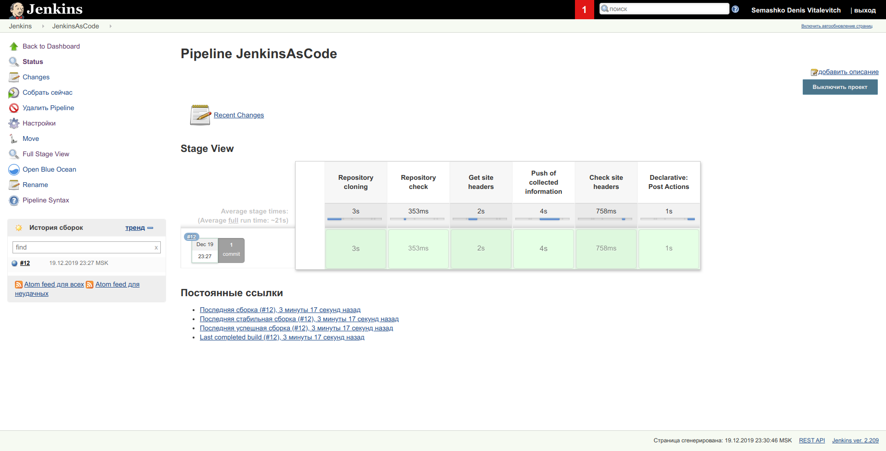
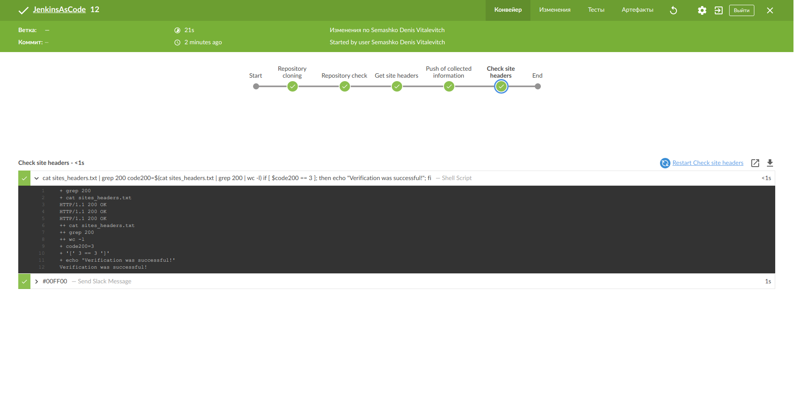
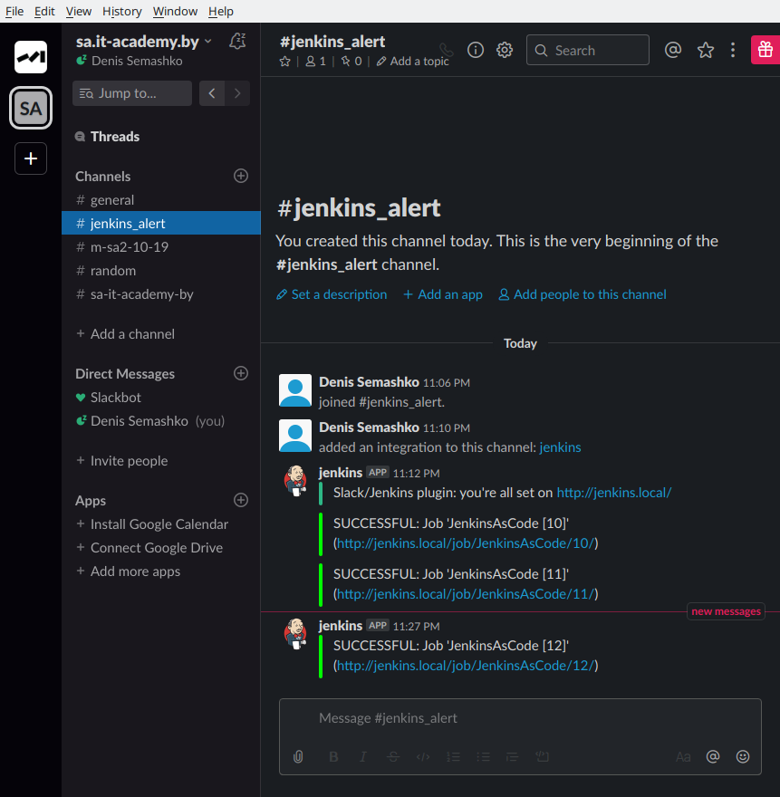

## Jenkinsfile

```sh
pipeline {
    agent any
    environment {
        BUILD = "${env.BUILD_ID}"
    }
    stages {
        stage('Repository cloning') { 
            steps { 
                    git branch: "master", url: "git@github.com:da-dsemashko/pipelinecode.git"            }
        }
        stage('Repository check'){
            steps { 
                    sh "ls -l"
            }
        }
        stage('Get site headers') {
            steps {
                sh """
                    curl -I https://www.tut.by > sites_headers.txt
                    curl -I https://www.onliner.by >> sites_headers.txt
                    curl -I https://shop.by >> sites_headers.txt
                """
            }
        }
        stage('Push of collected information') { 
            steps {
               sh """
                    git add --all
                    git commit -m "Site headers"
                    git push -f origin master
                  """
            }
        }
        stage('Сheck site headers') {
            steps {
                sh '''
                  cat sites_headers.txt | grep 200
                  code200=$(cat sites_headers.txt | grep 200 | wc -l)
                  if [ $code200 == 3 ]; then echo "Verification was successful!"; fi
                '''
            }
        }
    }
    post {
            success {
                slackSend (color: '#00FF00', message: "SUCCESSFUL: Job '${env.JOB_NAME} [${env.BUILD_NUMBER}]' (${env.BUILD_URL})")
            }
            failure {
                slackSend (color: '#FF0000', message: "FAILED: Job '${env.JOB_NAME} [${env.BUILD_NUMBER}]' (${env.BUILD_URL})")
            }
        }
}
```


## Output

```sh
Started by user Semashko Denis Vitalevitch
Running in Durability level: MAX_SURVIVABILITY
[Pipeline] Start of Pipeline
[Pipeline] node
Running on Jenkins in /var/lib/jenkins/workspace/JenkinsAsCode
[Pipeline] {
[Pipeline] withEnv
[Pipeline] {
[Pipeline] stage
[Pipeline] { (Repository cloning)
[Pipeline] git
No credentials specified
 > git rev-parse --is-inside-work-tree # timeout=10
Fetching changes from the remote Git repository
 > git config remote.origin.url git@github.com:da-dsemashko/pipelinecode.git # timeout=10
Fetching upstream changes from git@github.com:da-dsemashko/pipelinecode.git
 > git --version # timeout=10
 > git fetch --tags --progress git@github.com:da-dsemashko/pipelinecode.git +refs/heads/*:refs/remotes/origin/* # timeout=10
 > git rev-parse refs/remotes/origin/master^{commit} # timeout=10
 > git rev-parse refs/remotes/origin/origin/master^{commit} # timeout=10
Checking out Revision 0109c70c77dcf4b0c412239274ae8aa2d58f26ce (refs/remotes/origin/master)
 > git config core.sparsecheckout # timeout=10
 > git checkout -f 0109c70c77dcf4b0c412239274ae8aa2d58f26ce # timeout=10
 > git branch -a -v --no-abbrev # timeout=10
 > git branch -D master # timeout=10
 > git checkout -b master 0109c70c77dcf4b0c412239274ae8aa2d58f26ce # timeout=10
Commit message: "Site headers"
 > git rev-list --no-walk 2f0a73268c85d1cba85dad4fafd7826076444ab8 # timeout=10
[Pipeline] }
[Pipeline] // stage
[Pipeline] stage
[Pipeline] { (Repository check)
[Pipeline] sh
+ ls -l
total 8
-rw-r--r--. 1 jenkins jenkins   43 Dec 19 19:55 README.md
-rw-r--r--. 1 jenkins jenkins 3051 Dec 19 20:14 sites_headers.txt
[Pipeline] }
[Pipeline] // stage
[Pipeline] stage
[Pipeline] { (Get site headers)
[Pipeline] sh
+ curl -I https://www.tut.by
  % Total    % Received % Xferd  Average Speed   Time    Time     Time  Current
                                 Dload  Upload   Total   Spent    Left  Speed

  0     0    0     0    0     0      0      0 --:--:-- --:--:-- --:--:--     0
  0     0    0     0    0     0      0      0 --:--:-- --:--:-- --:--:--     0
+ curl -I https://www.onliner.by
  % Total    % Received % Xferd  Average Speed   Time    Time     Time  Current
                                 Dload  Upload   Total   Spent    Left  Speed

  0     0    0     0    0     0      0      0 --:--:-- --:--:-- --:--:--     0
  0     0    0     0    0     0      0      0 --:--:-- --:--:-- --:--:--     0
  0     0    0     0    0     0      0      0 --:--:-- --:--:-- --:--:--     0
+ curl -I https://shop.by
  % Total    % Received % Xferd  Average Speed   Time    Time     Time  Current
                                 Dload  Upload   Total   Spent    Left  Speed

  0     0    0     0    0     0      0      0 --:--:-- --:--:-- --:--:--     0
  0     0    0     0    0     0      0      0 --:--:-- --:--:-- --:--:--     0
[Pipeline] }
[Pipeline] // stage
[Pipeline] stage
[Pipeline] { (Push of collected information)
[Pipeline] sh
+ git add --all
+ git commit -m 'Site headers'
[master cb17eb4] Site headers
 1 file changed, 6 insertions(+), 6 deletions(-)
+ git push -f origin master
To git@github.com:da-dsemashko/pipelinecode.git
   0109c70..cb17eb4  master -> master
[Pipeline] }
[Pipeline] // stage
[Pipeline] stage
[Pipeline] { (Сheck site headers)
[Pipeline] sh
+ grep 200
+ cat sites_headers.txt
HTTP/1.1 200 OK
HTTP/1.1 200 OK
HTTP/1.1 200 OK
++ cat sites_headers.txt
++ grep 200
++ wc -l
+ code200=3
+ '[' 3 == 3 ']'
+ echo 'Verification was successful!'
Verification was successful!
[Pipeline] }
[Pipeline] // stage
[Pipeline] stage
[Pipeline] { (Declarative: Post Actions)
[Pipeline] slackSend
Slack Send Pipeline step running, values are - baseUrl: <empty>, teamDomain: sa-itacademy-by, channel: #jenkins_alert, color: #00FF00, botUser: false, tokenCredentialId: slack_token, notifyCommitters: false, iconEmoji: <empty>, username: <empty>
[Pipeline] }
[Pipeline] // stage
[Pipeline] }
[Pipeline] // withEnv
[Pipeline] }
[Pipeline] // node
[Pipeline] End of Pipeline
Finished: SUCCESS
```

