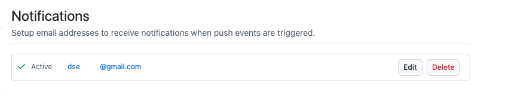
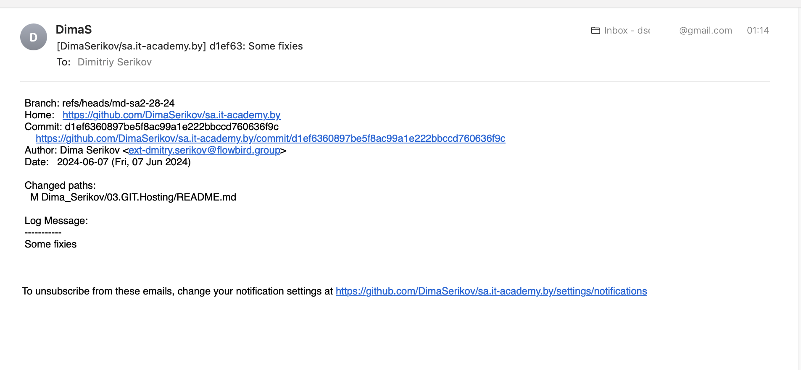

* Create remote empty repositories (GitHub and GitLab):
  * [GitHub](https://github.com/DimaSerikov/03.git.hosting)
  * [GitLab](https://gitlab.com/dimaserikov/03.git.hosting)
* Add ssh key(s) to use ssh authentication (id_rsa pair was generated before):
  * GitHub: Profile -> Settings -> SSH and GPG keys -> New SSH key
  * GitLab: Profile -> Preferencies -> SSH Keys -> Add new key
* Push your local repository into both remote repositories

```shell
git remote -v
#origin  git@github.com:DimaSerikov/sa.it-academy.by.git (fetch)
#origin  git@github.com:DimaSerikov/sa.it-academy.by.git (push)
```

... adding new remotes github and gitlab:

```shell
git remote add gitlab git@gitlab.com:dimaserikov/03.git.hosting.git \
&& git remote add github git@github.com:DimaSerikov/03.git.hosting.git
```

... checking

```shell
git remote -v
#github  git@github.com:DimaSerikov/03.git.hosting.git (fetch)
#github  git@github.com:DimaSerikov/03.git.hosting.git (push)
#gitlab  git@gitlab.com:dimaserikov/03.git.hosting.git (fetch)
#gitlab  git@gitlab.com:dimaserikov/03.git.hosting.git (push)
#origin  git@github.com:DimaSerikov/sa.it-academy.by.git (fetch)
#origin  git@github.com:DimaSerikov/sa.it-academy.by.git (push)
```

... pushing

```shell
git push --set-upstream github --all
git push --set-upstream gitlab --all
```
* Create email integration push/commit events
* Repository -> Settings -> Email notifications -> Add email


* Automate pushing your changes to all remote repositories (bash/python/go.. scripts) (list of upstream repositories should be extracted automatically for loop)
```shell
#!/bin/bash

# check if not indexed changes
if [ -n "$(git status --porcelain)" ]; then
  echo "There are changes to commit."
else
  echo "No changes to commit."
  exit 1
fi

# get users commit message
read -p "Enter commit message: " commit_message

# add alll changes
git add .

# commit creation
git commit -m "$commit_message"

# get all remotes
remotes=$(git remote)

# push to all remotes
for remote in $remotes; do
  echo "Pushing to remote: $remote"
  git push $remote --all
done

echo "Pushed to all remotes."
```
... result

```shell
dimitriyserikov@MacBook-Pro-2 sa.it-academy.by % sh ./Dima_Serikov/03.GIT.Hosting/remote_repository_pusher.sh
There are changes to commit.
Enter commit message: Added description
[md-sa2-28-24 b434bb66] Added description
 1 file changed, 32 insertions(+), 1 deletion(-)
Pushing to remote: github
Enumerating objects: 9, done.
Counting objects: 100% (9/9), done.
Delta compression using up to 10 threads
Compressing objects: 100% (5/5), done.
Writing objects: 100% (5/5), 843 bytes | 843.00 KiB/s, done.
Total 5 (delta 3), reused 0 (delta 0), pack-reused 0
remote: Resolving deltas: 100% (3/3), completed with 3 local objects.
To github.com:DimaSerikov/03.git.hosting.git
   3a6d9040..b434bb66  md-sa2-28-24 -> md-sa2-28-24
Pushing to remote: gitlab
Enumerating objects: 9, done.
Counting objects: 100% (9/9), done.
Delta compression using up to 10 threads
Compressing objects: 100% (5/5), done.
Writing objects: 100% (5/5), 843 bytes | 843.00 KiB/s, done.
Total 5 (delta 3), reused 0 (delta 0), pack-reused 0
remote: 
remote: To create a merge request for md-sa2-28-24, visit:
remote:   https://gitlab.com/dimaserikov/03.git.hosting/-/merge_requests/new?merge_request%5Bsource_branch%5D=md-sa2-28-24
remote: 
To gitlab.com:dimaserikov/03.git.hosting.git
   3a6d9040..b434bb66  md-sa2-28-24 -> md-sa2-28-24
Pushing to remote: origin
Enumerating objects: 9, done.
Counting objects: 100% (9/9), done.
Delta compression using up to 10 threads
Compressing objects: 100% (5/5), done.
Writing objects: 100% (5/5), 843 bytes | 843.00 KiB/s, done.
Total 5 (delta 3), reused 0 (delta 0), pack-reused 0
remote: Resolving deltas: 100% (3/3), completed with 3 local objects.
To github.com:DimaSerikov/sa.it-academy.by.git
   3a6d9040..b434bb66  md-sa2-28-24 -> md-sa2-28-24
Pushed to all remotes.
dimitriyserikov@MacBook-Pro-2 sa.it-academy.by %
```