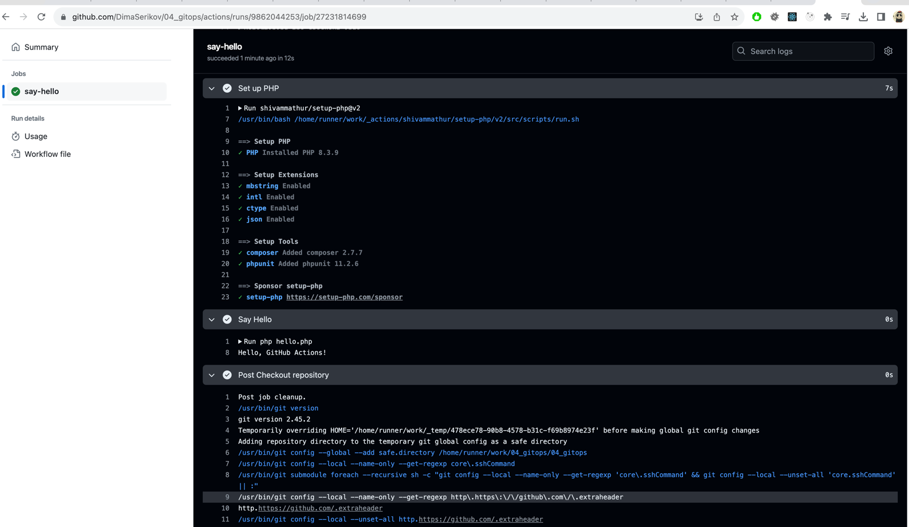
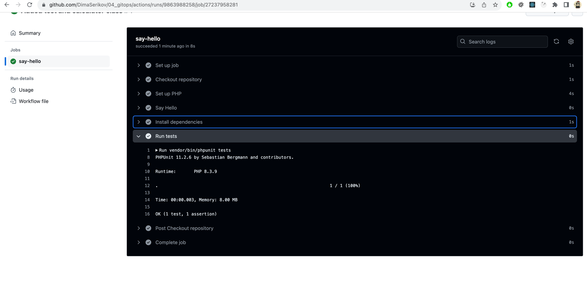

# 04. GitOps
## Homework Assignment 1: Setting up a Basic GitHub Action

* Create a new public repository on GitHub.
```shell
https://github.com/DimaSerikov/04_gitops
```
* Inside the repository, create a simple Python or JavaScript script (e.g., "hello.py" or "hello.js") that prints "Hello, GitHub Actions!" to the console.
```php
<?php

echo 'Hello, GitHub Actions!' . PHP_EOL;
```
* Create a new GitHub Action workflow (.github/workflows/hello.yml) that triggers on every push to the main branch.
* Configure the workflow to run the script you created in step 2.
```yaml
name: Hello World Workflow

on:
  push:
    branches:
      - master
      - main

jobs:
  say-hello:
    runs-on: ubuntu-latest
    
    steps:
      - name: Checkout repository
        uses: actions/checkout@v2

      - name: Set up PHP
        uses: shivammathur/setup-php@v2
        with:
          php-version: '8.3'
          extensions: mbstring, intl, ctype, json
          tools: composer, phpunit
      
      - name: Say Hello
        run: php hello.php
```
* Push your changes to the repository and observe the GitHub Action run.


## Homework Assignment 2: Building and Testing with GitHub Actions

* Choose a programming language of your choice.
```php
PHP 8.3
```
* Set up a new or use an existing repository.
```shell
https://github.com/DimaSerikov/04_gitops
```
* Create a simple program that performs a basic operation (e.g., calculation, string manipulation).
```php
<?php declare(strict_types=1);

namespace App;

final class Calculator
{
    public function add(int $a, int $b): int
    {
        return $a + $b;
    }
}

```
* Write unit tests for your program using a testing framework appropriate for the language.
```php
<?php declare(strict_types=1);

namespace Tests;

use PHPUnit\Framework\TestCase;
use App\Calculator;

final class CalculatorTest extends TestCase
{
    public function testAdd(): void
    {
        $calculator = new Calculator();
        $result = $calculator->add(2, 3);

        $this->assertEquals(5, $result);
    }
}

```
* Create a GitHub Action workflow that runs the unit tests whenever changes are pushed to the repository.
```yaml
#...
jobs:
  say-hello:
    runs-on: ubuntu-latest

    steps:
      #...
      - name: Install dependencies
        run: composer install
        
      - name: Run tests
        run: vendor/bin/phpunit tests
```
* Ensure the workflow reports whether the tests passed or failed.
