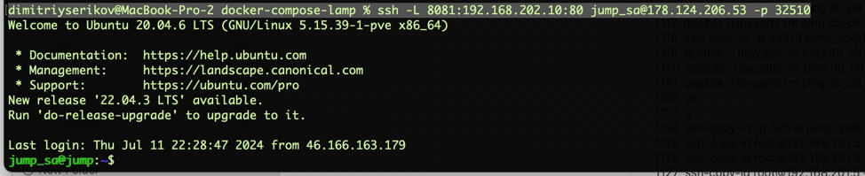
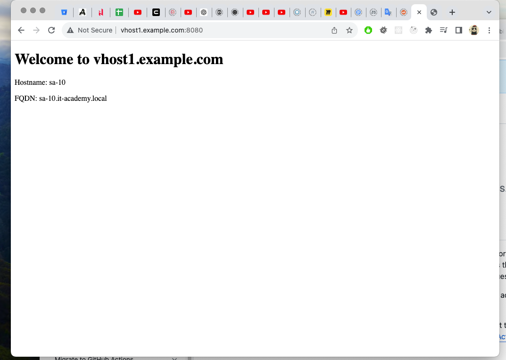
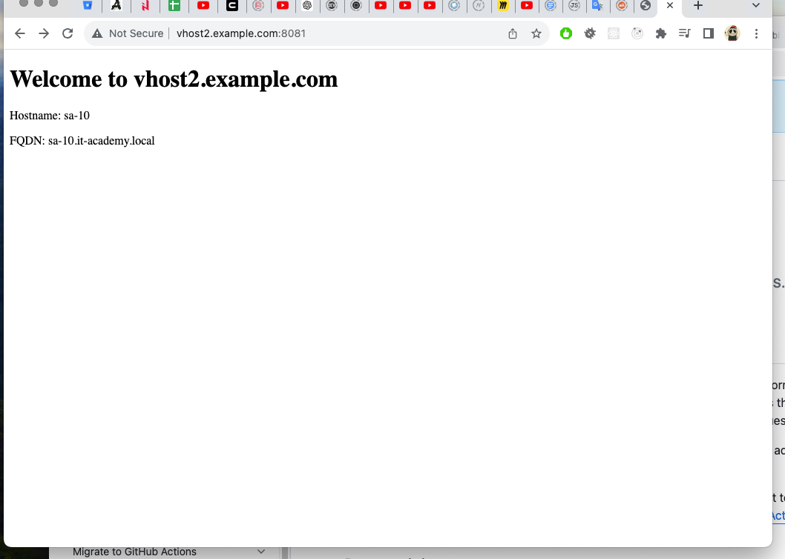

# 06. Ansible Workshop

## Homework Assignment 1: Configuration Management

* Choose a web server software (e.g., Nginx) for configuration management.
* Include tasks to create a simple HTML file served by the web server, with unique data inside (host name and FQDN) for each virtualhost.
```shell
  198  touch inv.yaml
  199  touch playbook.yaml
  200  mkdir templates
  201  touch templates/nginx.conf.j2
  202  touch templates/vhost.conf.j2
  203  touch templates/index.html.j2
  203  touch ansible.cfg
```

**ansible.cfg**
```ini
[defaults]
inventory = inv.yaml

[ssh_connection]
ssh_args = '-o ProxyCommand="ssh -W %h:%p -q jump_sa@178.124.206.53 -p 32510"'
```
**inv.yaml**
```yaml
all_workers:
  children:
    work_sa:
      hosts:
        host10:
          ansible_host: 192.168.202.10
          ansible_user: root
jump_sa:
  vars:
    env: "it-academy"
  hosts:
    bastion:
      ansible_host: 178.124.206.53
      ansible_user: jump_sa
```
**nginx.conf.j2**
```ini
user www-data;
worker_processes auto;
pid /run/nginx.pid;
include /etc/nginx/modules-enabled/*.conf;

events {
    worker_connections 768;
}

http {
    sendfile on;
    tcp_nopush on;
    tcp_nodelay on;
    keepalive_timeout 65;
    types_hash_max_size 2048;
    include /etc/nginx/mime.types;
    default_type application/octet-stream;

    access_log /var/log/nginx/access.log;
    error_log /var/log/nginx/error.log;

    gzip on;
    gzip_disable "msie6";

    include /etc/nginx/conf.d/*.conf;
    include /etc/nginx/sites-enabled/*;
}

```
**vhost.conf.j2**
```ini
server {
    listen 80;
    server_name {{ item.server_name }};

    root {{ item.document_root }};
    index index.html;

    location / {
        try_files $uri $uri/ =404;
    }

    error_page 404 /404.html;
    location = /404.html {
        internal;
    }

    error_page 500 502 503 504 /50x.html;
    location = /50x.html {
        internal;
    }
}

```
**index.html.j2**
```html
<!DOCTYPE html>
<html>
<head>
    <title>Welcome to {{ item.server_name }}</title>
</head>
<body>
    <h1>Welcome to {{ item.server_name }}</h1>
    <p>Hostname: {{ hostname }}</p>
    <p>FQDN: {{ fqdn }}</p>
</body>
</html>
```

* Write an Ansible playbook to install and configure the chosen web server on a remote host (two virtualhosts using templates).
```yaml
- name: Install and configure Nginx web server
  hosts: all_workers
  become: yes
  vars:
    vhosts:
      - server_name: vhost1.example.com
        document_root: /var/www/vhost1
      - server_name: vhost2.example.com
        document_root: /var/www/vhost2

  tasks:
    - name: Ensure Nginx is installed
      apt:
        name: nginx
        state: present
        update_cache: yes

    - name: Ensure Nginx is enabled and started
      service:
        name: nginx
        state: started
        enabled: yes

    - name: Create document roots for virtual hosts
      file:
        path: "{{ item.document_root }}"
        state: directory
        owner: www-data
        group: www-data
        mode: '0755'
      loop: "{{ vhosts }}"

    - name: Create index.html for each virtual host
      template:
        src: index.html.j2
        dest: "{{ item.document_root }}/index.html"
        mode: '0644'
      loop: "{{ vhosts }}"
      vars:
        hostname: "{{ ansible_hostname }}"
        fqdn: "{{ ansible_fqdn }}"

    - name: Create Nginx configuration file
      template:
        src: nginx.conf.j2
        dest: /etc/nginx/nginx.conf
        mode: '0644'
      notify:
        - Restart Nginx

    - name: Create virtual host configuration files
      template:
        src: vhost.conf.j2
        dest: /etc/nginx/sites-available/{{ item.server_name }}
        mode: '0644'
      loop: "{{ vhosts }}"
      notify:
        - Restart Nginx

    - name: Enable virtual hosts
      file:
        src: /etc/nginx/sites-available/{{ item.server_name }}
        dest: /etc/nginx/sites-enabled/{{ item.server_name }}
        state: link
        force: yes
      loop: "{{ vhosts }}"
      notify:
        - Restart Nginx

  handlers:
    - name: Restart Nginx
      service:
        name: nginx
        state: restarted
```

* Run the playbook and ensure the web server is installed, configured, and serving the HTML file.
```shell
dserikov@dsserver:~/devops_courses/06.ansible_workshop$ ansible-playbook playbook.yaml

PLAY [Install and configure Nginx web server] ********************************************************************************************************************************************************************

TASK [Gathering Facts] *******************************************************************************************************************************************************************************************
[WARNING]: Platform linux on host host10 is using the discovered Python interpreter at /usr/bin/python3.8, but future installation of another Python interpreter could change the meaning of that path. See
https://docs.ansible.com/ansible-core/2.17/reference_appendices/interpreter_discovery.html for more information.
ok: [host10]

TASK [Ensure Nginx is installed] *********************************************************************************************************************************************************************************
ok: [host10]

TASK [Ensure Nginx is enabled and started] ***********************************************************************************************************************************************************************
ok: [host10]

TASK [Create document roots for virtual hosts] *******************************************************************************************************************************************************************
ok: [host10] => (item={'server_name': 'vhost1.example.com', 'document_root': '/var/www/vhost1'})
ok: [host10] => (item={'server_name': 'vhost2.example.com', 'document_root': '/var/www/vhost2'})

TASK [Create index.html for each virtual host] *******************************************************************************************************************************************************************
ok: [host10] => (item={'server_name': 'vhost1.example.com', 'document_root': '/var/www/vhost1'})
ok: [host10] => (item={'server_name': 'vhost2.example.com', 'document_root': '/var/www/vhost2'})

TASK [Create Nginx configuration file] ***************************************************************************************************************************************************************************
ok: [host10]

TASK [Create virtual host configuration files] *******************************************************************************************************************************************************************
ok: [host10] => (item={'server_name': 'vhost1.example.com', 'document_root': '/var/www/vhost1'})
ok: [host10] => (item={'server_name': 'vhost2.example.com', 'document_root': '/var/www/vhost2'})

TASK [Enable virtual hosts] **************************************************************************************************************************************************************************************
ok: [host10] => (item={'server_name': 'vhost1.example.com', 'document_root': '/var/www/vhost1'})
ok: [host10] => (item={'server_name': 'vhost2.example.com', 'document_root': '/var/www/vhost2'})

PLAY RECAP *******************************************************************************************************************************************************************************************************
host10                     : ok=8    changed=0    unreachable=0    failed=0    skipped=0    rescued=0    ignored=0  
```

### Testing availability

* Starting ssh tunnels (due to Bastion):
```shell
ssh -L 8080:192.168.202.10:80 jump_sa@178.124.206.53 -p 32510
ssh -L 8081:192.168.202.10:80 jump_sa@178.124.206.53 -p 32510
```



* Setup /etc/hosts with new vhosts:
```ini
127.0.0.1 vhost1.example.com
127.0.0.1 vhost2.example.com
```
* Result:

**vhost1.example.com**



**vhost1.example.com**

