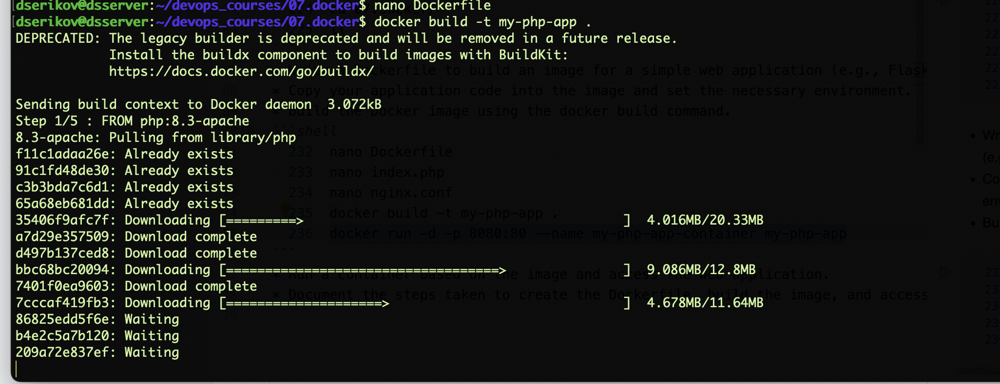

# 07. Docker

## Homework Assignment 1: Docker Installation and Basic Commands

* Install Docker on your local machine or a virtual environment.
**for Ubuntu 24.04**
```shell
sudo apt update
sudo apt install docker.io
sudo usermod -aG docker $USER
newgrp docker #--- refresh membership
groups $USER
```

```shell
dserikov@dsserver:~$ groups $USER
# dserikov : dserikov adm cdrom sudo dip plugdev lxd docker
```
* Verify the Docker installation by running the docker --version command.
```shell
dserikov@dsserver:~$ docker -v
# Docker version 24.0.7, build 24.0.7-0ubuntu4
```
* Pull the official "hello-world" Docker image and run a container based on it.
```shell
dserikov@dsserver:~$ docker run hello-world

# Hello from Docker!
# This message shows that your installation appears to be working correctly.
# 
# To generate this message, Docker took the following steps:
#  1. The Docker client contacted the Docker daemon.
#  2. The Docker daemon pulled the "hello-world" image from the Docker Hub.
#     (amd64)
#  3. The Docker daemon created a new container from that image which runs the
#     executable that produces the output you are currently reading.
#  4. The Docker daemon streamed that output to the Docker client, which sent it
#     to your terminal.
# 
# To try something more ambitious, you can run an Ubuntu container with:
#  $ docker run -it ubuntu bash
# 
# Share images, automate workflows, and more with a free Docker ID:
#  https://hub.docker.com/
# 
# For more examples and ideas, visit:
#  https://docs.docker.com/get-started/

```
* List the running containers using the docker ps command.
```shell
dserikov@dsserver:~$ docker ps
# CONTAINER ID   IMAGE     COMMAND   CREATED   STATUS    PORTS     NAMES
```

## Homework Assignment 2: Building a Docker Image with Dockerfile

* Create a new directory for your Dockerfile and application code.
```shell
  220  pwd # /home/dserikov/
  221  cd devops_courses/
  222  ll
  223  mkdir 07.docker
  224  cd 07.docker/
  225  ll
```
* Write a Dockerfile to build an image for a simple web application (e.g., Flask or Node.js).
* Copy your application code into the image and set the necessary environment.
* Build the Docker image using the docker build command.
```shell
  232  nano Dockerfile 
  233  nano index.php 
  234  docker build -t my-php-app .
```
**Dockerfile**

```ini
# Use the official PHP image with Apache
FROM php:8.3-apache

# Set the working directory
WORKDIR /var/www/html

# Copy the current directory contents into the container at /var/www/html
COPY . .

# Expose port 80
EXPOSE 80

# Start Apache in the foreground (this is needed to keep the container running)
CMD ["apache2-foreground"]
```
**index.php**
```php
<?php
echo "Hello, World!";
```



* Run a container based on the image and access the web application.
```shell
  235  docker run -d -p 8080:80 --name my-php-app-container my-php-app
```
* Document the steps taken to create the Dockerfile, build the image, and access the app.

![img.png](img.png

* Cleaning
```shell
  250  docker ps

  # CONTAINER ID   IMAGE        COMMAND                  CREATED          STATUS          PORTS                                   NAMES
  # 689d89fef419   my-php-app   "docker-php-entrypoi…"   21 seconds ago   Up 20 seconds   0.0.0.0:8080->80/tcp, :::8080->80/tcp   my-php-app-container
```
```shell
  251  docker stop 689d89fef419
  252  docker rm my-php-app-container 
```