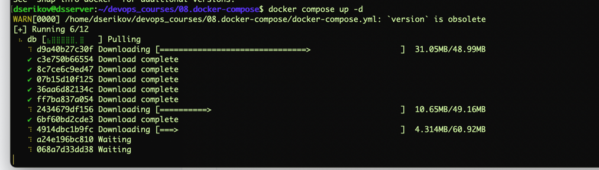
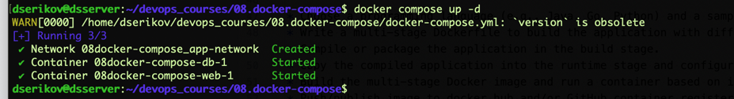
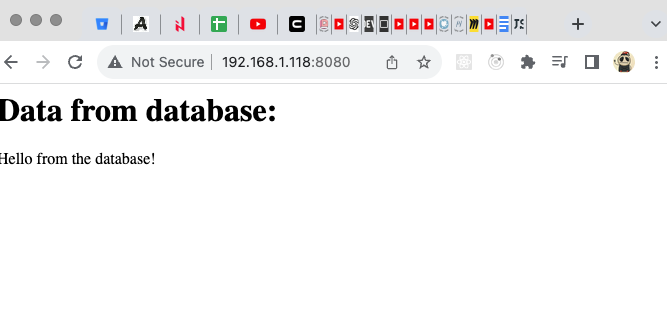
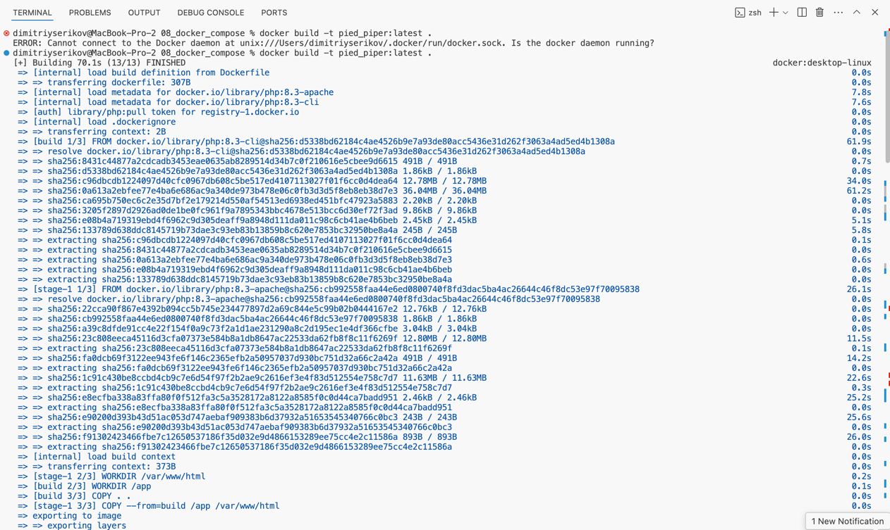
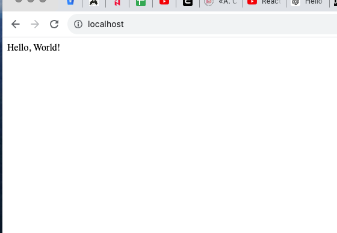
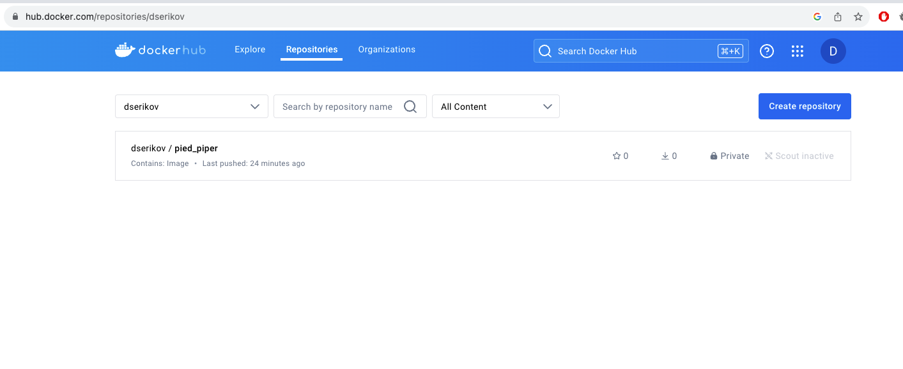
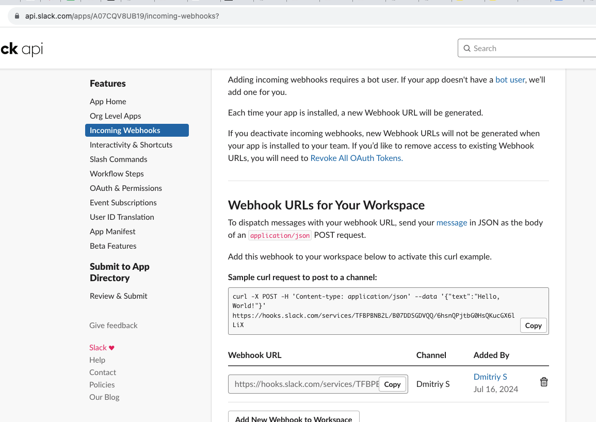
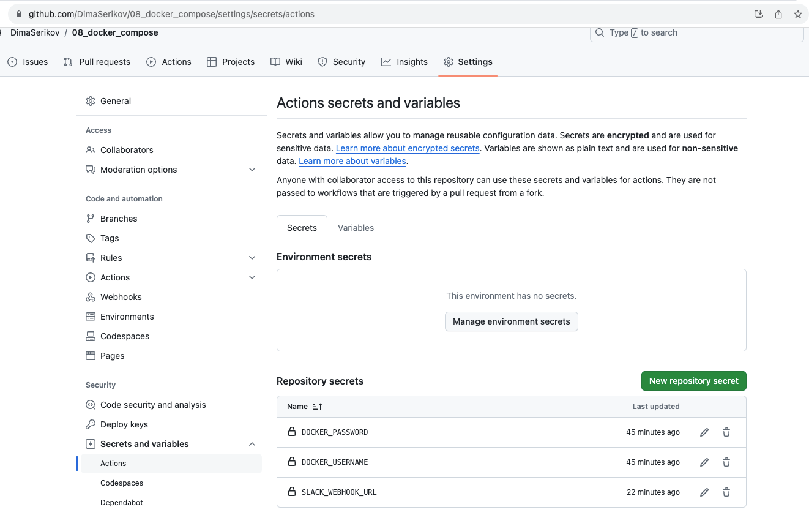
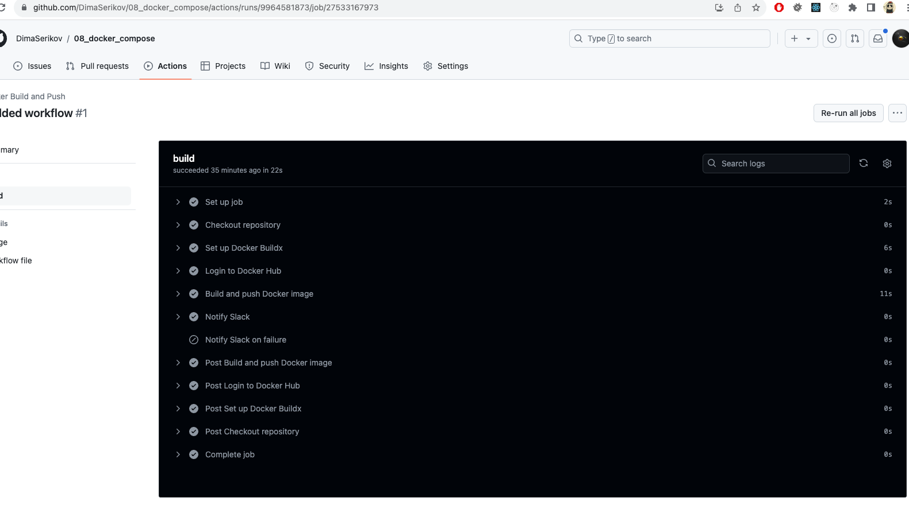
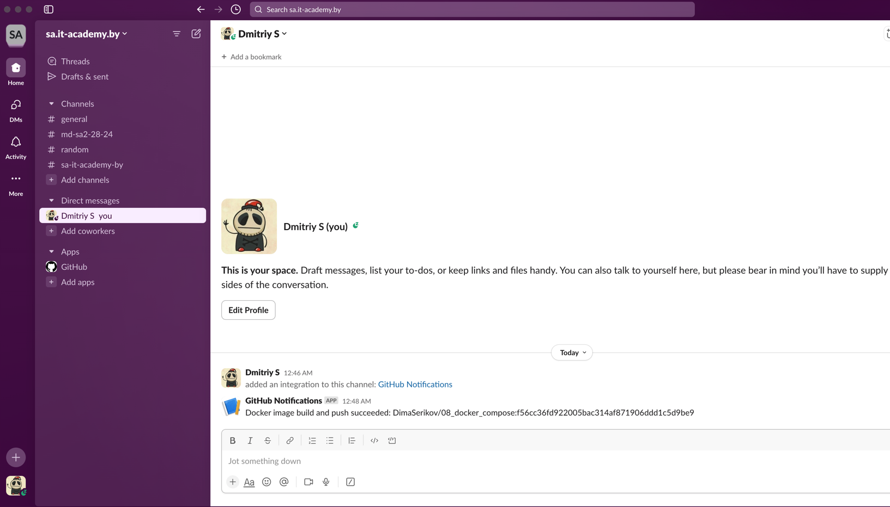

# 08. Docker. Docker compose

## Homework Assignment 1: Docker Compose for Application Stacks

* Select a combination of services (e.g., web app, database) to create a multi-container application.
* Create a Docker Compose YAML file to define the services, networks, and volumes.
* Configure environment variables and dependencies between services.

**docker-compose.yml**
```yaml
version: '3.8'

services:
  web:
    build: ./web
    ports:
      - "8080:80"
    depends_on:
      - db
    networks:
      - app-network

  db:
    image: mysql:8.0
    volumes:
      - db-data:/var/lib/mysql
      - ./db/init.sql:/docker-entrypoint-initdb.d/init.sql
    environment:
      MYSQL_ROOT_PASSWORD: tiger
      MYSQL_DATABASE: test_db
    networks:
      - app-network

networks:
  app-network:

volumes:
  db-data:
```
**db/init.sql**
```sql
CREATE TABLE test_table (
    id INT AUTO_INCREMENT PRIMARY KEY,
    data VARCHAR(255) NOT NULL
);

INSERT INTO test_table (data) VALUES ('Hello from the database!');
```
**web/Dockerfile**

```shell
# Use the official PHP image with Apache
FROM php:8.3-apache

# Enable the pdo_mysql extension
RUN docker-php-ext-install pdo pdo_mysql

# Set the working directory
WORKDIR /var/www/html

# Copy the current directory contents into the container at /var/www/html
COPY . .

# Expose port 80
EXPOSE 80

# Start Apache in the foreground (this is needed to keep the container running)
CMD ["apache2-foreground"]
```
**web/index.php**
```php
<?php
$host = 'db';
$db = 'test_db';
$user = 'root';
$pass = 'tiger';
$charset = 'utf8mb4';

$dsn = "mysql:host=$host;dbname=$db;charset=$charset";
$options = [
    PDO::ATTR_ERRMODE            => PDO::ERRMODE_EXCEPTION,
    PDO::ATTR_DEFAULT_FETCH_MODE => PDO::FETCH_ASSOC,
    PDO::ATTR_EMULATE_PREPARES   => false,
];

try {
    $pdo = new PDO($dsn, $user, $pass, $options);
    $stmt = $pdo->query('SELECT * FROM test_table');
    echo "<h1>Data from database:</h1>";
    while ($row = $stmt->fetch()) {
        echo $row['data'] . "<br>";
    }
} catch (\PDOException $e) {
    throw new \PDOException($e->getMessage(), (int)$e->getCode());
}
```

* Run the application stack using the docker-compose up or docker compose up command.
```shell
docker compose up -d
```



* Access the application through a web browser or API client.


## Homework Assignment 2: Docker build automation (GitHub action)

* Choose a programming language (e.g., Java, Go, Python) and a sample application.
* Write a multi-stage Dockerfile to build the application with different stages for build and runtime.
```dockerfile
# Build stage
FROM php:8.3-cli as build

WORKDIR /app

# Copy application files
COPY . .

# Runtime stage
FROM php:8.3-apache

WORKDIR /var/www/html

# Copy application files from build stage
COPY --from=build /app /var/www/html

EXPOSE 80

CMD ["apache2-foreground"]
```
* Compile or package the application in the build stage.
* Copy the compiled application into the runtime stage and configure it to run.
* Build the multi-stage Docker image and run a container based on it.
```shell
docker build -t pied_piper:latest .
docker run -d -p 80:80 pied_piper:latest
dimitriyserikov@MacBook-Pro-2 08_docker_compose % docker ps
# CONTAINER ID   IMAGE               COMMAND                  CREATED             STATUS             PORTS                NAMES
# bcaf272c98a6   pied_piper:latest   "docker-php-entrypoi…"   About an hour ago   Up About an hour   0.0.0.0:80->80/tcp   zealous_yonath
```


* Push/publish image to docker hub and/or GitHub container register.
```shell
docker login
# Authenticating with existing credentials...
# Login Succeeded
docker tag pied_piper:latest dserikov/pied_piper:latest
docker push dserikov/pied_piper:latest
```


I've added some automation with github actions to send a Slack notification when the build fails or succeeds.

For the `tags: dserikov/pied_piper:latest` here `latest` is a default tag used to identify the most recent version of an image.

To dynamically change the tag value the Git commit SHA, build number, or a version number can be used. 
This can be done using environment variables and GitHub Actions.
```shell
tags: |
    dserikov/pied_piper:latest
    dserikov/pied_piper:${{ steps.vars.outputs.sha_short }}
# OR
tags: |
    dserikov/pied_piper:latest
    dserikov/pied_piper:${{ env.VERSION }}
```
**.github/workflows/docker-build.yml**
```yaml
name: Docker Build and Push

on:
  push:
    branches:
      - main

jobs:
  build:
    runs-on: ubuntu-latest

    steps:
      - name: Checkout repository
        uses: actions/checkout@v2

      - name: Set up Docker Buildx
        uses: docker/setup-buildx-action@v1

      - name: Login to Docker Hub
        uses: docker/login-action@v1
        with:
          username: ${{ secrets.DOCKER_USERNAME }}
          password: ${{ secrets.DOCKER_PASSWORD }}

      - name: Build and push Docker image
        id: docker_build
        uses: docker/build-push-action@v2
        with:
          context: .
          push: true
          tags: dserikov/pied_piper:latest

      - name: Notify Slack
        if: success()
        uses: 8398a7/action-slack@v3
        with:
          status: custom
          fields: repo,message,commit,author
          custom_payload: '{"text":"Docker image build and push succeeded: ${{ github.repository }}:${{ github.sha }}"}'
        env:
          SLACK_WEBHOOK_URL: ${{ secrets.SLACK_WEBHOOK_URL }}

      - name: Notify Slack on failure
        if: failure()
        uses: 8398a7/action-slack@v3
        with:
          status: custom
          fields: repo,message,commit,author
          custom_payload: '{"text":"Docker image build and push failed: ${{ github.repository }}:${{ github.sha }}"}'
        env:
          SLACK_WEBHOOK_URL: ${{ secrets.SLACK_WEBHOOK_URL }}
```

  * Slack notification when build failed/success with image name/tag. 
  * Navigate to https://api.slack.com/apps
  * Click the "Create New App" button.
  * Choose "From scratch".
  * Enter an app name (e.g., "GitHub Notifications") and select the workspace where you want to install the app.
  * Click the "Create App" button.
  * In the left-hand sidebar, click on "Incoming Webhooks".
  * Click the toggle to turn on "Activate Incoming Webhooks".
  * Click the "Add New Webhook to Workspace" button.
  * Select the channel where you want the notifications to be sent
  * Click the "Allow" button.
  * After creating the webhook, you'll see a new webhook URL in the "Webhook URLs for Your Workspace" section.
  * Copy this URL. You will use it to send messages to the specified Slack channel.

**Config Slack result:**

**Git settings:**


* Document the Dockerfile structure, the build process, and the advantages of multi-stage builds.




Link to repository: https://github.com/DimaSerikov/08_docker_compose