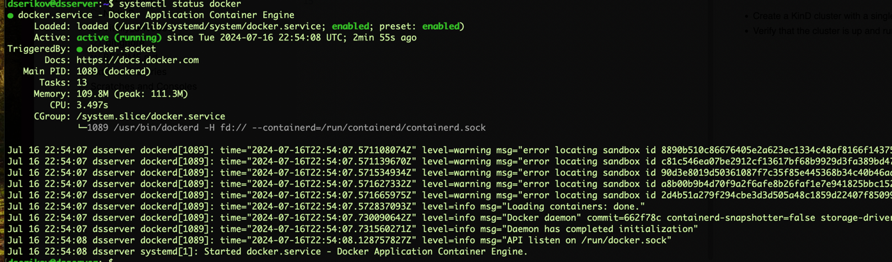
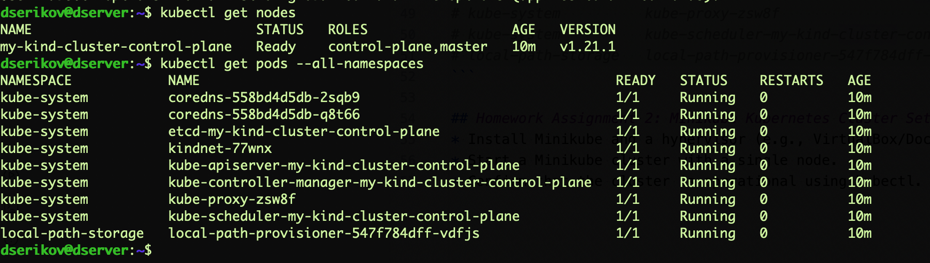
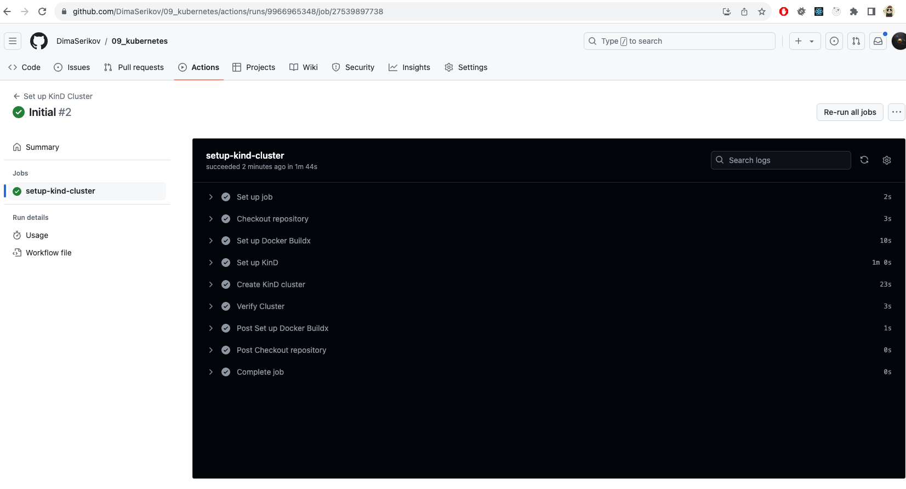

# 09. Kubernetes

## Homework Assignment 1: KinD Kubernetes Cluster Setup
* Install Docker and KinD on your local machine.

Docker had already been installed:
```shell
systemctl status docker
```

KinD installation:
```shell
curl -Lo ./kind https://kind.sigs.k8s.io/dl/v0.11.1/kind-$(uname)-amd64
chmod +x ./kind
sudo mv ./kind /usr/local/bin/kind
```
kubectl installation:
```shell
curl -LO "https://dl.k8s.io/release/$(curl -L -s https://dl.k8s.io/release/stable.txt)/bin/$(uname)/amd64/kubectl"
chmod +x ./kubectl
sudo mv ./kubectl /usr/local/bin/kubectl
```
* Create a KinD cluster with a single control plane node.
```shell
docker login
# Login Succeeded
kind create cluster --name myKindCluster
# ERROR: failed to create cluster: 'myKindCluster' is not a valid cluster name, cluster names must match `^[a-z0-9.-]+$`
kind create cluster --name my-kind-cluster
```
* Verify that the cluster is up and running using kubectl.
```shell
kubectl get nodes

# NAME                            STATUS   ROLES                  AGE   VERSION
# my-kind-cluster-control-plane   Ready    control-plane,master   10m   v1.21.1
```

```shell
kubectl get pods --all-namespaces

# NAMESPACE            NAME                                                    READY   STATUS    RESTARTS   AGE
# kube-system          coredns-558bd4d5db-2sqb9                                1/1     Running   0          10m
# kube-system          coredns-558bd4d5db-q8t66                                1/1     Running   0          10m
# kube-system          etcd-my-kind-cluster-control-plane                      1/1     Running   0          10m
# kube-system          kindnet-77wnx                                           1/1     Running   0          10m
# kube-system          kube-apiserver-my-kind-cluster-control-plane            1/1     Running   0          10m
# kube-system          kube-controller-manager-my-kind-cluster-control-plane   1/1     Running   0          10m
# kube-system          kube-proxy-zsw8f                                        1/1     Running   0          10m
# kube-system          kube-scheduler-my-kind-cluster-control-plane            1/1     Running   0          10m
# local-path-storage   local-path-provisioner-547f784dff-vdfjs                 1/1     Running   0          10m
```


## Homework Assignment 2: Minikube Kubernetes Cluster Setup
* Install Minikube and a hypervisor (e.g., VirtualBox/Docker) on your local machine.
```shell
curl -LO "https://dl.k8s.io/release/$(curl -L -s https://dl.k8s.io/release/stable.txt)/bin/$(uname)/amd64/kubectl"
chmod +x kubectl
sudo mv kubectl /usr/local/bin/
```
* Start a Minikube cluster with a single node.
```shell
minikube start --driver=docker
```
* Confirm that the cluster is operational using kubectl.
```shell
minikube status

# minikube
# type: Control Plane
# host: Running
# kubelet: Running
# apiserver: Running
# kubeconfig: Configured
```

```shell
kubectl get nodes

# NAME       STATUS   ROLES           AGE   VERSION
# minikube   Ready    control-plane   27s   v1.30.0
```

```shell
kubectl get pods --all-namespaces

# NAMESPACE     NAME                               READY   STATUS    RESTARTS   AGE
# kube-system   coredns-7db6d8ff4d-sxdz2           0/1     Running   0          16s
# kube-system   etcd-minikube                      1/1     Running   0          30s
# kube-system   kube-apiserver-minikube            1/1     Running   0          30s
# kube-system   kube-controller-manager-minikube   1/1     Running   0          30s
# kube-system   kube-proxy-7kqc6                   1/1     Running   0          16s
# kube-system   kube-scheduler-minikube            1/1     Running   0          30s
# kube-system   storage-provisioner                1/1     Running   0          27s
```


## Homework Assignment 3: GitHub Actions for KinD Cluster Setup
* Create a [GitHub repository](https://github.com/DimaSerikov/09_kubernetes) for your Kubernetes-related assignments.
* Write a GitHub Actions workflow that sets up a KinD cluster.
* Configure the workflow to run on every push to a specific branch.
* Use a Docker container or GitHub-hosted runner for the workflow execution.
```yaml
name: Set up KinD Cluster

on:
  push:
    branches:
      - main

jobs:
  setup-kind-cluster:
    runs-on: ubuntu-latest
    
    steps:
      - name: Checkout repository
        uses: actions/checkout@v2

      - name: Set up Docker Buildx
        uses: docker/setup-buildx-action@v1

      - name: Set up KinD
        uses: engineerd/setup-kind@v0.5.0
        with:
          version: v0.11.1

      - name: Create KinD cluster
        run: kind create cluster --name kind-cluster

      - name: Verify Cluster
        run: kubectl get nodes
```



**Full logs:**
```shell
2024-07-17T02:06:01.7407479Z Current runner version: '2.317.0'
2024-07-17T02:06:01.7433519Z ##[group]Operating System
2024-07-17T02:06:01.7434129Z Ubuntu
2024-07-17T02:06:01.7434541Z 22.04.4
2024-07-17T02:06:01.7434883Z LTS
2024-07-17T02:06:01.7435201Z ##[endgroup]
2024-07-17T02:06:01.7435628Z ##[group]Runner Image
2024-07-17T02:06:01.7436055Z Image: ubuntu-22.04
2024-07-17T02:06:01.7436435Z Version: 20240708.1.0
2024-07-17T02:06:01.7437455Z Included Software: https://github.com/actions/runner-images/blob/ubuntu22/20240708.1/images/ubuntu/Ubuntu2204-Readme.md
2024-07-17T02:06:01.7439102Z Image Release: https://github.com/actions/runner-images/releases/tag/ubuntu22%2F20240708.1
2024-07-17T02:06:01.7439958Z ##[endgroup]
2024-07-17T02:06:01.7440410Z ##[group]Runner Image Provisioner
2024-07-17T02:06:01.7440900Z 2.0.370.1
2024-07-17T02:06:01.7441247Z ##[endgroup]
2024-07-17T02:06:01.7442282Z ##[group]GITHUB_TOKEN Permissions
2024-07-17T02:06:01.7443831Z Contents: read
2024-07-17T02:06:01.7444235Z Metadata: read
2024-07-17T02:06:01.7444923Z Packages: read
2024-07-17T02:06:01.7445454Z ##[endgroup]
2024-07-17T02:06:01.7448467Z Secret source: Actions
2024-07-17T02:06:01.7449021Z Prepare workflow directory
2024-07-17T02:06:01.8068892Z Prepare all required actions
2024-07-17T02:06:01.8241711Z Getting action download info
2024-07-17T02:06:01.9854519Z Download action repository 'actions/checkout@v2' (SHA:ee0669bd1cc54295c223e0bb666b733df41de1c5)
2024-07-17T02:06:02.6903132Z Download action repository 'docker/setup-buildx-action@v1' (SHA:f211e3e9ded2d9377c8cadc4489a4e38014bc4c9)
2024-07-17T02:06:02.8496405Z Download action repository 'engineerd/setup-kind@v0.5.0' (SHA:aa272fe2a7309878ffc2a81c56cfe3ef108ae7d0)
2024-07-17T02:06:03.2244679Z Complete job name: setup-kind-cluster
2024-07-17T02:06:03.3132753Z ##[group]Run actions/checkout@v2
2024-07-17T02:06:03.3133271Z with:
2024-07-17T02:06:03.3133752Z   repository: DimaSerikov/09_kubernetes
2024-07-17T02:06:03.3134394Z   token: ***
2024-07-17T02:06:03.3134710Z   ssh-strict: true
2024-07-17T02:06:03.3135174Z   persist-credentials: true
2024-07-17T02:06:03.3135574Z   clean: true
2024-07-17T02:06:03.3135863Z   fetch-depth: 1
2024-07-17T02:06:03.3136259Z   lfs: false
2024-07-17T02:06:03.3136616Z   submodules: false
2024-07-17T02:06:03.3136932Z   set-safe-directory: true
2024-07-17T02:06:03.3137391Z ##[endgroup]
2024-07-17T02:06:06.0801008Z Syncing repository: DimaSerikov/09_kubernetes
2024-07-17T02:06:06.1664609Z ##[group]Getting Git version info
2024-07-17T02:06:06.1665706Z Working directory is '/home/runner/work/09_kubernetes/09_kubernetes'
2024-07-17T02:06:06.1705090Z [command]/usr/bin/git version
2024-07-17T02:06:06.3231253Z git version 2.45.2
2024-07-17T02:06:06.3257398Z ##[endgroup]
2024-07-17T02:06:06.3331367Z Temporarily overriding HOME='/home/runner/work/_temp/071c6d88-28a7-48ec-b07e-ef360f120f79' before making global git config changes
2024-07-17T02:06:06.3332453Z Adding repository directory to the temporary git global config as a safe directory
2024-07-17T02:06:06.3334974Z [command]/usr/bin/git config --global --add safe.directory /home/runner/work/09_kubernetes/09_kubernetes
2024-07-17T02:06:06.3371407Z Deleting the contents of '/home/runner/work/09_kubernetes/09_kubernetes'
2024-07-17T02:06:06.3374662Z ##[group]Initializing the repository
2024-07-17T02:06:06.3378383Z [command]/usr/bin/git init /home/runner/work/09_kubernetes/09_kubernetes
2024-07-17T02:06:06.4066463Z hint: Using 'master' as the name for the initial branch. This default branch name
2024-07-17T02:06:06.4068196Z hint: is subject to change. To configure the initial branch name to use in all
2024-07-17T02:06:06.4069222Z hint: of your new repositories, which will suppress this warning, call:
2024-07-17T02:06:06.4069935Z hint:
2024-07-17T02:06:06.4070532Z hint: 	git config --global init.defaultBranch <name>
2024-07-17T02:06:06.4071018Z hint:
2024-07-17T02:06:06.4071535Z hint: Names commonly chosen instead of 'master' are 'main', 'trunk' and
2024-07-17T02:06:06.4072398Z hint: 'development'. The just-created branch can be renamed via this command:
2024-07-17T02:06:06.4073290Z hint:
2024-07-17T02:06:06.4073664Z hint: 	git branch -m <name>
2024-07-17T02:06:06.4117647Z Initialized empty Git repository in /home/runner/work/09_kubernetes/09_kubernetes/.git/
2024-07-17T02:06:06.4129544Z [command]/usr/bin/git remote add origin https://github.com/DimaSerikov/09_kubernetes
2024-07-17T02:06:06.4233387Z ##[endgroup]
2024-07-17T02:06:06.4235088Z ##[group]Disabling automatic garbage collection
2024-07-17T02:06:06.4237347Z [command]/usr/bin/git config --local gc.auto 0
2024-07-17T02:06:06.4266009Z ##[endgroup]
2024-07-17T02:06:06.4267258Z ##[group]Setting up auth
2024-07-17T02:06:06.4272635Z [command]/usr/bin/git config --local --name-only --get-regexp core\.sshCommand
2024-07-17T02:06:06.4301400Z [command]/usr/bin/git submodule foreach --recursive sh -c "git config --local --name-only --get-regexp 'core\.sshCommand' && git config --local --unset-all 'core.sshCommand' || :"
2024-07-17T02:06:06.6380987Z [command]/usr/bin/git config --local --name-only --get-regexp http\.https\:\/\/github\.com\/\.extraheader
2024-07-17T02:06:06.6412712Z [command]/usr/bin/git submodule foreach --recursive sh -c "git config --local --name-only --get-regexp 'http\.https\:\/\/github\.com\/\.extraheader' && git config --local --unset-all 'http.https://github.com/.extraheader' || :"
2024-07-17T02:06:06.6653842Z [command]/usr/bin/git config --local http.https://github.com/.extraheader AUTHORIZATION: basic ***
2024-07-17T02:06:06.6720566Z ##[endgroup]
2024-07-17T02:06:06.6721703Z ##[group]Fetching the repository
2024-07-17T02:06:06.6731131Z [command]/usr/bin/git -c protocol.version=2 fetch --no-tags --prune --progress --no-recurse-submodules --depth=1 origin +4d51c66fd97dd76b5d907bb87009c54a6bc1ccc2:refs/remotes/origin/main
2024-07-17T02:06:06.8912315Z remote: Enumerating objects: 6, done.        
2024-07-17T02:06:06.8913417Z remote: Counting objects:  16% (1/6)        
2024-07-17T02:06:06.8914537Z remote: Counting objects:  33% (2/6)        
2024-07-17T02:06:06.8940342Z remote: Counting objects:  50% (3/6)        
2024-07-17T02:06:06.8941221Z remote: Counting objects:  66% (4/6)        
2024-07-17T02:06:06.8941945Z remote: Counting objects:  83% (5/6)        
2024-07-17T02:06:06.8942867Z remote: Counting objects: 100% (6/6)        
2024-07-17T02:06:06.8943699Z remote: Counting objects: 100% (6/6), done.        
2024-07-17T02:06:06.8944517Z remote: Compressing objects:  25% (1/4)        
2024-07-17T02:06:06.8945318Z remote: Compressing objects:  50% (2/4)        
2024-07-17T02:06:06.8946157Z remote: Compressing objects:  75% (3/4)        
2024-07-17T02:06:06.8946905Z remote: Compressing objects: 100% (4/4)        
2024-07-17T02:06:06.8947737Z remote: Compressing objects: 100% (4/4), done.        
2024-07-17T02:06:06.8949123Z remote: Total 6 (delta 0), reused 5 (delta 0), pack-reused 0        
2024-07-17T02:06:06.9231129Z From https://github.com/DimaSerikov/09_kubernetes
2024-07-17T02:06:06.9232296Z  * [new ref]         4d51c66fd97dd76b5d907bb87009c54a6bc1ccc2 -> origin/main
2024-07-17T02:06:06.9337755Z ##[endgroup]
2024-07-17T02:06:06.9338456Z ##[group]Determining the checkout info
2024-07-17T02:06:06.9340060Z ##[endgroup]
2024-07-17T02:06:06.9341104Z ##[group]Checking out the ref
2024-07-17T02:06:06.9346335Z [command]/usr/bin/git checkout --progress --force -B main refs/remotes/origin/main
2024-07-17T02:06:06.9390486Z Switched to a new branch 'main'
2024-07-17T02:06:06.9393518Z branch 'main' set up to track 'origin/main'.
2024-07-17T02:06:06.9400175Z ##[endgroup]
2024-07-17T02:06:06.9437436Z [command]/usr/bin/git log -1 --format='%H'
2024-07-17T02:06:06.9463754Z '4d51c66fd97dd76b5d907bb87009c54a6bc1ccc2'
2024-07-17T02:06:06.9829307Z ##[group]Run docker/setup-buildx-action@v1
2024-07-17T02:06:06.9829808Z with:
2024-07-17T02:06:06.9830147Z   driver: docker-container
2024-07-17T02:06:06.9830907Z   buildkitd-flags: --allow-insecure-entitlement security.insecure --allow-insecure-entitlement network.host
2024-07-17T02:06:06.9831622Z   install: false
2024-07-17T02:06:06.9831962Z   use: true
2024-07-17T02:06:06.9832544Z ##[endgroup]
2024-07-17T02:06:07.0336282Z ##[warning]The `save-state` command is deprecated and will be disabled soon. Please upgrade to using Environment Files. For more information see: https://github.blog/changelog/2022-10-11-github-actions-deprecating-save-state-and-set-output-commands/
2024-07-17T02:06:12.2139008Z ##[warning]The `save-state` command is deprecated and will be disabled soon. Please upgrade to using Environment Files. For more information see: https://github.blog/changelog/2022-10-11-github-actions-deprecating-save-state-and-set-output-commands/
2024-07-17T02:06:12.2143455Z ##[group]Docker info
2024-07-17T02:06:12.2147322Z [command]/usr/bin/docker version
2024-07-17T02:06:12.2462841Z Client: Docker Engine - Community
2024-07-17T02:06:12.2465408Z  Version:           26.1.3
2024-07-17T02:06:12.2466063Z  API version:       1.45
2024-07-17T02:06:12.2466887Z  Go version:        go1.21.10
2024-07-17T02:06:12.2467488Z  Git commit:        b72abbb
2024-07-17T02:06:12.2468083Z  Built:             Thu May 16 08:33:29 2024
2024-07-17T02:06:12.2468927Z  OS/Arch:           linux/amd64
2024-07-17T02:06:12.2469520Z  Context:           default
2024-07-17T02:06:12.2469855Z 
2024-07-17T02:06:12.2470162Z Server: Docker Engine - Community
2024-07-17T02:06:12.2470887Z  Engine:
2024-07-17T02:06:12.2471368Z   Version:          26.1.3
2024-07-17T02:06:12.2471995Z   API version:      1.45 (minimum version 1.24)
2024-07-17T02:06:12.2472835Z   Go version:       go1.21.10
2024-07-17T02:06:12.2473400Z   Git commit:       8e96db1
2024-07-17T02:06:12.2474015Z   Built:            Thu May 16 08:33:29 2024
2024-07-17T02:06:12.2475455Z   OS/Arch:          linux/amd64
2024-07-17T02:06:12.2476121Z   Experimental:     false
2024-07-17T02:06:12.2476768Z  containerd:
2024-07-17T02:06:12.2477334Z   Version:          1.7.18
2024-07-17T02:06:12.2478463Z   GitCommit:        ae71819c4f5e67bb4d5ae76a6b735f29cc25774e
2024-07-17T02:06:12.2479480Z  runc:
2024-07-17T02:06:12.2480039Z   Version:          1.7.18
2024-07-17T02:06:12.2481008Z   GitCommit:        v1.1.13-0-g58aa920
2024-07-17T02:06:12.2481706Z  docker-init:
2024-07-17T02:06:12.2482241Z   Version:          0.19.0
2024-07-17T02:06:12.2483004Z   GitCommit:        de40ad0
2024-07-17T02:06:12.2500040Z [command]/usr/bin/docker info
2024-07-17T02:06:12.3060873Z Client: Docker Engine - Community
2024-07-17T02:06:12.3061740Z  Version:    26.1.3
2024-07-17T02:06:12.3062443Z  Context:    default
2024-07-17T02:06:12.3063012Z  Debug Mode: false
2024-07-17T02:06:12.3063477Z  Plugins:
2024-07-17T02:06:12.3064106Z   buildx: Docker Buildx (Docker Inc.)
2024-07-17T02:06:12.3064814Z     Version:  v0.15.1
2024-07-17T02:06:12.3065554Z     Path:     /usr/libexec/docker/cli-plugins/docker-buildx
2024-07-17T02:06:12.3066463Z   compose: Docker Compose (Docker Inc.)
2024-07-17T02:06:12.3067147Z     Version:  v2.27.1
2024-07-17T02:06:12.3067866Z     Path:     /usr/libexec/docker/cli-plugins/docker-compose
2024-07-17T02:06:12.3068562Z 
2024-07-17T02:06:12.3068712Z Server:
2024-07-17T02:06:12.3069028Z  Containers: 0
2024-07-17T02:06:12.3069334Z   Running: 0
2024-07-17T02:06:12.3069746Z   Paused: 0
2024-07-17T02:06:12.3070055Z   Stopped: 0
2024-07-17T02:06:12.3070333Z  Images: 15
2024-07-17T02:06:12.3070735Z  Server Version: 26.1.3
2024-07-17T02:06:12.3071067Z  Storage Driver: overlay2
2024-07-17T02:06:12.3071449Z   Backing Filesystem: extfs
2024-07-17T02:06:12.3071918Z   Supports d_type: true
2024-07-17T02:06:12.3072244Z   Using metacopy: false
2024-07-17T02:06:12.3072601Z   Native Overlay Diff: false
2024-07-17T02:06:12.3073279Z   userxattr: false
2024-07-17T02:06:12.3073698Z  Logging Driver: json-file
2024-07-17T02:06:12.3074488Z  Cgroup Driver: cgroupfs
2024-07-17T02:06:12.3074977Z  Cgroup Version: 2
2024-07-17T02:06:12.3075280Z  Plugins:
2024-07-17T02:06:12.3075613Z   Volume: local
2024-07-17T02:06:12.3076065Z   Network: bridge host ipvlan macvlan null overlay
2024-07-17T02:06:12.3076740Z   Log: awslogs fluentd gcplogs gelf journald json-file local splunk syslog
2024-07-17T02:06:12.3077321Z  Swarm: inactive
2024-07-17T02:06:12.3078245Z  Runtimes: io.containerd.runc.v2 runc
2024-07-17T02:06:12.3078723Z  Default Runtime: runc
2024-07-17T02:06:12.3079114Z  Init Binary: docker-init
2024-07-17T02:06:12.3080229Z  containerd version: ae71819c4f5e67bb4d5ae76a6b735f29cc25774e
2024-07-17T02:06:12.3081142Z  runc version: v1.1.13-0-g58aa920
2024-07-17T02:06:12.3081592Z  init version: de40ad0
2024-07-17T02:06:12.3082038Z  Security Options:
2024-07-17T02:06:12.3082389Z   apparmor
2024-07-17T02:06:12.3082658Z   seccomp
2024-07-17T02:06:12.3083032Z    Profile: builtin
2024-07-17T02:06:12.3083507Z   cgroupns
2024-07-17T02:06:12.3083858Z  Kernel Version: 6.5.0-1023-azure
2024-07-17T02:06:12.3084375Z  Operating System: Ubuntu 22.04.4 LTS
2024-07-17T02:06:12.3084790Z  OSType: linux
2024-07-17T02:06:12.3085102Z  Architecture: x86_64
2024-07-17T02:06:12.3085537Z  CPUs: 4
2024-07-17T02:06:12.3085852Z  Total Memory: 15.61GiB
2024-07-17T02:06:12.3086204Z  Name: fv-az1215-344
2024-07-17T02:06:12.3086705Z  ID: e47e7669-35e6-4532-94ca-a2b577895d60
2024-07-17T02:06:12.3087151Z  Docker Root Dir: /var/lib/docker
2024-07-17T02:06:12.3087507Z  Debug Mode: false
2024-07-17T02:06:12.3087938Z  Username: githubactions
2024-07-17T02:06:12.3088307Z  Experimental: false
2024-07-17T02:06:12.3088624Z  Insecure Registries:
2024-07-17T02:06:12.3089044Z   127.0.0.0/8
2024-07-17T02:06:12.3089339Z  Live Restore Enabled: false
2024-07-17T02:06:12.3089600Z 
2024-07-17T02:06:12.3090541Z ##[endgroup]
2024-07-17T02:06:12.4944615Z ##[group]Buildx version
2024-07-17T02:06:12.4958161Z [command]/usr/bin/docker buildx version
2024-07-17T02:06:12.5355735Z github.com/docker/buildx v0.15.1 1c1dbb2e4cb5363110f42102744a08d034c2300d
2024-07-17T02:06:12.5387322Z ##[endgroup]
2024-07-17T02:06:12.5401348Z ##[warning]The `set-output` command is deprecated and will be disabled soon. Please upgrade to using Environment Files. For more information see: https://github.blog/changelog/2022-10-11-github-actions-deprecating-save-state-and-set-output-commands/
2024-07-17T02:06:12.5411359Z ##[warning]The `save-state` command is deprecated and will be disabled soon. Please upgrade to using Environment Files. For more information see: https://github.blog/changelog/2022-10-11-github-actions-deprecating-save-state-and-set-output-commands/
2024-07-17T02:06:12.5415383Z ##[group]Creating a new builder instance
2024-07-17T02:06:12.5438763Z [command]/usr/bin/docker buildx create --name builder-8bfedcc9-6ea9-43ed-bb7b-037b50a57d9e --driver docker-container --buildkitd-flags --allow-insecure-entitlement security.insecure --allow-insecure-entitlement network.host --use
2024-07-17T02:06:12.6167464Z builder-8bfedcc9-6ea9-43ed-bb7b-037b50a57d9e
2024-07-17T02:06:12.6199090Z ##[endgroup]
2024-07-17T02:06:12.6199992Z ##[group]Booting builder
2024-07-17T02:06:12.6220347Z [command]/usr/bin/docker buildx inspect --bootstrap --builder builder-8bfedcc9-6ea9-43ed-bb7b-037b50a57d9e
2024-07-17T02:06:12.6754933Z #1 [internal] booting buildkit
2024-07-17T02:06:12.8260076Z #1 pulling image moby/buildkit:buildx-stable-1
2024-07-17T02:06:15.3585125Z #1 pulling image moby/buildkit:buildx-stable-1 2.7s done
2024-07-17T02:06:15.5090745Z #1 creating container buildx_buildkit_builder-8bfedcc9-6ea9-43ed-bb7b-037b50a57d9e0
2024-07-17T02:06:16.4974643Z #1 creating container buildx_buildkit_builder-8bfedcc9-6ea9-43ed-bb7b-037b50a57d9e0 1.1s done
2024-07-17T02:06:16.4984453Z #1 DONE 3.8s
2024-07-17T02:06:16.5741032Z Name:          builder-8bfedcc9-6ea9-43ed-bb7b-037b50a57d9e
2024-07-17T02:06:16.5742466Z Driver:        docker-container
2024-07-17T02:06:16.5743895Z Last Activity: 2024-07-17 02:06:12 +0000 UTC
2024-07-17T02:06:16.5744815Z 
2024-07-17T02:06:16.5745638Z Nodes:
2024-07-17T02:06:16.5746489Z Name:                  builder-8bfedcc9-6ea9-43ed-bb7b-037b50a57d9e0
2024-07-17T02:06:16.5747596Z Endpoint:              unix:///var/run/docker.sock
2024-07-17T02:06:16.5748342Z Status:                running
2024-07-17T02:06:16.5749696Z BuildKit daemon flags: --allow-insecure-entitlement security.insecure --allow-insecure-entitlement network.host
2024-07-17T02:06:16.5751314Z BuildKit version:      v0.15.0
2024-07-17T02:06:16.5752094Z Platforms:             linux/amd64, linux/amd64/v2, linux/amd64/v3, linux/386
2024-07-17T02:06:16.5752657Z Labels:
2024-07-17T02:06:16.5753120Z  org.mobyproject.buildkit.worker.executor:         oci
2024-07-17T02:06:16.5753748Z  org.mobyproject.buildkit.worker.hostname:         d039d0a626b5
2024-07-17T02:06:16.5754390Z  org.mobyproject.buildkit.worker.network:          host
2024-07-17T02:06:16.5755148Z  org.mobyproject.buildkit.worker.oci.process-mode: sandbox
2024-07-17T02:06:16.5755760Z  org.mobyproject.buildkit.worker.selinux.enabled:  false
2024-07-17T02:06:16.5756411Z  org.mobyproject.buildkit.worker.snapshotter:      overlayfs
2024-07-17T02:06:16.5757017Z GC Policy rule#0:
2024-07-17T02:06:16.5757338Z  All:           false
2024-07-17T02:06:16.5758789Z  Filters:       type==source.local,type==exec.cachemount,type==source.git.checkout
2024-07-17T02:06:16.5759510Z  Keep Duration: 48h0m0s
2024-07-17T02:06:16.5759877Z  Keep Bytes:    488.3MiB
2024-07-17T02:06:16.5760240Z GC Policy rule#1:
2024-07-17T02:06:16.5760645Z  All:           false
2024-07-17T02:06:16.5761010Z  Keep Duration: 1440h0m0s
2024-07-17T02:06:16.5761384Z  Keep Bytes:    7.451GiB
2024-07-17T02:06:16.5761801Z GC Policy rule#2:
2024-07-17T02:06:16.5762107Z  All:        false
2024-07-17T02:06:16.5762438Z  Keep Bytes: 7.451GiB
2024-07-17T02:06:16.5762903Z GC Policy rule#3:
2024-07-17T02:06:16.5763365Z  All:        true
2024-07-17T02:06:16.5763867Z  Keep Bytes: 7.451GiB
2024-07-17T02:06:16.5787260Z ##[endgroup]
2024-07-17T02:06:16.5792272Z ##[group]Inspect builder
2024-07-17T02:06:16.6841163Z {
2024-07-17T02:06:16.6843984Z   "name": "builder-8bfedcc9-6ea9-43ed-bb7b-037b50a57d9e",
2024-07-17T02:06:16.6845163Z   "driver": "docker-container",
2024-07-17T02:06:16.6846249Z   "node_name": "builder-8bfedcc9-6ea9-43ed-bb7b-037b50a57d9e0",
2024-07-17T02:06:16.6847237Z   "node_endpoint": "unix:///var/run/docker.sock",
2024-07-17T02:06:16.6848083Z   "node_status": "running",
2024-07-17T02:06:16.6848787Z   "node_platforms": "linux/amd64,linux/amd64/v2,linux/amd64/v3,linux/386"
2024-07-17T02:06:16.6849336Z }
2024-07-17T02:06:16.6853143Z ##[warning]The `set-output` command is deprecated and will be disabled soon. Please upgrade to using Environment Files. For more information see: https://github.blog/changelog/2022-10-11-github-actions-deprecating-save-state-and-set-output-commands/
2024-07-17T02:06:16.6860521Z ##[warning]The `set-output` command is deprecated and will be disabled soon. Please upgrade to using Environment Files. For more information see: https://github.blog/changelog/2022-10-11-github-actions-deprecating-save-state-and-set-output-commands/
2024-07-17T02:06:16.6868139Z ##[warning]The `set-output` command is deprecated and will be disabled soon. Please upgrade to using Environment Files. For more information see: https://github.blog/changelog/2022-10-11-github-actions-deprecating-save-state-and-set-output-commands/
2024-07-17T02:06:16.6875580Z ##[warning]The `set-output` command is deprecated and will be disabled soon. Please upgrade to using Environment Files. For more information see: https://github.blog/changelog/2022-10-11-github-actions-deprecating-save-state-and-set-output-commands/
2024-07-17T02:06:16.6885578Z ##[warning]The `set-output` command is deprecated and will be disabled soon. Please upgrade to using Environment Files. For more information see: https://github.blog/changelog/2022-10-11-github-actions-deprecating-save-state-and-set-output-commands/
2024-07-17T02:06:16.6889478Z ##[endgroup]
2024-07-17T02:06:16.6895306Z ##[warning]The `save-state` command is deprecated and will be disabled soon. Please upgrade to using Environment Files. For more information see: https://github.blog/changelog/2022-10-11-github-actions-deprecating-save-state-and-set-output-commands/
2024-07-17T02:06:16.6899184Z ##[group]BuildKit version
2024-07-17T02:06:17.0811530Z moby/buildkit:buildx-stable-1 => buildkitd github.com/moby/buildkit v0.15.0 e83d79a51fb49aeb921d8a2348ae14a58701c98c
2024-07-17T02:06:17.0813259Z ##[endgroup]
2024-07-17T02:06:17.0949353Z ##[group]Run engineerd/setup-kind@v0.5.0
2024-07-17T02:06:17.0949861Z with:
2024-07-17T02:06:17.0950169Z   version: v0.11.1
2024-07-17T02:06:17.0950568Z   name: kind
2024-07-17T02:06:17.0950908Z   wait: 300s
2024-07-17T02:06:17.0951255Z   skipClusterCreation: false
2024-07-17T02:06:17.0951673Z ##[endgroup]
2024-07-17T02:06:17.1380338Z downloading kind from https://github.com/kubernetes-sigs/kind/releases/download/v0.11.1/kind-linux-amd64
2024-07-17T02:06:17.3953714Z [command]/usr/bin/chmod +x /home/runner/work/_temp/bf7393b6-6136-4c0c-8e13-a56c796281e9
2024-07-17T02:06:17.4111167Z Executing kind with args create,cluster,--name,kind,--wait,300s
2024-07-17T02:06:17.4114281Z [command]/opt/hostedtoolcache/kind/0.11.1/x64/kind create cluster --name kind --wait 300s
2024-07-17T02:06:17.4928681Z Creating cluster "kind" ...
2024-07-17T02:06:17.4930603Z  • Ensuring node image (kindest/node:v1.21.1) 🖼  ...
2024-07-17T02:06:30.4758960Z  ✓ Ensuring node image (kindest/node:v1.21.1) 🖼
2024-07-17T02:06:30.4760218Z  • Preparing nodes 📦   ...
2024-07-17T02:06:34.2495032Z  ✓ Preparing nodes 📦 
2024-07-17T02:06:34.2781324Z  • Writing configuration 📜  ...
2024-07-17T02:06:34.5255021Z  ✓ Writing configuration 📜
2024-07-17T02:06:34.5256643Z  • Starting control-plane 🕹️  ...
2024-07-17T02:06:52.3034044Z  ✓ Starting control-plane 🕹️
2024-07-17T02:06:52.3035516Z  • Installing CNI 🔌  ...
2024-07-17T02:06:52.6175818Z  ✓ Installing CNI 🔌
2024-07-17T02:06:52.6176369Z  • Installing StorageClass 💾  ...
2024-07-17T02:06:52.8769372Z  ✓ Installing StorageClass 💾
2024-07-17T02:06:52.9113663Z  • Waiting ≤ 5m0s for control-plane = Ready ⏳  ...
2024-07-17T02:07:17.3978036Z  ✓ Waiting ≤ 5m0s for control-plane = Ready ⏳
2024-07-17T02:07:17.3978784Z  • Ready after 24s 💚
2024-07-17T02:07:17.5482124Z Set kubectl context to "kind-kind"
2024-07-17T02:07:17.5483028Z You can now use your cluster with:
2024-07-17T02:07:17.5483479Z 
2024-07-17T02:07:17.5483879Z kubectl cluster-info --context kind-kind
2024-07-17T02:07:17.5487823Z 
2024-07-17T02:07:17.5491027Z Not sure what to do next? 😅  Check out https://kind.sigs.k8s.io/docs/user/quick-start/
2024-07-17T02:07:17.5614145Z ##[group]Run kind create cluster --name kind-cluster
2024-07-17T02:07:17.5614808Z kind create cluster --name kind-cluster
2024-07-17T02:07:17.5659911Z shell: /usr/bin/bash -e {0}
2024-07-17T02:07:17.5660455Z ##[endgroup]
2024-07-17T02:07:17.6443856Z Creating cluster "kind-cluster" ...
2024-07-17T02:07:17.6444713Z  • Ensuring node image (kindest/node:v1.21.1) 🖼  ...
2024-07-17T02:07:17.6691560Z  ✓ Ensuring node image (kindest/node:v1.21.1) 🖼
2024-07-17T02:07:17.6692294Z  • Preparing nodes 📦   ...
2024-07-17T02:07:21.3116227Z  ✓ Preparing nodes 📦 
2024-07-17T02:07:21.3418979Z  • Writing configuration 📜  ...
2024-07-17T02:07:21.5698286Z  ✓ Writing configuration 📜
2024-07-17T02:07:21.5699226Z  • Starting control-plane 🕹️  ...
2024-07-17T02:07:39.7729268Z  ✓ Starting control-plane 🕹️
2024-07-17T02:07:39.7730262Z  • Installing CNI 🔌  ...
2024-07-17T02:07:40.1018577Z  ✓ Installing CNI 🔌
2024-07-17T02:07:40.1019609Z  • Installing StorageClass 💾  ...
2024-07-17T02:07:40.3592801Z  ✓ Installing StorageClass 💾
2024-07-17T02:07:40.5374517Z Set kubectl context to "kind-kind-cluster"
2024-07-17T02:07:40.5375112Z You can now use your cluster with:
2024-07-17T02:07:40.5375422Z 
2024-07-17T02:07:40.5375687Z kubectl cluster-info --context kind-kind-cluster
2024-07-17T02:07:40.5376163Z 
2024-07-17T02:07:40.5376823Z Not sure what to do next? 😅  Check out https://kind.sigs.k8s.io/docs/user/quick-start/
2024-07-17T02:07:40.5420758Z ##[group]Run kubectl get nodes
2024-07-17T02:07:40.5421303Z kubectl get nodes
2024-07-17T02:07:40.5461522Z shell: /usr/bin/bash -e {0}
2024-07-17T02:07:40.5462045Z ##[endgroup]
2024-07-17T02:07:43.7793401Z NAME                         STATUS     ROLES                  AGE   VERSION
2024-07-17T02:07:43.7794954Z kind-cluster-control-plane   NotReady   control-plane,master   7s    v1.21.1
2024-07-17T02:07:43.7876410Z Post job cleanup.
2024-07-17T02:07:43.8398954Z ##[group]Removing builder
2024-07-17T02:07:43.8435253Z [command]/usr/bin/docker buildx rm builder-8bfedcc9-6ea9-43ed-bb7b-037b50a57d9e
2024-07-17T02:07:44.0759342Z builder-8bfedcc9-6ea9-43ed-bb7b-037b50a57d9e removed
2024-07-17T02:07:44.0807193Z ##[endgroup]
2024-07-17T02:07:44.0909178Z Post job cleanup.
2024-07-17T02:07:44.1830242Z [command]/usr/bin/git version
2024-07-17T02:07:44.1868615Z git version 2.45.2
2024-07-17T02:07:44.1912300Z Temporarily overriding HOME='/home/runner/work/_temp/6d80de50-4c3d-43a0-8f31-a41c0b6db84b' before making global git config changes
2024-07-17T02:07:44.1913592Z Adding repository directory to the temporary git global config as a safe directory
2024-07-17T02:07:44.1917311Z [command]/usr/bin/git config --global --add safe.directory /home/runner/work/09_kubernetes/09_kubernetes
2024-07-17T02:07:44.1952854Z [command]/usr/bin/git config --local --name-only --get-regexp core\.sshCommand
2024-07-17T02:07:44.1984830Z [command]/usr/bin/git submodule foreach --recursive sh -c "git config --local --name-only --get-regexp 'core\.sshCommand' && git config --local --unset-all 'core.sshCommand' || :"
2024-07-17T02:07:44.2293271Z [command]/usr/bin/git config --local --name-only --get-regexp http\.https\:\/\/github\.com\/\.extraheader
2024-07-17T02:07:44.2315212Z http.https://github.com/.extraheader
2024-07-17T02:07:44.2326561Z [command]/usr/bin/git config --local --unset-all http.https://github.com/.extraheader
2024-07-17T02:07:44.2358868Z [command]/usr/bin/git submodule foreach --recursive sh -c "git config --local --name-only --get-regexp 'http\.https\:\/\/github\.com\/\.extraheader' && git config --local --unset-all 'http.https://github.com/.extraheader' || :"
2024-07-17T02:07:44.2847069Z Cleaning up orphan processes
```

## Homework Assignment 4: GitHub Actions for Minikube Cluster Setup
* Enhance the existing [GitHub repository](https://github.com/DimaSerikov/09_kubernetes) with another Actions workflow.
* This time, create a workflow that sets up a Minikube cluster.
* Configure the workflow to run on pull requests to the repository.
* Utilize appropriate GitHub Actions features to customize the workflow execution environment.

**.github/workflows/minikube-cluster.yml**
```yaml
name: Set up Minikube Cluster

on:
  push:
    branches:
      - main

jobs:
  setup-minikube-cluster:
    runs-on: ubuntu-latest

    steps:
      - name: Checkout repository
        uses: actions/checkout@v2

      - name: Set up Minikube
        uses: medyagh/setup-minikube@latest
        with:
          minikube-version: 'latest'
          kubernetes-version: 'latest'
          driver: docker

      - name: Start Minikube
        run: minikube start --wait=true

      - name: Verify Minikube Cluster
        run: |
          start_time=$(date +%s)
          minikube start --wait=true
          end_time=$(date +%s)
          echo "Spin-up time: $(($end_time - $start_time)) seconds"
          kubectl get nodes
          kubectl version
```
Please check in the last two assignments:

* how many nodes they have
* which latest version of Kubernetes they are using
* how long they spin up (you can provide just timing)

```shell
Spin-up time: 47 seconds

NAME       STATUS   ROLES           AGE    VERSION
minikube   Ready    control-plane   104s   v1.30.0

Client Version: v1.30.2
Kustomize Version: v5.0.4-0.20230601165947-6ce0bf390ce3
Server Version: v1.30.0
```