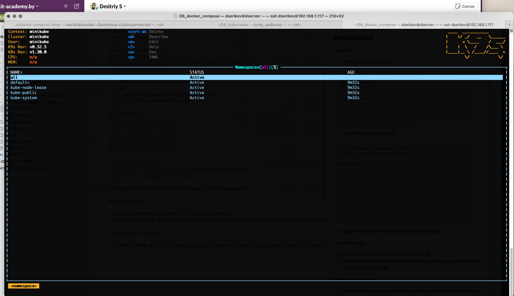
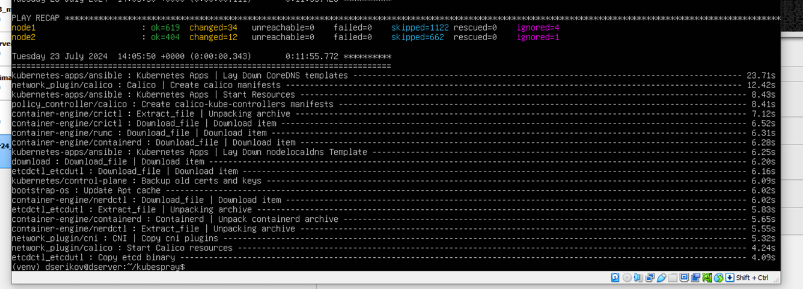
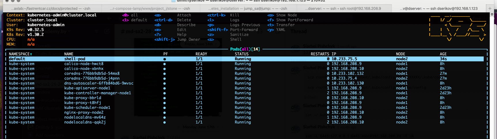
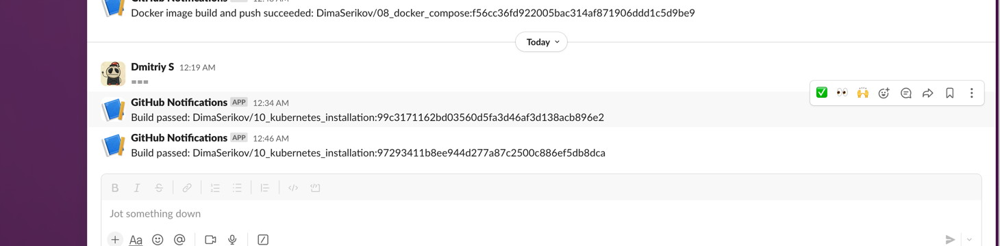

# 10. Kubernetes installation (WS)

## Homework Assignment 1. K8s Installation

Localhost:

* Install kubectl for local run
```shell
curl -LO "https://dl.k8s.io/release/$(curl -L -s https://dl.k8s.io/release/stable.txt)/bin/linux/amd64/kubectl"
chmod +x kubectl
chmod +x kubectl

kubectl version
# Client Version: v1.30.2
# Kustomize Version: v5.0.4-0.20230601165947-6ce0bf390ce3
# Server Version: v1.30.0
```
* Install k9s to maintain cluster
```shell
curl -sS https://webinstall.dev/k9s | bash
source ~/.config/envman/PATH.env

k9s version
#  ____  __.________       
# |    |/ _/   __   \______
# |      < \____    /  ___/
# |    |  \   /    /\___ \ 
# |____|__ \ /____//____  >
#         \/            \/ 
# 
# Version:    v0.32.5
# Commit:     1440643e8d1a101a38d9be1933131ddf5c863940
# Date:       2024-06-15T17:11:02Z
```
* Make print-screen of k9s with pods in all namespaces


Kubernetes host

* Finish workshop deployment if it is not done yet

* Deploy shell pod in default namespace which you can you use for internal checks inside the cluster
```yaml
apiVersion: v1
kind: Pod
metadata:
  name: shell-pod
  namespace: default
spec:
  containers:
  - name: shell
    image: busybox
    command: ['sh', '-c', 'sleep 3600']
    stdin: true
    tty: true
```

```shell
  110  ssh -L 6443:127.0.0.1:6443 root@192.168.208.9 -f -N
  111  k9s
  112  ll
  113  nano pod.yml
  114  kubectl get pods -A
  115  kubectl create -f pod.yml 
  116  k9s

```


Monitoring of cluster:

* Create GitHub action to check status of pods and create slack notification if you have crashed/failed pods

[GitHub - 10_kubernetes_installation](https://github.com/DimaSerikov/10_kubernetes_installation)

```yaml
name: Check Pods monitoring

on:
  push:
  workflow_dispatch:

jobs:
  build:
    name: build
    runs-on: ubuntu-latest

    steps:
      - uses: actions/checkout@v2

      - name: Check for failed pods
        uses: appleboy/ssh-action@v1.0.3
        with:
          proxy_host: ${{ secrets.BASTION_IP }}
          proxy_port: ${{ secrets.BASTION_PORT }}
          proxy_username: ${{ secrets.BASTION_USER }}
          proxy_password: ${{ secrets.BASTION_PASS }}
          host: ${{ secrets.SERVER_9_IP }}
          username: ${{ secrets.SERVER_USER }}
          password: ${{ secrets.SERVER_PASS }}
          run: |
            kubectl get pods -A > output.log
            crash_pods=$(kubectl get pods -A | awk 'NR!=1 {print $4}' | grep -v 'Running' | wc -l)
            echo "crash-pods=${crash_pods}" >> $GITHUB_ENV
            echo "crash_pods=${crash_pods}"

      - name: Send Slack notification (failed pods)
        if: env.crash_pods != '0'
        uses: 8398a7/action-slack@v3
        with:
          status: ${{ job.status }}
          fields: repo,message,commit,author,action,eventName,ref,workflow,job,took
        env:
          SLACK_WEBHOOK_URL: ${{ secrets.SLACK_WEBHOOK_URL }}
          SLACK_MESSAGE: "There are failed pods in the Kubernetes cluster."
          
      - name: Send Slack notification (build success)
        if: success()
        uses: 8398a7/action-slack@v3
        with:
          status: custom
          fields: repo,message,commit,author
          custom_payload: '{"text":"Build passed: ${{ github.repository }}:${{ github.sha }}"}'
        env:
          SLACK_WEBHOOK_URL: ${{ secrets.SLACK_WEBHOOK_URL }}
```

