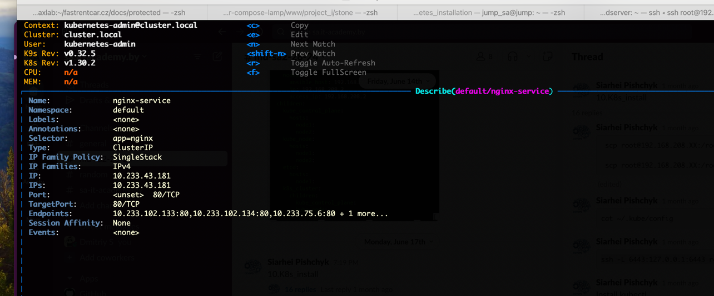
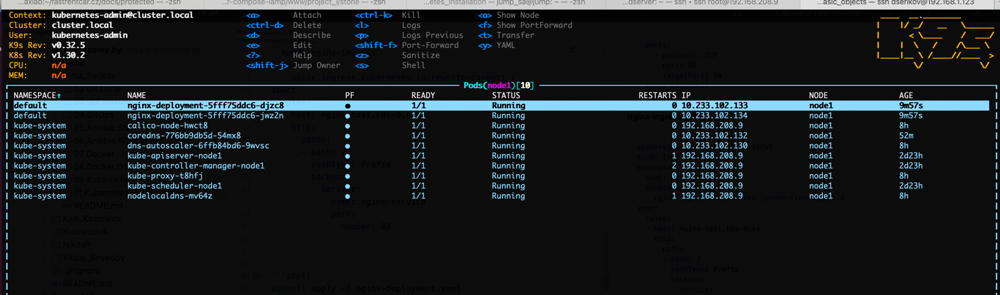
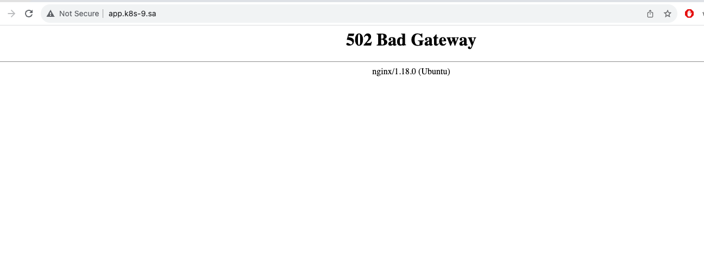
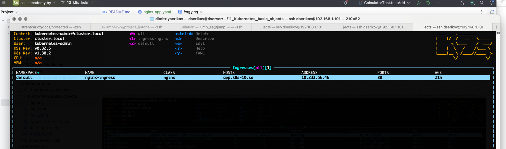

# 11. Kubernetes. Basic objects

## Homework Assignment 1. Nginx deployment

Create deployment of nginx service:

* replicas: 4
* set resources for pods
* deployment shouldn't have any outage (service is available all time)
* ingress rule for host name (nginx-test.k8s-<NUMBER>.sa)

**nginx-deployment.yaml**

```yaml
apiVersion: apps/v1
kind: Deployment
metadata:
  name: nginx-deployment
spec:
  replicas: 4
  selector:
    matchLabels:
      app: nginx
  strategy:
    type: RollingUpdate
    rollingUpdate:
      maxUnavailable: 0
      maxSurge: 1
  template:
    metadata:
      labels:
        app: nginx
    spec:
      containers:
      - name: nginx
        image: nginx:latest
        resources:
          requests:
            memory: "128Mi"
            cpu: "250m"
          limits:
            memory: "256Mi"
            cpu: "500m"
        ports:
        - containerPort: 80
```

**nginx-service.yaml**

```yaml
apiVersion: v1
kind: Service
metadata:
  name: app-service
spec:
  selector:
    app: nginx
  ports:
    - protocol: TCP
      port: 80
      targetPort: 80
  type: ClusterIP
```

**nginx-ingress.yaml**

```yaml
apiVersion: networking.k8s.io/v1
kind: Ingress
metadata:
  name: nginx-ingress
  annotations:
    nginx.ingress.kubernetes.io/rewrite-target: /
spec:
  rules:
  - host: app.k8s-9.sa
    http:
      paths:
      - path: /
        pathType: Prefix
        backend:
          service:
            name: nginx-service
            port:
              number: 80

```

```shell
kubectl apply -f nginx-deployment.yaml
kubectl apply -f nginx-service.yaml
kubectl apply -f nginx-ingress.yaml

kubectl get deployments
# NAME               READY   UP-TO-DATE   AVAILABLE   AGE
# nginx-deployment   4/4     4            4           19s

kubectl get svc

# NAME            TYPE        CLUSTER-IP      EXTERNAL-IP   PORT(S)   AGE
# kubernetes      ClusterIP   10.233.0.1      <none>        443/TCP   2d23h
# nginx-service   ClusterIP   10.233.43.181   <none>        80/TCP    42s

kubectl get ingress
# NAME            CLASS    HOSTS                 ADDRESS   PORTS   AGE
# nginx-ingress   <none>   nginx-test.k8s-9.sa             80      46s
```

```shell
k9s
```




