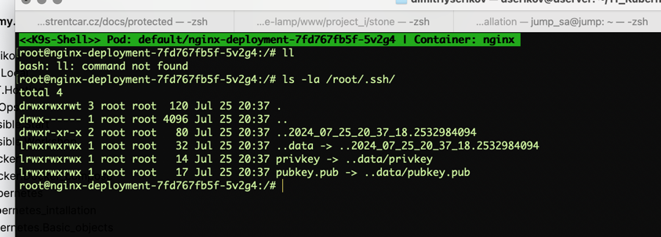
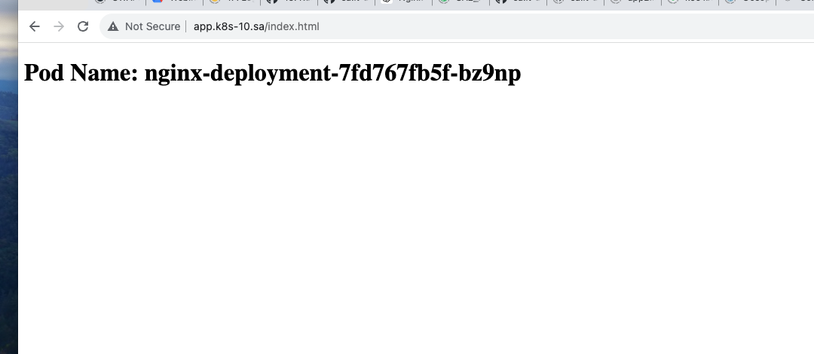
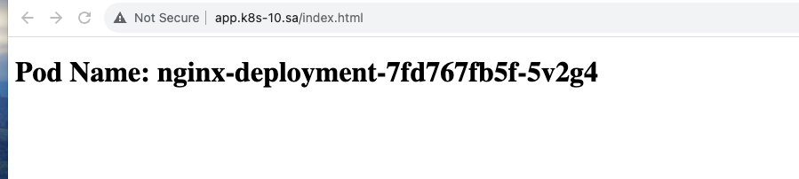
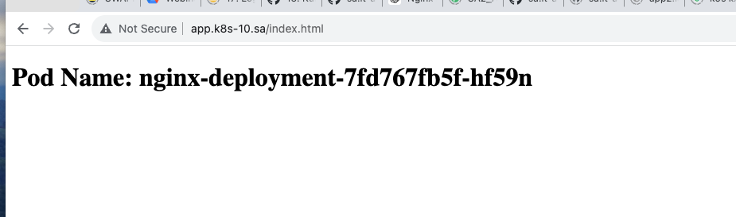

# 12. Kubernetes. Data. Security

## Homework Assignment 1. Config maps and secrets

You need to improve deployment from previous task:

* Add index.php page as config map, which should display hostname of pod as first level header, or generate index.html inside init container
```yaml
apiVersion: v1
kind: ConfigMap
metadata:
  name: html-config
data:
  index.html: |
    <!DOCTYPE html>
    <html>
    <head>
        <meta charset="UTF-8">
        <title>Pods</title>
    </head>
    <body>
    <h1>Pod Name: HOSTNAME</h1>
    </body>
    </html>
---
apiVersion: apps/v1
kind: Deployment
metadata:
  name: nginx-deployment
  labels:
    app: nginx
spec:
  replicas: 4
  selector:
    matchLabels:
      app: nginx
  strategy:
    type: RollingUpdate
    rollingUpdate:
      maxUnavailable: 0
      maxSurge: 1
  template:
    metadata:
      labels:
        app: nginx
    spec:
      containers:
        - name: nginx
          image: nginx:latest
          resources:
            requests:
              memory: "128Mi"
              cpu: "250m"
            limits:
              memory: "256Mi"
              cpu: "500m"
          ports:
            - containerPort: 80
          volumeMounts:
            - name: index-html-for-nginx
              mountPath: /usr/share/nginx/html
            - name: ssh-secret
              mountPath: /root/.ssh
      initContainers:
        - name: config
          image: nginx:latest
          command: ["sh", "-c", 'cd /tmp/; sed -e "s/HOSTNAME/$HOSTNAME/" /tmp/index.html > /usr/share/nginx/html/index.html']
          env:
            - name: HTML_CONTENT
              valueFrom:
                configMapKeyRef:
                  name: html-config
                  key: index.html
          volumeMounts:
            - name: config-mount
              mountPath: /tmp
            - name: index-html-for-nginx
              mountPath: /usr/share/nginx/html
            - name: ssh-secret
              mountPath: /root/.ssh
      volumes:
        - name: config-mount
          configMap:
            name: html-config
        - name: index-html-for-nginx
          emptyDir: { }
        - name: ssh-secret
          secret:
            secretName: ssh-keys
---
apiVersion: v1
kind: Service
metadata:
  name: app-service-nginx
spec:
  selector:
    app: nginx
  ports:
    - protocol: TCP
      port: 80
      targetPort: 80
  type: ClusterIP
---
apiVersion: networking.k8s.io/v1
kind: Ingress
metadata:
  name: nginx-ingress
  annotations:
    kubernetes.io/ingress.class: "nginx"
    nginx.ingress.kubernetes.io/rewrite-target: /
    nginx.ingress.kubernetes.io/proxy-connect-timeout: "30"
    nginx.ingress.kubernetes.io/proxy-send-timeout: "30"
    nginx.ingress.kubernetes.io/proxy-read-timeout: "30"
spec:
  ingressClassName: nginx
  rules:
    - host: app.k8s-10.sa
      http:
        paths:
          - path: /
            pathType: Prefix
            backend:
              service:
                name: app-service-nginx
                port:
                  number: 80
```
* generate pair public and private keys (or use existing) and add them to the pod for user root as secrets, please use sealsecret object for that
```shell
kubectl apply -f https://github.com/bitnami-labs/sealed-secrets/releases/download/v0.27.0/controller.yaml
wget https://github.com/bitnami-labs/sealed-secrets/releases/download/v0.27.0/kubeseal-0.27.0-linux-amd64.tar.gz
sudo tar -C /usr/local/bin -xzf kubeseal-0.27.0-linux-amd64.tar.gz
kubeseal --version
# kubeseal version: 0.27.0

touch privkey && touch pubkey.pub
kubectl create secret generic ssh-keys --from-file=privkey --from-file=pubkey.pub

kubectl get secret ssh-keys  -o yaml > ssh-keys-secret.yaml
kubeseal < ssh-keys-secret.yaml > sealed-ssh-keys-secret.yaml
kubectl apply -f sealed-ssh-keys-secret.yaml
# sealedsecret.bitnami.com/ssh-keys configured
```
* Validate secrets and index.html display



