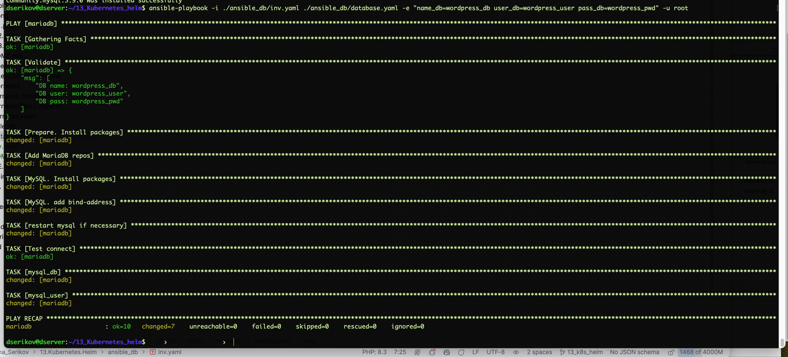
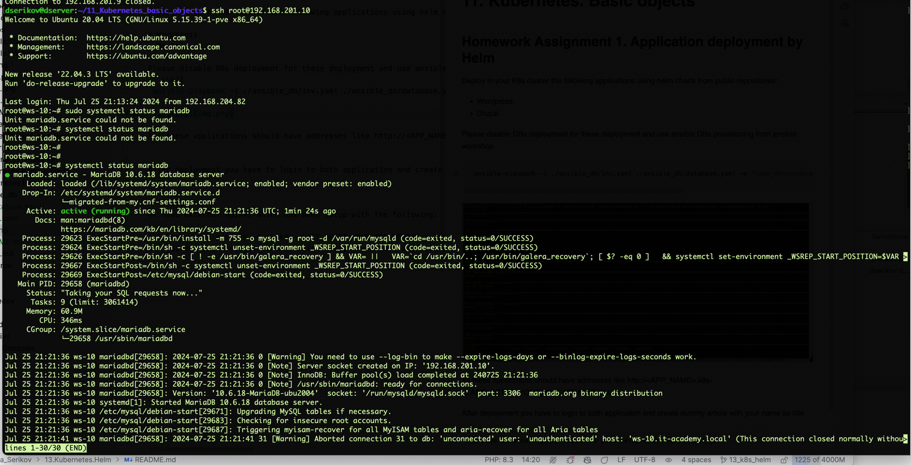
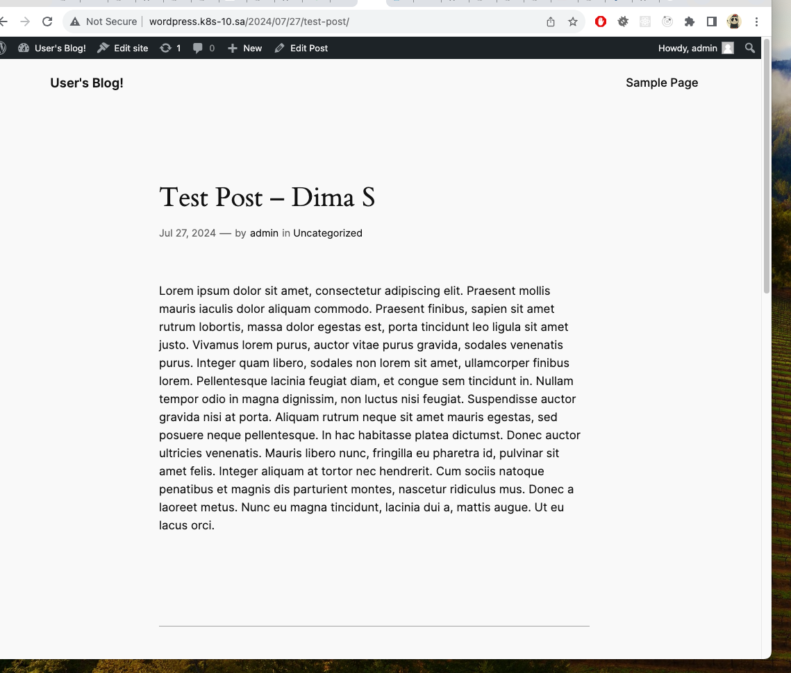
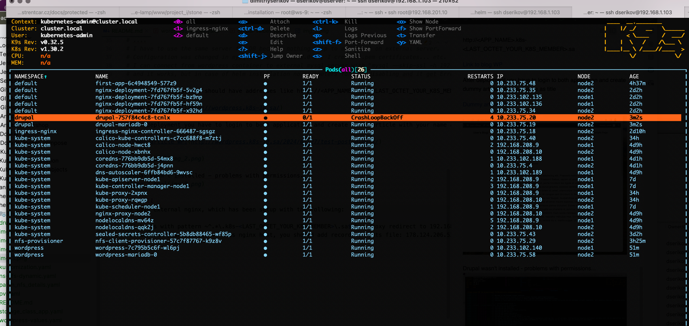
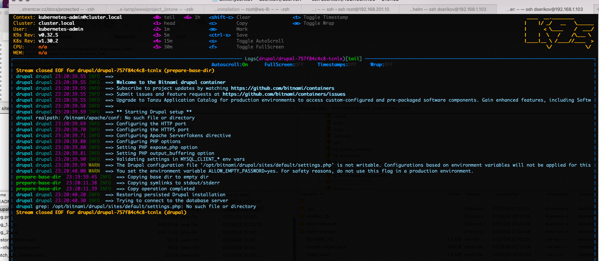

# 11. Kubernetes. Basic objects

## Homework Assignment 1. Application deployment by Helm

Deploy in your K8s cluster the following applications using helm charts from public repositories:

* Wordpress
* Drupal

```shell
kubectl create namespace wordpress
kubectl create namespace drupal
```

Please disable DBs deployment for these deployment and use ansible DBs provisioning from ansible workshop
```shell
 ansible-playbook -i ./ansible_db/inv.yaml ./ansible_db/database.yaml -e "name_db=wordpress_db user_db=wordpress_user pass_db=wordpress_pwd"
```


**Checking DB existence:**
```shell
ssh root@192.168.201.10
systemctl status mariadb
root@ws-10:~# netstat -tuln | grep 3306
# tcp        0      0 0.0.0.0:3306            0.0.0.0:*               LISTEN  
```



## CMS Installing
```yaml
mariadb:
  enabled: true
# ....
# I have to use the same server for DB because nothing help to manage it on external server.
# Configuration was changed in mysqld block to 0.0.0.0 IP, I created .pem certificates... etc.
# I can connect from wordpress container to external mysql server with "mysql --skip-ssl -h 192.168.201.10 -u wordpress_user -p"
# and it works, but in case of helm installation no parameters for ssl disabling and it get Error when DB connecting.
```
All these applications should have addresses like http://<APP_NAME>.k8s-<LAST_OCTET_YOUR_K8S_MEMBER>.sa

[Link to blog WP](http://wordpress.k8s-10.sa/)
[Link to Drupal](http://drupal.k8s-10.sa/)

After deployment you have to login to both application and create dummy article with your name as title

[Dummy article WP](http://wordpress.k8s-10.sa/2024/07/27/test-post-dima-s/)



Drupal wasn't installed - problems with permissions... :(



```shell
We have external nginx, which has been setup with the following:

All hosts with pattern ~^.*\.k8s-<LAST_OCTET_YOUR_K8S_MEMBER>\.sa$ has proxy redirect to 192.168.203.<LAST_OCTET_YOUR_K8S_MEMBER>:30001
To redirect your request to this nginx host, you should add record to hosts file: 178.124.206.53  app1.k8s-<LAST_OCTET_YOUR_K8S_MEMBER>.sa app2.k8s-<LAST_OCTET_YOUR_K8S_MEMBER>.sa
```