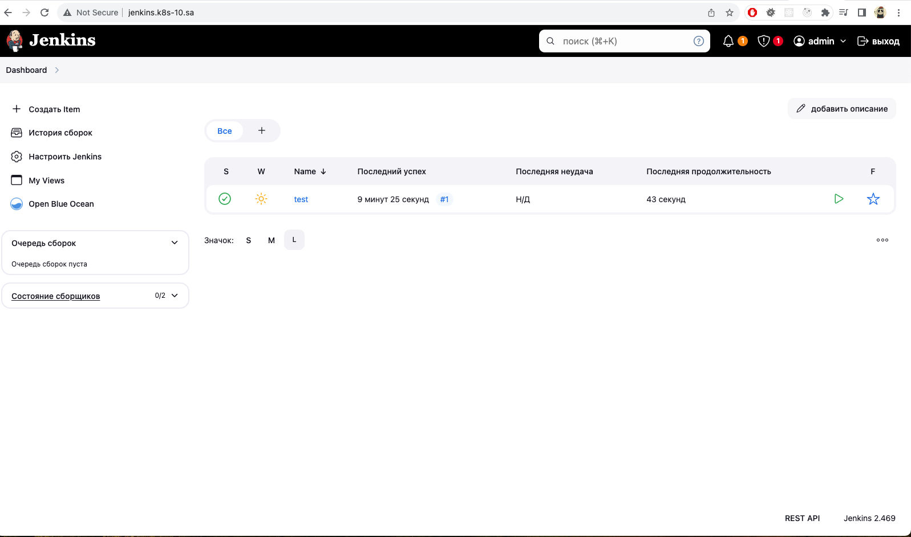
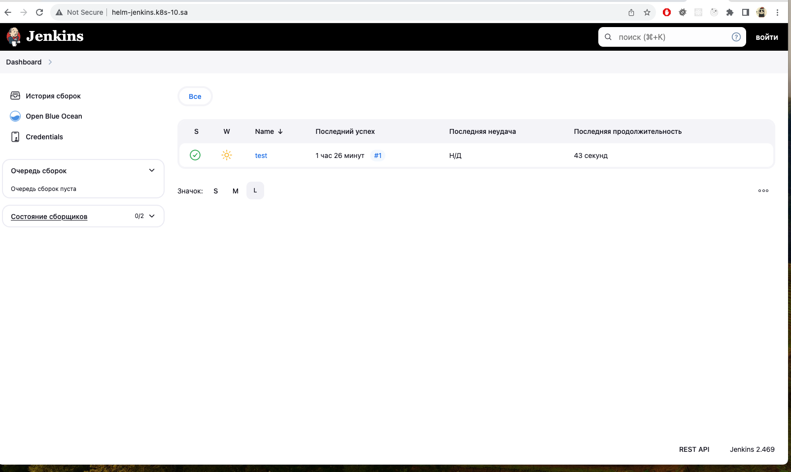
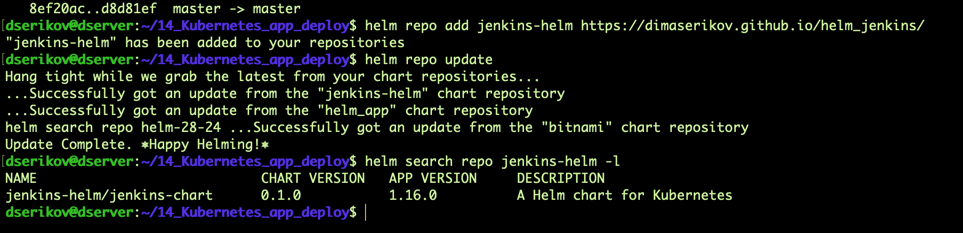

# 14. Kubernetes application deployment

## Homework Assignment 1. Transform Jenkins deployment to Helm

* Finish application deployment



* Create helm package for your Jenkins application
  * all variables should be inside variable file
  * publish helm on your repository

**test run from releases:**
```shell
  426  cd ../helm-sources/
  427  helm package jenkins-chart
  428  mv jenkins-chart-0.1.0.tgz ../helm-releases/
  429  cd ../helm-releases/
  430  ll
  431  helm upgrade --install jenkins-chart ./jenkins-chart-0.1.0.tgz -n ci-cd-helm --create-namespace
```


**create repo image**

```shell
# k8s secrets creation to avoid GitGuardian detection (and others)
kubectl create secret generic jenkins-secret --from-literal=password=admin -n ci-cd-helm
kubectl create secret generic jenkins-credentials --from-literal=username=git_hub_user --from-literal=password=XXXXXX -n ci-cd-helm
```

[Gihub Repository for Jenkins Helm](https://github.com/DimaSerikov/helm_jenkins)



```shell
  433  cd ..
  434  git init
  435  git remote add origin git@github.com:DimaSerikov/helm_jenkins.git
  436  git status
  437  git add --all
  438  git commit -m "First release"
  439  git config --global user.email "dserikov7@gmail.com"
  440  git config --global user.name "Dima Serikov"
  441  git commit -m "First release"
  442  git status
  443  git push -u origin master
  444  echo -e "User-Agent: *\nDisallow: /" > robots.txt
  445  ll
  446  helm repo index --url "https://dimaserikov.github.io/helm_jenkins/" .
  447  ll
  448  cat index.yaml 
  449  git add --all
  450  git commit -m "Added first version"
  451  git push
  452  helm repo add jenkins-helm https://dimaserikov.github.io/helm_jenkins/
  453  helm repo update
  454  helm search repo jenkins-helm -l
  455  history 
```