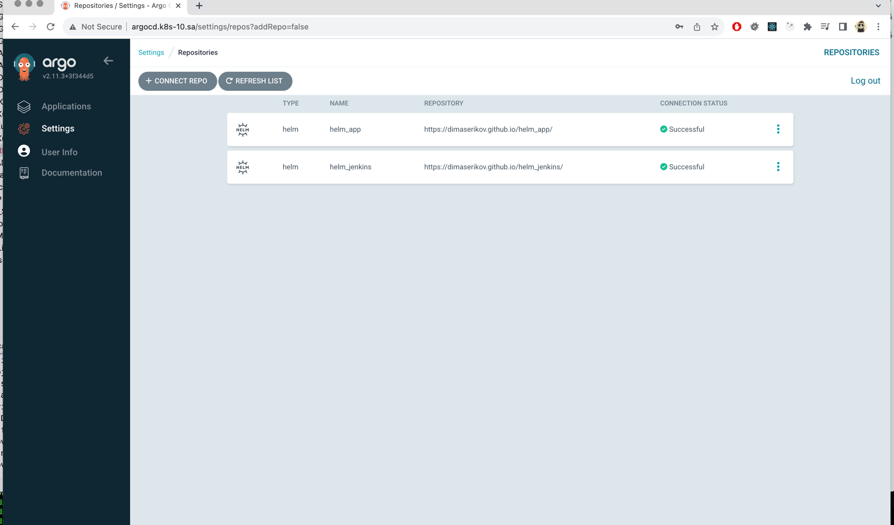
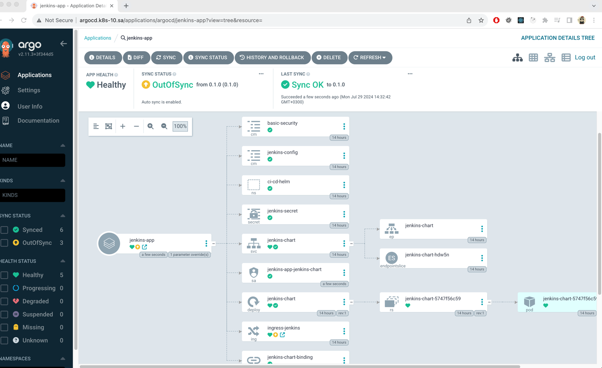

# 15. Kubernetes CI CD

## Homework Assignment 1. ArgoCD deployment and application

* deploy ArgoCD into your cluster

```shell
  460  mkdir 15_k8s_argocd
  461  cd 15_k8s_argocd/
  462  ll
  463  kubectl create namespace argocd
  464  wget https://raw.githubusercontent.com/argoproj/argo-cd/stable/manifests/install.yaml -O argocd-install.yaml
  465  nano argocd-install.yaml
#   nodePort: 30007
#   type: NodePort
#   - --insecure
  466  kubectl apply -f argocd-install.yaml -n argocd
  467  nano argocd-install.yaml 
  468  kubectl apply -f argocd-install.yaml -n argocd
  469  echo `echo eWQtWGVJeW56YUsteXXXX== | base64 --decode`
# yd-XeIynzaK-XXXX
```

* add your repositories with helm packages as source for deployment



* create separate repository which contains application manifests for ArgoCD
```shell
  472  git init
  473  git remote add origin git@github.com:DimaSerikov/15_argocd.git
  474  ll
  475  git config --global user.email "dserikov7@gmail.com"
  476  git config --global user.name "Dima Serikov"
  477  git add --all
  478  git commit -m "Init"
  479  git push --set-upstream origin master
```
  * application objects
  * git secrets objects as sealsecret objects
* add this repository as project for your applications

Links your repositories, pritscreen of your project in ArgoCD add to PR

[ArgoCD Repository](https://github.com/DimaSerikov/15_argocd)

