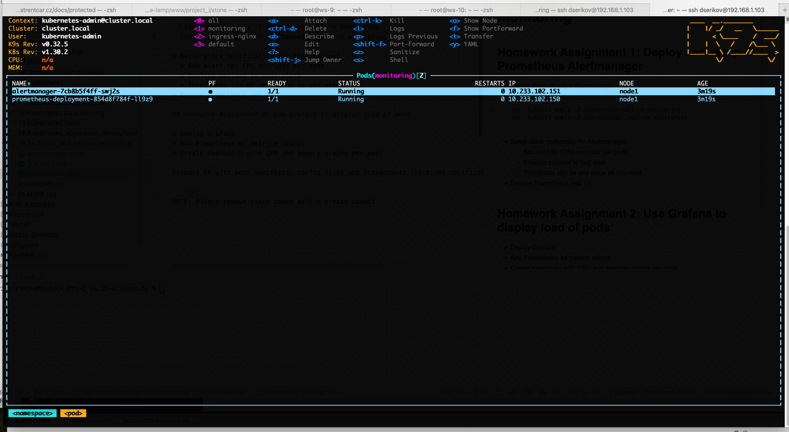
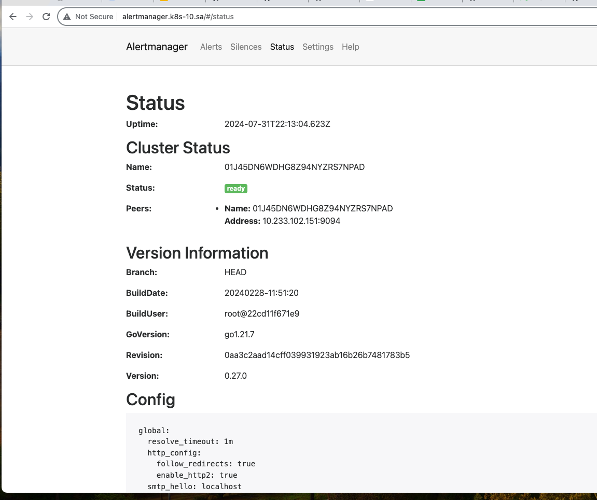
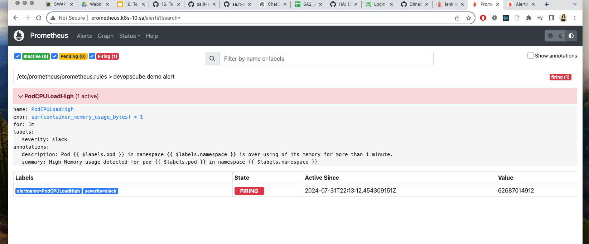
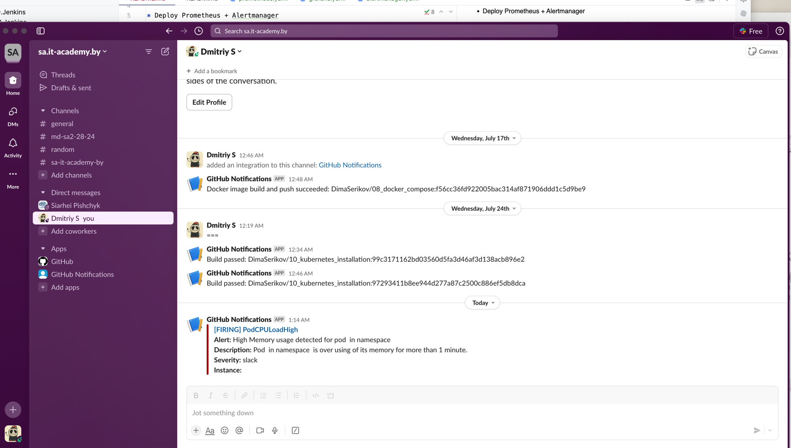
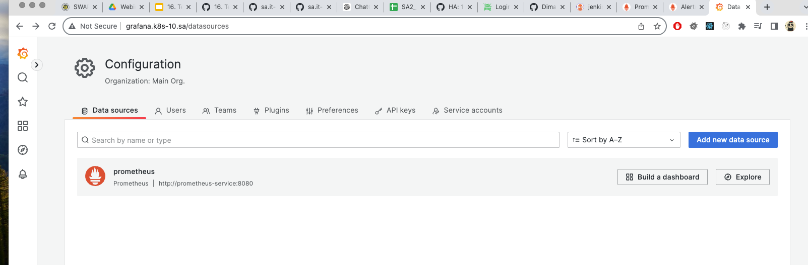
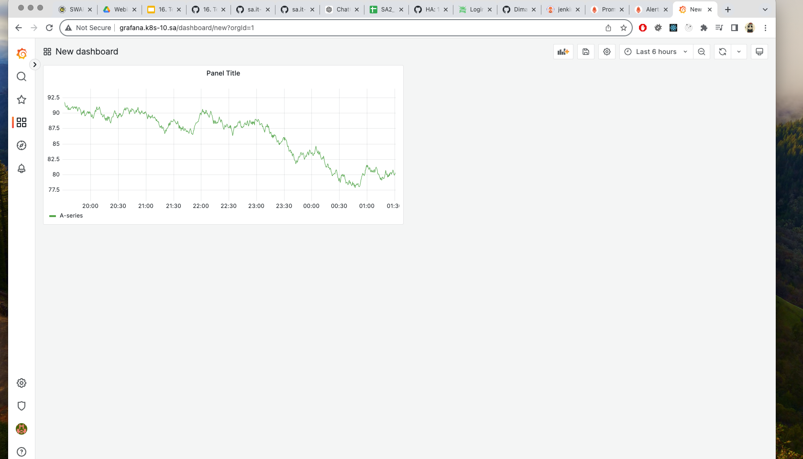

# 16. Technical and service monitoring

## Homework Assignment 1: Deploy and setup Prometheus Alertmanager

* Deploy Prometheus + Alertmanager
```shell
  497  kubectl create namespace monitoring
  ...
  505  kubectl apply -f prometheus.yaml -n monitoring
  506  kubectl apply -f alertmanager.yaml -n monitoring
```



* Setup slack notification for Alertmanager
  * Add alert for CPU overload per pods
  * Emulate payload to test alert
  * Thresholds can be any value as you wish 
* Expose Prometheus web UI





## Homework Assignment 2: Use Grafana to display load of pods

* Deploy Grafana
```shell
  508  kubectl apply -f grafana.yaml -n monitoring
```
* Add Prometheus as metrics source



* Create dashboard with CPU and memory graphs per pods



Prepare PR with your manifests, config files and screenshots (received notification in slack, Grafana dashboard)

```text
NOTE: Please remove slack token before create commit
```