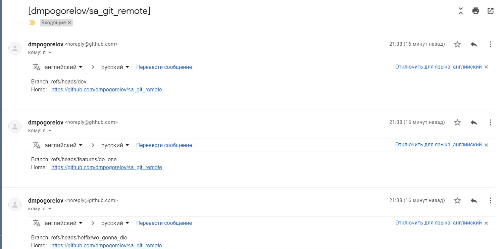
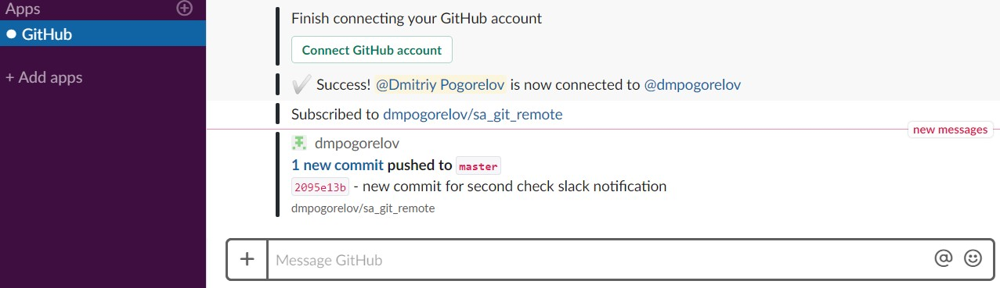
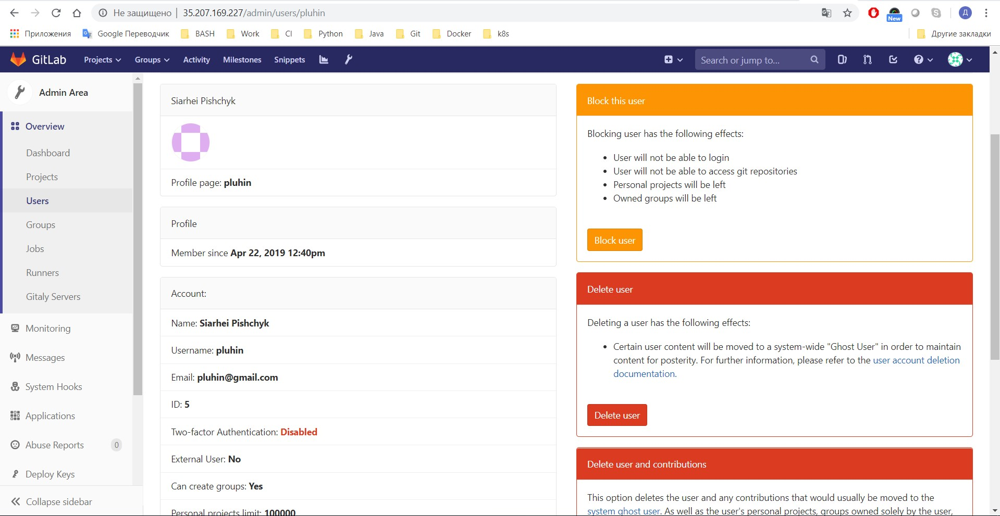

## Homework - Remote git repository
---
### Urls to remote repository


[Github](https://github.com/dmpogorelov/sa_git_remote)

---
![alt text][logo_bitbucket]

[logo_bitbucket]: https://www.chandandubey.com/wp-content/uploads/2018/01/0722.sdt-atlassian.png "Bitbucket"

[Bitbucket](https://bitbucket.org/dmpogorelov/sa_git_remote/)

---


[Gitlab](https://gitlab.com/dmpogorelov/sa_test_project)

[Gitlab CE](http://35.207.169.227/dmpogorelov/sa_test_project)

---
### Notification to email and slack

__Mail notification__



__Slack notification__



###  Gitlab CE
---
>Gitlab CE was deployed on **Google cloud platform**

>Invitation was sent during creation account (Please check your spam :smile: )

**Create new user**



**Creation and send notification log**

```bash
Processing by Admin::UsersController#create as HTML
  Parameters: {"utf8"=>"✓", "authenticity_token"=>"[FILTERED]", "user"=>{"name"=>"Siarhei Pishchyk", "username"=>"pluhin", "email"=>"pluhin@gmail.com", "projects_limit"=>"100000", "can_create_group"=>"1", "access_level"=>"regular", "external"=>"0", "skype"=>"", "linkedin"=>"", "twitter"=>"", "website_url"=>""}}
[ActiveJob] [ActionMailer::DeliveryJob] [4b43b30b-a5e1-4579-827b-4fd54bc05c6b] Performing ActionMailer::DeliveryJob from Sidekiq(mailers) with arguments: "Notify", "new_user_email", "deliver_now", 5, "x1Q5sy3gex_PTkpexJby"
[ActiveJob] Enqueued ActionMailer::DeliveryJob (Job ID: 4b43b30b-a5e1-4579-827b-4fd54bc05c6b) to Sidekiq(mailers) with arguments: "Notify", "new_user_email", "deliver_now", 5, "x1Q5sy3gex_PTkpexJby"
Redirected to http://35.207.169.227/admin/users/pluhin
Completed 302 Found in 130ms (ActiveRecord: 11.2ms)
Started GET "/admin/users/pluhin" for 128.140.241.193 at 2019-04-22 12:40:54 +0000
Processing by Admin::UsersController#show as HTML
  Parameters: {"id"=>"pluhin"}
Completed 200 OK in 58ms (Views: 39.7ms | ActiveRecord: 6.4ms)
[ActiveJob] [ActionMailer::DeliveryJob] [4b43b30b-a5e1-4579-827b-4fd54bc05c6b] Sent mail to pluhin@gmail.com (1217.4ms)
[ActiveJob] [ActionMailer::DeliveryJob] [4b43b30b-a5e1-4579-827b-4fd54bc05c6b] Performed ActionMailer::DeliveryJob from Sidekiq(mailers) in 1241.9ms
```
> Gitlab CE vs Gitlab EE

**Several differences**

|Features |Gitlab CE |Gitlab CE |
|:--------|:--------:|:--------:|
|Cost     |Free      |$4-99/month|
|CI/CD    |2k pipelines |2k-50k pipelines|
|Support  |Community | Standart-Premium|

*Full comparation list you can find by the link bellow*

[Feature Comparison](https://about.gitlab.com/pricing/gitlab-com/feature-comparison/)