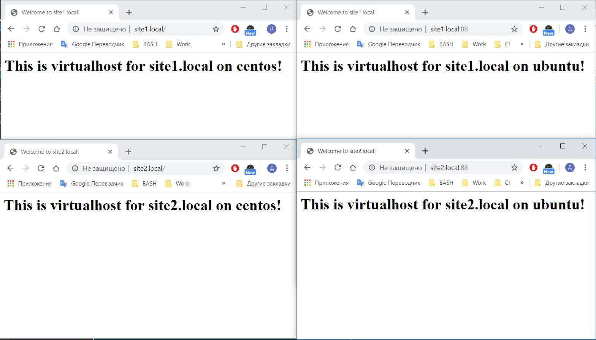

## Homework - Ansible cruise

To complete task need to do following stets:

### 1. Install nginx package.

As this taks depends on OS distribution can be used module ***include*** with option ***static=no***. And create 2 different taks's files for each OS
```yml
- include: "{{ ansible_os_family }}.yml"
  static: no
```
[for CentOS](./roles/install_nginx/tasks/RedHat.yml)

[for Ubuntu](./roles/install_nginx/tasks/Debian.yml)

### 2. Add site names to file hosts

Create new variable ***site_fqdn*** in folder `default` and use loop ***with_items*** add values to file (similar constration will use in the next steps)
```yml
site_fqdn:
  - site1.local
  - site2.local
```

### 3. Create home directory for each site

Use module ***file*** and condition ***with_items*** for create directory 
```yml
- name: "create directory for virtualhosts "
  file:
    path: "{{ nginx_home }}/{{ item }}/html"
    state: directory
  with_items: "{{ site_fqdn }}"
```

### 4. Copy index.html

Use module ***template*** for copy index.html with loop ***with_items***
```html
<html>
   <head>
       <title>Welcome to {{ item }}!</title>
   </head>
   <body>
       <h1>This is virtualhost for {{ item }} on {{ ansible_hostname }}!</h1>
   </body>
</html>
```

### 5. Create configuration file for each site

For this task same modules as for the previous
```j2
server {
   listen 80;

   root {{ nginx_home }}{{ item }}/html;
   index index.html index.htm;

   server_name {{ item }};

   location / {
       try_files $uri $uri/ =404;
   }
}
```
Also use ***notify*** and handlers for restart nginx service
```yml
---
- name: restart_nginx
  service:
    name: nginx
    state: restarted
    enabled: yes
```

### 6. Checking deployment

For check deployment use module ***uri*** to send request by url and module debug for print output information
```yml
- name: check page
  uri:
    url: "http://{{ item }}"
    return_content: yes
  register: out
  with_items: "{{ site_fqdn }}"
  tags: 
  - final::check

- debug:
    msg: "{{ out }}"
  tags: 
  - final::check
```

For run tasks one by one was created tags e.g.
```yml
tags: 
  - final::check
```
---

Result of deployment [console output](./playbook.out)

### Screenshop of Redmine project

